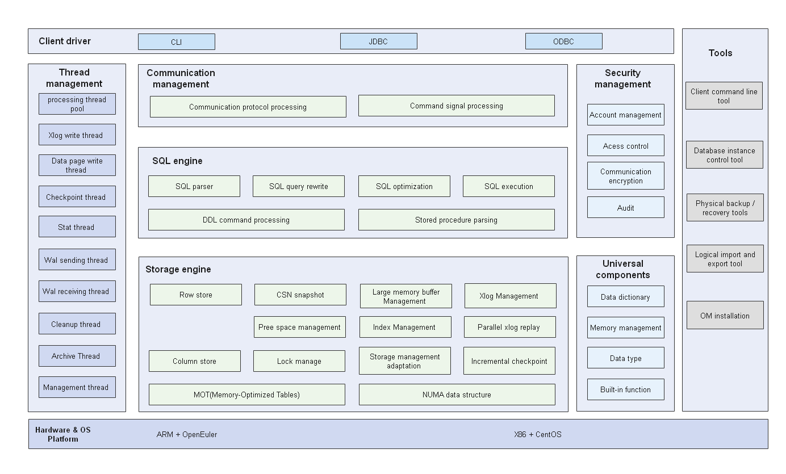

[English](./README.en.md) | 简体中文


- [什么是openGauss](#什么是openGauss)
- [安装](#安装)
  - [创建配置文件](#创建配置文件)
  - [初始化安装环境](#初始化安装环境)
  - [执行安装](#执行安装)
  - [卸载openGauss](#卸载opengauss)
    - [**执行卸载**](#执行卸载)
    - [**一键式环境清理**](#一键式环境清理)
- [编译](#编译)
  - [概述](#概述)
  - [操作系统和软件依赖要求](#操作系统和软件依赖要求)
  - [下载openGauss](#下载opengauss)
  - [编译第三方软件](#编译第三方软件)
  - [代码编译](#代码编译)
      - [使用build.sh编译代码](#使用buildsh编译代码)
      - [使用命令编译代码](#使用命令编译代码)
  - [编译安装包](#编译安装包)
- [快速入门](#快速入门)
- [文档](#文档)
- [社区](#社区)
  - [治理](#治理)
  - [交流](#交流)
- [贡献](#贡献)
- [发行说明](#发行说明)
- [许可证](#许可证)

## 什么是openGauss

openGauss是一款开源的关系型数据库管理系统，它具有多核高性能、全链路安全性、智能运维等企业级特性。
openGauss内核早期源自开源数据库PostgreSQL，融合了华为在数据库领域多年的内核经验，在架构、事务、存储引擎、优化器及ARM架构上进行了适配与优化。作为一个开源数据库，期望与广泛的开发者共同构建一个多元化技术的开源数据库社区。



**高性能**

openGauss突破了多核CPU的瓶颈，实现两路鲲鹏128核150万tpmC，内存优化表（MOT）引擎达350万tpmC。

**数据分区**

内部线程共享的关键数据结构进行数据分区，减少加锁访问冲突。比如CLOG就采用分区优化，解决ClogControlLock锁瓶颈。

**NUMA化内核数据结构**

关键数据结构NUMA化分配，减少跨CPU访问。比如全局PGPROC数组按照NUMA Node的数目分为多份，分别在对应NUMA Node上申请内存。解决ProcArrayLock锁瓶颈。

**绑核优化**

把网络中断绑核和后台业务线程绑核区分开，避免运行线程在核间迁移造成的性能不稳定。

**ARM指令优化**

结合ARM平台的原子操作lse进行优化，实现关键互斥变量原子高效操作。

**SQL BY PASS**

通过SQL BY PASS优化SQL执行流程，简化CPU执行开销。

**高可靠**

正常业务负载情况下，RTO小于10秒，降低节点故障导致的业务不可用时间。

**并行恢复**

主机日志传输到备机时，备机日志落盘的同时，发送给重做恢复分发线程，分发线程根据日志类型和日志操作的数据页发给多个并行恢复线程进行日志重做，保证备机的重做速度跟上主机日志的产生速度。这样备机实时处于ready状态，从而实现瞬间故障切换。


**MOT引擎（Beta发布）**

内存优化表（MOT）存储引擎是一个专为多核大内存优化的存储引擎，具有极高的联机事务处理（OLTP）性能和资源利用率。MOT的数据和索引完全存储在内存中，通过NUMA感知执行，算法消除闩锁争用以及查询JIT本地编译，提供低时延数据访问及高效事务执行。更多请参考[MOT引擎文档](https://opengauss.org/zh/docs/2.0.0/docs/Developerguide/%E5%86%85%E5%AD%98%E8%A1%A8%E7%89%B9%E6%80%A7.html)。

**安全**

openGauss支持账号管理，账号认证，口令复杂度检查，账号锁定，权限管理和校验，传输加密，操作
审计等全方位的数据库安全能力，保护业务满足安全要求。

**易运维**

openGauss将AI算法集成到数据库中，减少数据库维护的负担。

- **SQL预测**

openGauss根据收集的历史性能数据进行编码和基于深度学习的训练及预测，支持SQL执行时间预测。

- **SQL诊断器**

openGauss支持SQL执行语句的诊断器，提前发现慢查询。

- **参数自动调整**

openGauss通过机器学习方法自动调整数据库参数，提高调参效率，降低正确调参成本。


## 安装

### 创建配置文件

在安装openGauss之前，需要创建clusterconfig.xml配置文件。XML文件包含部署openGauss的服务器信息、安装路径、IP地址以及端口号等。用于告知openGauss如何部署。用户需根据不同场配置对应的XML文件。

下面以一主一备的部署方案为例，说明如何创建XML配置文件。
以下value取值信息仅为示例，可自行替换。每行信息均有注释进行说明。

```
<?xml version="1.0" encoding="UTF-8"?>
<ROOT>
    <!-- openGauss整体信息 -->
    <CLUSTER>
    <!-- 数据库名称 -->
        <PARAM name="clusterName" value="dbCluster" />
    <!-- 数据库节点名称(hostname) -->
        <PARAM name="nodeNames" value="node1,node2" />
    <!-- 节点IP，与nodeNames一一对应 -->
        <PARAM name="backIp1s" value="192.168.0.11,192.168.0.12"/>
    <!-- 数据库安装目录-->
        <PARAM name="gaussdbAppPath" value="/opt/huawei/install/app" />
    <!-- 日志目录-->
        <PARAM name="gaussdbLogPath" value="/var/log/omm" />
    <!-- 临时文件目录-->
        <PARAM name="tmpMppdbPath" value="/opt/huawei/tmp"/>
    <!--数据库工具目录-->
        <PARAM name="gaussdbToolPath" value="/opt/huawei/install/om" />
    <!--数据库core文件目录-->
        <PARAM name="corePath" value="/opt/huawei/corefile"/>
    <!-- openGauss类型，此处示例为单机类型，“single-inst”表示单机一主多备部署形态-->
        <PARAM name="clusterType" value="single-inst"/>
    </CLUSTER>
    <!-- 每台服务器上的节点部署信息 -->
    <DEVICELIST>
        <!-- node1上的节点部署信息 -->
        <DEVICE sn="1000001">
        <!-- node1的hostname -->
            <PARAM name="name" value="node1"/>
        <!-- node1所在的AZ及AZ优先级 -->
            <PARAM name="azName" value="AZ1"/>
            <PARAM name="azPriority" value="1"/>
        <!-- 如果服务器只有一个网卡可用，将backIP1和sshIP1配置成同一个IP -->
            <PARAM name="backIp1" value="192.168.0.11"/>
            <PARAM name="sshIp1" value="192.168.0.11"/>
            
	    <!--dbnode-->
	    	<PARAM name="dataNum" value="1"/>
	    <!--DBnode端口号-->
	    	<PARAM name="dataPortBase" value="26000"/>
	    <!--DBnode主节点上数据目录，及备机数据目录-->
	    	<PARAM name="dataNode1" value="/opt/huawei/install/data/db1,node2,/opt/huawei/install/data/db1"/>
	    <!--DBnode节点上设定同步模式的节点数-->
	    	<PARAM name="dataNode1_syncNum" value="0"/>
        </DEVICE>

        <!-- node2上的节点部署信息，其中“name”的值配置为主机名称（hostname） -->
        <DEVICE sn="1000002">
            <PARAM name="name" value="node2"/>
            <PARAM name="azName" value="AZ1"/>
            <PARAM name="azPriority" value="1"/>
            <!-- 如果服务器只有一个网卡可用，将backIP1和sshIP1配置成同一个IP -->
            <PARAM name="backIp1" value="192.168.0.12"/>
            <PARAM name="sshIp1" value="192.168.0.12"/>
	</DEVICE>
    </DEVICELIST>
</ROOT>
```

### 初始化安装环境

创建完openGauss配置文件后，在执行安装前，为了后续能以最小权限进行安装及openGauss管理操作，保证系统安全性，需要运行安装前置脚本gs_preinstall准备好安装用户及环境。

安装前置脚本gs_preinstall可以协助用户自动完成如下的安装环境准备工作：

- 自动设置Linux内核参数以达到提高服务器负载能力的目的。这些参数直接影响数据库系统的运行状态，请仅在确认必要时调整。
- 自动将openGauss配置文件、安装包拷贝到openGauss主机的相同目录下。
- openGauss安装用户、用户组不存在时，自动创建安装用户以及用户组。
- 读取openGauss配置文件中的目录信息并创建，将目录权限授予安装用户。

**注意事项**

- 用户需要检查上层目录权限，保证安装用户对安装包和配置文件目录读写执行的权限。
- xml文件中各主机的名称与IP映射配置正确。
- 只能使用root用户执行gs_preinstall命令。

**操作步骤**

1.以root用户登录待安装openGauss的任意主机，并按规划创建存放安装包的目录。

   ```
mkdir -p /opt/software/openGauss
chmod 755 -R /opt/software
   ```

   > **说明** 
   >
   > - 不建议把安装包的存放目录规划到openGauss用户的家目录或其子目录下，可能导致权限问题。
   > - openGauss用户须具有/opt/software/openGauss目录的读写权限。

2.将安装包“openGauss-x.x.x-openEULER-64bit.tar.gz”和配置文件“clusterconfig.xml”都上传至上一步所创建的目录中。

3.在安装包所在的目录下，解压安装包openGauss-x.x.x-openEULER-64bit.tar.gz。安装包解压后，在/opt/software/openGauss目录下自动生成script目录。在script目录下生成gs_preinstall等OM工具脚本。

```
cd /opt/software/openGauss
tar -zxvf openGauss-x.x.x-openEULER-64bit.tar.gz
```

4.进入工具脚本目录。

   ```
cd /opt/software/openGauss/script
   ```

5.如果是openEuler的操作系统，执行如下命令打开performance.sh文件，用#注释sysctl -w vm.min_free_kbytes=112640 &> /dev/null，键入“ESC”键进入指令模式，执行**:wq**保存并退出修改。

```
vi /etc/profile.d/performance.sh
```

6.为确保openssl版本正确，执行预安装前请加载安装包中lib库。执行命令如下，其中*{packagePath}*为用户安装包放置的路径，本示例中为/opt/software/openGauss。

   ```
export LD_LIBRARY_PATH={packagePath}/script/gspylib/clib:$LD_LIBRARY_PATH
   ```


7.为确保成功安装，检查 hostname 与 /etc/hostname 是否一致。预安装过程中，会对hostname进行检查。

8.使用gs_preinstall准备好安装环境。若为共用环境需加入--sep-env-file=ENVFILE参数分离环境变量，避免与其他用户相互影响，ENVFILE为用户自行指定的环境变量分离文件的路径。
   执行如下命令，即采用交互模式执行前置，并在执行过程中自动创建root用户互信和openGauss用户互信：

   ```
./gs_preinstall -U omm -G dbgrp -X /opt/software/openGauss/clusterconfig.xml
   ```

   omm为数据库管理员用户（即运行openGauss的操作系统用户）,dbgrp为运行openGauss的操作系统用户的组名，/opt/software/ openGauss/clusterconfig.xml为openGauss的配置文件路径。执行过程中需要根据提示选择建立互信，并输入root或openGauss用户的密码。

### 执行安装

执行前置脚本准备好openGauss安装环境之后，按照启动安装过程部署openGauss。

**前提条件**

- 已成功执行前置脚本gs_preinstall。
- 所有服务器操作系统和网络均正常运行。
- 用户需确保各个主机上的locale保持一致。

**操作步骤**

1.（可选）检查安装包和openGauss配置文件在规划路径下是否已存在，如果没有，重新执行预安装，确保预安装成功，再执行以下步骤。

2.登录到openGauss的主机，并切换到omm用户。

   ```
su - omm
   ```

   > **说明** 
   >
   > - omm为gs_preinstall脚本中-U参数指定的用户。
   > - 以上述omm用户执行gs_install脚本。否则会报执行错误。

3.使用gs_install安装openGauss。若为环境变量分离的模式安装的集群需要source环境变量分离文件ENVFILE。

   ```
gs_install -X /opt/software/openGauss/clusterconfig.xml
   ```

 /opt/software/openGauss/script/clusterconfig.xml为openGauss配置文件的路径。在执行过程中，用户需根据提示输入数据库的密码，密码具有一定的复杂度，为保证用户正常使用该数据库，请记住输入的数据库密码。

 密码复杂度要求：

   - 长度至少8个字符。	
   - 不能和用户名、当前密码（ALTER）、当前密码的倒序相同。
   - 以下至少包含三类：大写字母（A - Z）、小写字母（a - z）、数字（0 - 9）、其他字符（仅限~!@#$%^&*()-_=+\|[{}];:,<.>/?）。

4.安装执行成功之后，需要手动删除主机root用户的互信，即删除openGauss数据库各节点上的互信文件。

   ```
rm -rf ~/.ssh
   ```

### 卸载openGauss

卸载openGauss的过程包括卸载openGauss和清理openGauss服务器环境。

#### **执行卸载**

openGauss提供了卸载脚本，帮助用户卸载openGauss。

**操作步骤**

1.以操作系统用户omm登录数据库主节点。

2.使用gs_uninstall卸载openGauss。

   ```
gs_uninstall --delete-data
   ```

   或者在openGauss中每个节点执行本地卸载。

   ```
gs_uninstall --delete-data -L
   ```

#### **一键式环境清理**

在openGauss卸载完成后，如果不需要在环境上重新部署openGauss，可以运行脚本gs_postuninstall对openGauss服务器上环境信息做清理。openGauss环境清理是对环境准备脚本gs_preinstall所做设置的清理。
**前提条件**

- openGauss卸载执行成功。
- root用户互信可用。
- 只能使用root用户执行gs_postuninstall命令。

**操作步骤**

1.以root用户登录openGauss服务器。

2.查看互信是否建成功，可以互相执行**ssh 主机名**。输入exit退出。

   ```
   plat1:~ # ssh plat2 
   Last login: Tue Jan  5 10:28:18 2016 from plat1 
   plat2:~ # exit 
   logout 
   Connection to plat2 closed. 
   plat1:~ #
   ```

3.进入script路径下。

   ```
   cd /opt/software/openGauss/script
   ```

4.使用gs_postuninstall进行清理。若为环境变量分离的模式安装的集群需要source环境变量分离文件ENVFILE。

   ```
   ./gs_postuninstall -U omm -X /opt/software/openGauss/clusterconfig.xml --delete-user --delete-group
   ```

  或者在openGauss中每个节点执行本地后置清理。

   ```
   ./gs_postuninstall -U omm -X /opt/software/openGauss/clusterconfig.xml --delete-user --delete-group -L
   ```

 omm为运行openGauss的操作系统用户名，/opt/software/openGauss/clusterconfig.xml为openGauss配置文件路径。

若为环境变量分离的模式安装的集群需删除之前source的环境变量分离的env参数unset MPPDB_ENV_SEPARATE_PATH

5.删除各openGauss数据库节点root用户互信。 


## 编译

### 概述

编译openGauss需要openGauss-server和binarylibs两个组件。

- openGauss-server：openGauss的主要代码。可以从开源社区获取。

- binarylibs：openGauss依赖的第三方开源软件，你可以直接编译openGauss-third_party代码获取，也可以从开源社区下载已经编译好的并上传的一个副本。

对于数据库、三方库、GCC的编译以及常见问题，参照博客[openGauss数据库编译指导](https://opengauss.org/zh/blogs/blogs.html?post/xingchen/opengauss_compile/)

在编译openGauss之前，请检查操作系统和软件依赖要求。

openGauss可以通过一键式shell工具build.sh进行编译，也可以通过命令进行编译。安装包由build.sh生成。

### 操作系统和软件依赖要求

openGauss支持以下操作系统：

- CentOS 7.6（x86架构）

- openEuler-20.03-LTS（aarch64架构）

适配其他系统，参照博客[openGauss数据库编译指导](https://opengauss.org/zh/blogs/blogs.html?post/xingchen/opengauss_compile/)

以下表格列举了编译openGauss的软件要求。

建议使用从列出的操作系统安装盘或安装源中获取的以下依赖软件的默认安装包进行安装。如果不存在以下软件，请参考推荐的软件版本。

软件依赖要求如下：

| 软件            | 推荐版本            |
| ------------- | --------------- |
| libaio-devel  | 0.3.109-13      |
| flex          | 2.5.31及以上版本     |
| bison         | 2.7-4           |
| ncurses-devel | 5.9-13.20130511 |
| glibc-devel   | 2.17-111        |
| patch         | 2.7.1-10        |
| lsb_release   | 4.1             |
| readline-devel| 7.0-13          |

### 下载openGauss

可以从开源社区下载openGauss-server和openGauss-third_party。

https://opengauss.org/zh/

可以通过以下网站获取编译好的binarylibs。下载后请解压缩并重命名为**binarylibs**。

各版本和分支对应编译好的三方库二进制地址如下：

| 版本和分支            | 下载路径            |
| ------------- | --------------- |
| 1.0.0  | https://opengauss.obs.cn-south-1.myhuaweicloud.com/1.0.0/openGauss-third_party_binarylibs.tar.gz      |
| 1.1.0  | https://opengauss.obs.cn-south-1.myhuaweicloud.com/1.1.0/openGauss-third_party_binarylibs.tar.gz      |
| 2.0.0 2.0.1  |   https://opengauss.obs.cn-south-1.myhuaweicloud.com/2.0.0/openGauss-third_party_binarylibs.tar.gz    |
| 2.1.0  |   https://opengauss.obs.cn-south-1.myhuaweicloud.com/2.1.0/openGauss-third_party_binarylibs.tar.gz    |
| 3.0.0  |    https://opengauss.obs.cn-south-1.myhuaweicloud.com/3.0.0/openGauss-third_party_binarylibs.tar.gz   |
| master |    https://opengauss.obs.cn-south-1.myhuaweicloud.com/latest/openGauss-third_party_binarylibs.tar.gz   |

现在我们已经拥有完整的openGauss代码，把它存储在以下目录中（以sda为例）。

- /sda/openGauss-server
- /sda/binarylibs
- /sda/openGauss-third_party

### 编译第三方软件

在编译openGauss之前，需要先编译openGauss依赖的开源及第三方软件。这些开源及第三方软件存储在openGauss-third_party代码仓库中，通常只需要构建一次。如果开源软件有更新，需要重新构建软件。

用户也可以直接从**binarylibs**库中获取开源软件编译和构建的输出文件。

如果你想自己编译第三方软件，请到openGauss-third_party仓库查看详情。 

执行完上述脚本后，最终编译和构建的结果保存在与**openGauss-third_party**同级的**binarylibs**目录下。在编译**openGauss-server**时会用到这些文件。

### 代码编译

##### 使用build.sh编译代码

openGauss-server中的build.sh是编译过程中的重要脚本工具。该工具集成了软件安装编译和产品安装包编译功能，可快速进行代码编译和打包。。

参数说明请见以下表格。

| 选项  | 缺省值                       | 参数                                   | 说明                                              |
| :---- | :--------------------------- | :------------------------------------- | :------------------------------------------------ |
| -h    | 请勿使用此选项。             | -                                      | 帮助菜单。                                        |
| -m    | release                      | [debug &#124; release &#124; memcheck] | 选择目标版本。                                    |
| -3rd  | ${Code directory}/binarylibs | [binarylibs path]                      | 指定binarylibs路径。该路径必须是绝对路径。        |
| -pkg  | 请勿使用此选项。             | -                                      | 将代码编译结果压缩至安装包。                      |
| -nopt | 请勿使用此选项。             | -                                      | 如果使用此功能，则对鲲鹏平台的相关CPU不进行优化。 |

> **注意** 
>
> - **-m [debug | release | memcheck]**表示有三个目标版本可以选择：
>    - **release**：生成release版本的二进制程序。此版本编译时，通过配置GCC高级优化选项，去除内核调试代码。此选项通常在生成环境或性能测试环境中使用。
>    - **debug**：表示生成debug版本的二进制程序。此版本编译时，增加了内核代码调试功能，一般用于开发自测环境。
>    - **memcheck**：表示生成memcheck版本的二进制程序。此版本编译时，在debug版本的基础上增加了ASAN功能，用于定位内存问题。
> - **-3rd [binarylibs path]**为**binarylibs**的路径。默认设置为当前代码文件夹下存在**binarylibs**，因此如果**binarylibs**被移至**openGauss-server**中，或者在**openGauss-server**中创建了到**binarylibs**的软链接，则不需要指定此参数。但请注意，这样做的话，该文件很容易被**git clean**命令删除。
> - 该脚本中的每个选项都有一个默认值。选项数量少，依赖简单。因此，该脚本易于使用。如果实际需要的参数值与默认值不同，请根据实际情况配置。

现在你已经知晓build.sh的用法，只需使用如下命令即可编译openGauss-server。

```
[user@linux openGauss-server]$ sh build.sh -m [debug | release | memcheck] -3rd [binarylibs path]
```

举例： 

```
[user@linux openGauss-server]$ sh build.sh       # 编译安装release版本的openGauss。需代码目录下有binarylibs或者其软链接，否则将会失败。
[user@linux openGauss-server]$ sh build.sh -m debug -3rd /sda/binarylibs    # 编译安装debug版本的openGauss
```

编译后的软件安装路径为：**/sda/openGauss-server/dest**

编译后的二进制文件路径为：**/sda/openGauss-server/dest/bin**

编译日志： **make_compile.log**


##### 使用命令编译代码

1.执行以下脚本获取系统版本号：

   ```
   [user@linux openGauss-server]$ sh src/get_PlatForm_str.sh
   ```

   > **注意** 
   >
   > - 命令回显信息即为openGauss支持的操作系统。目前openGauss支持的操作系统为centos7.6_x86_64和openeuler_aarch64。
   > - 如果显示**Failed**或其他版本，表示openGauss不支持当前操作系统。

2.配置环境变量，根据代码下载位置添加**____**，并将***替换为上一步的结果。

   ```
   export CODE_BASE=________     # Path of the openGauss-server file
   export BINARYLIBS=________    # Path of the binarylibs file
   export GAUSSHOME=$CODE_BASE/dest/
   export GCC_PATH=$BINARYLIBS/buildtools/***/gcc7.3/
   export CC=$GCC_PATH/gcc/bin/gcc
   export CXX=$GCC_PATH/gcc/bin/g++
   export LD_LIBRARY_PATH=$GAUSSHOME/lib:$GCC_PATH/gcc/lib64:$GCC_PATH/isl/lib:$GCC_PATH/mpc/lib/:$GCC_PATH/mpfr/lib/:$GCC_PATH/gmp/lib/:$LD_LIBRARY_PATH
   export PATH=$GAUSSHOME/bin:$GCC_PATH/gcc/bin:$PATH

   ```

   例如，在CENTOS X86-64平台上，binarylibs目录被作为openGauss-server目录的兄弟目录。
   在openGauss-server目录下执行以下命令。

   ```
   export CODE_BASE=`pwd`
   export BINARYLIBS=`pwd`/../binarylibs
   export GAUSSHOME=$CODE_BASE/dest/
   export GCC_PATH=$BINARYLIBS/buildtools/centos7.6_x86_64/gcc7.3/
   export CC=$GCC_PATH/gcc/bin/gcc
   export CXX=$GCC_PATH/gcc/bin/g++
   export LD_LIBRARY_PATH=$GAUSSHOME/lib:$GCC_PATH/gcc/lib64:$GCC_PATH/isl/lib:$GCC_PATH/mpc/lib/:$GCC_PATH/mpfr/lib/:$GCC_PATH/gmp/lib/:$LD_LIBRARY_PATH
   export PATH=$GAUSSHOME/bin:$GCC_PATH/gcc/bin:$PATH

   ```
3.选择一个版本进行配置。

   **debug**版本：

   ```
   ./configure --gcc-version=7.3.0 CC=g++ CFLAGS='-O0' --prefix=$GAUSSHOME --3rd=$BINARYLIBS --enable-debug --enable-cassert --enable-thread-safety --with-readline --without-zlib
   ```

   **release**版本：

   ```
   ./configure --gcc-version=7.3.0 CC=g++ CFLAGS="-O2 -g3" --prefix=$GAUSSHOME --3rd=$BINARYLIBS --enable-thread-safety --with-readline --without-zlib
   ```

   **memcheck**版本：

   ```
   ./configure --gcc-version=7.3.0 CC=g++ CFLAGS='-O0' --prefix=$GAUSSHOME --3rd=$BINARYLIBS --enable-debug --enable-cassert --enable-thread-safety --with-readline --without-zlib --enable-memory-check
   ```

   > **注意** 
   >
   > - *[debug | release | memcheck]*表示有三个目标版本可用。 
   > - 在ARM平台上，需要把**-D__USE_NUMA**添加至**CFLAGS**中。
   > - 在**ARMv8.1**及以上平台（如鲲鹏920），需要把**-D__ARM_LSE**添加至**CFLAGS**中。
   > - 如果**binarylibs**被移至**openGauss-server**中，或者在**openGauss-server**中创建了到**binarylibs**的软链接，则不需要指定**--3rd**参数。但请注意，这样做的话，该文件很容易被`git clean`命令删除。

4.执行以下命令编译openGauss：

   ```
   [user@linux openGauss-server]$ make -sj
   [user@linux openGauss-server]$ make install -sj
   ```

5.显示如下信息，表示编译和安装成功。

   ```
   openGauss installation complete.
   ```

- 编译后的软件安装路径为**$GAUSSHOME**。

- 编译后的二进制文件存放路径为：**$GAUSSHOME/bin**。


### 编译安装包 

请先阅读[使用build.sh编译](#使用build.sh编译)章节，了解build.sh的用法，以及如何使用该脚本编译openGauss。

现在，只需添加一个-pkg选项，就可以编译安装包。

```
[user@linux openGauss-server]$ sh build.sh -m [debug | release | memcheck] -3rd [binarylibs path] -pkg
```

举例：

```
sh build.sh -pkg       # 生成release版本的openGauss安装包。需代码目录下有binarylibs或者其软链接，否则将会失败。
sh build.sh -m debug -3rd /sdc/binarylibs -pkg           # 生成debug版本的openGauss安装包
```

- 生成的安装包存放目录：**./package**。

- 编译日志： **make_compile.log**

- 安装包打包日志： **./package/make_package.log**


## 快速入门

参考[快速入门](https://opengauss.org/zh/docs/2.0.0/docs/Quickstart/Quickstart.html)。

## 文档

更多安装指南、教程和API请参考[用户文档](https://gitee.com/opengauss/docs)。

## 社区

### 治理

查看openGauss是如何实现开放[治理](https://gitee.com/opengauss/community/blob/master/governance.md)。

### 交流

- WeLink：开发者的交流平台。
- IRC频道：`#opengauss-meeting`（仅用于会议纪要）。
- 邮件列表：https://opengauss.org/zh/community/onlineCommunication.html

## 贡献

欢迎大家来参与贡献。详情请参阅我们的[社区贡献](https://opengauss.org/zh/contribution.html)。

## 发行说明

请参见[发行说明](https://opengauss.org/zh/docs/2.0.0/docs/Releasenotes/Releasenotes.html)。

## 许可证

[MulanPSL-2.0](http://license.coscl.org.cn/MulanPSL2/)
