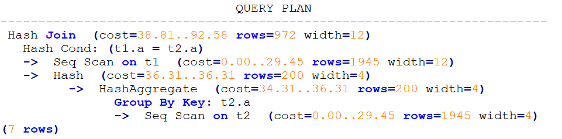
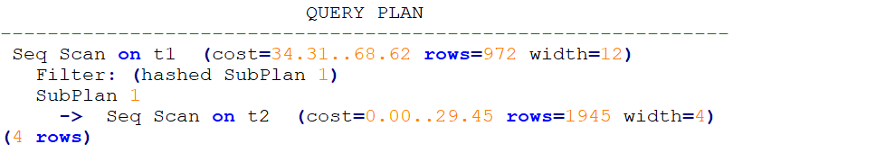

# Hint Specifying Not to Expand Subqueries<a name="EN-US_TOPIC_0000001143320483"></a>

## Function<a name="section290819468377"></a>

When the database optimizes the query logic, some subqueries can be promoted to the upper layer to avoid nested execution. However, for some subqueries that have a low selection rate and can use indexes to filter access pages, nested execution does not cause too much performance deterioration, while after the promotion, the query search scope is expanded, which may cause performance deterioration. In this case, you can use the  **no\_expand**  hint for debugging. This hint is not recommended in most cases.

## Syntax<a name="section530131664410"></a>

```
no_expand
```

## Examples<a name="section175581239572"></a>

Normal query execution:

```
explain select * from t1 where t1.a in (select t2.a from t2);
```

Plan:



After  **no\_expand**  is added:

```
explain select * from t1 where t1.a in (select /*+ no_expand*/ t2.a from t2);
```

Plan:


