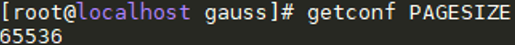

# OS Configuration<a name="EN-US_TOPIC_0289900544"></a>

1. Install the openEuler OS. For details, see  [openEuler Installation Guide](https://openeuler.org/en/docs/20.03_LTS/docs/Installation/Installation.html).
2. Change the value of  **PAGESIZE**  of the OS kernel to  **64** **KB**.
    1. Check the  **PAGESIZE**  value.

        Log in to the OS as user  **root**  and run the following command to check the  **PAGESIZE**  value:

        ```
        getconf PAGESIZE
        ```

        As shown in  [Figure 1](#en-us_topic_0283137217_en-us_topic_0263913267_fig1277156123020), the  **PAGESIZE**  value is  **64** **KB**.

        **Figure  1**  Checking the  **PAGESIZE**  value<a name="en-us_topic_0283137217_en-us_topic_0263913267_fig1277156123020"></a>  
        

    2. If the  **PAGESIZE**  value is not  **64** **KB**, you need to modify the parameters and recompile the kernel. For details, see  [https://bbs.huaweicloud.com/blogs/154313](https://bbs.huaweicloud.com/blogs/154313).

3. Disable irqbalance. irqbalance balances CPU interruptions to prevent a single CPU from being overloaded when processing interrupts.

    Log in to the OS as user  **root**  and run the following command: 

    ```
    service irqbalance stop   #Disable irqbalance.
    echo 0 > /proc/sys/kernel/numa_balancing    
    echo 'never' > /sys/kernel/mm/transparent_hugepage/enabled 
    echo 'never' > /sys/kernel/mm/transparent_hugepage/defrag 
    echo none > /sys/block/nvme*n*/queue/scheduler #Set the I/O queue scheduling mechanism for NVMe disks.
    ```
