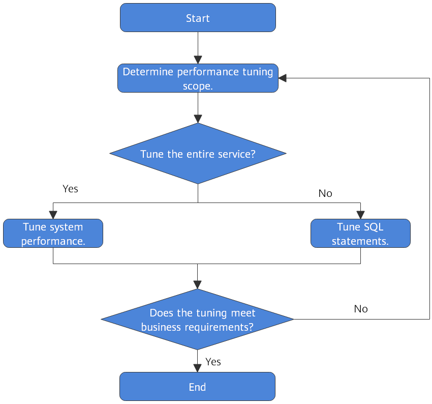

# Overview

To fine-tune openGauss performance, you need to identify performance bottlenecks, adjust key parameters, and optimize SQL statements. During performance tuning, locate and analyze performance issues based on performance elements, such as system resources, throughput, and loads to achieve required system performance.

Various factors must be considered during openGauss performance tuning. Therefore, optimization personnel must know well about knowledge, such as system software architecture, hardware and software configuration, database parameter configuration, concurrency control, query processing, and database applications.

>[!TIP]NOTICE 
>Performance tuning sometimes require openGauss restart, which may interrupt current services. Therefore, after the service goes live and when openGauss needs to be restarted, you must send the request to related management department about the operation window time for approval.

## Tuning Process

[Figure 1](#en-us_topic_0283137244_fig36820421398)  shows the procedure of performance tuning.

**Figure  1**  openGauss performance tuning  

[Table 1](#en-us_topic_0283137244_en-us_topic_0237121483_en-us_topic_0073253541_en-us_topic_0040046511_table18747316113544)  lists the details about each phase.

**Table  1**  openGauss performance tuning

<table><thead align="left"><tr id="en-us_topic_0283137244_en-us_topic_0237121483_en-us_topic_0073253541_en-us_topic_0040046511_row57564514113544"><th class="cellrowborder" valign="top" width="26%" id="mcps1.2.3.1.1">
Phase

</th>
<th class="cellrowborder" valign="top" width="74%" id="mcps1.2.3.1.2">
Description

</th>
</tr>
</thead>
<tbody><tr id="en-us_topic_0283137244_en-us_topic_0237121483_en-us_topic_0073253541_en-us_topic_0040046511_row30792195113544"><td class="cellrowborder" valign="top" width="26%" headers="mcps1.2.3.1.1 ">
<a href="determining_the_scope_of_performance_tuning.md">Determining the Scope of Performance Tuning</a>

</td>
<td class="cellrowborder" valign="top" width="74%" headers="mcps1.2.3.1.2 ">
The phase where the CPU, memory, I/O, and network resource usage of each node in openGauss are obtained to check whether these resources are fully used and whether any bottleneck exists

</td>
</tr>
<tr id="en-us_topic_0283137244_en-us_topic_0237121483_en-us_topic_0073253541_en-us_topic_0040046511_row7268277113544"><td class="cellrowborder" valign="top" width="26%" headers="mcps1.2.3.1.1 ">
<a href="optimizing_os_parameters.md">System Optimization</a>

</td>
<td class="cellrowborder" valign="top" width="74%" headers="mcps1.2.3.1.2 ">
The phase where OS and database system level optimization are performed to fully use the CPU, memory, I/O, and network resources, prevent resource conflicts, and improve the query throughput in the system

</td>
</tr>
<tr id="en-us_topic_0283137244_en-us_topic_0237121483_en-us_topic_0073253541_en-us_topic_0040046511_row23318170113544"><td class="cellrowborder" valign="top" width="26%" headers="mcps1.2.3.1.1 ">
<a href="sql_optimization.md">SQL Optimization</a>

</td>
<td class="cellrowborder" valign="top" width="74%" headers="mcps1.2.3.1.2 ">
The phase where the SQL statements used are analyzed to determine whether any optimization can be performed. Analysis of SQL statements comprises:

<ul id="en-us_topic_0283137244_en-us_topic_0237121483_en-us_topic_0073253541_en-us_topic_0040046511_ul42091895113544"><li>Generating table statistics using <strong id="b361953564512">ANALYZE</strong>: The <strong id="b361923534517">ANALYZE</strong> statement collects statistics about the database table content. Statistical results are stored in the system catalog <strong id="b1662018358452">PG_STATISTIC</strong>. The execution plan generator uses these statistics to determine which one is the most effective execution plan.</li><li>Analyzing the execution plan: The <strong id="b898034720482">EXPLAIN</strong> statement displays the execution plan of SQL statements, and the <strong id="b298724715488">EXPLAIN PERFORMANCE</strong> statement displays the execution time of each operator in SQL statements.</li><li>Identifying the root causes of issues: Identifies possible causes by analyzing the execution plan and performs specific optimization by modifying database-level SQL optimization parameters.</li><li>Compiling better SQL statements: Compiles better SQL statements in the scenarios, such as cache of intermediate and temporary data for complex queries, result set cache, and result set combination.</li></ul>
</td>
</tr>
</tbody>
</table>
