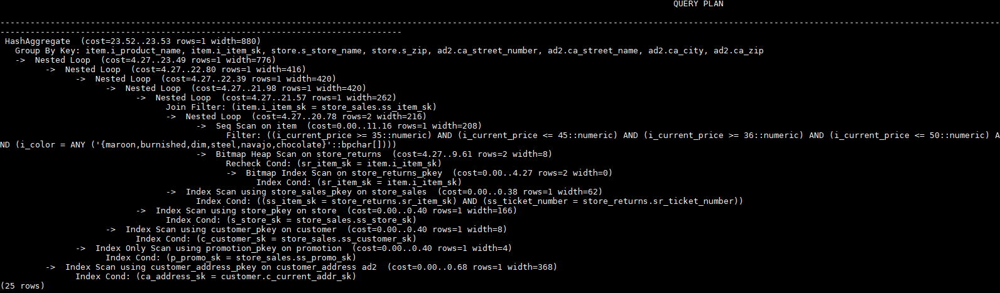

# Plan Hint Optimization<a name="EN-US_TOPIC_0289900090"></a>

In plan hints, you can specify a join order, join and scan operations, and the number of rows in a result to tune an execution plan, improving query performance.

## Function<a name="en-us_topic_0283137554_en-us_topic_0237121532_section54351718142011"></a>

The hint syntax must follow immediately after a  **SELECT**  keyword and is written in the following format:

```
/*+ <plan hint>*/
```

You can specify multiple hints for a query plan and separate them by spaces. A hint specified for a query plan does not apply to its subquery plans. To specify a hint for a subquery, add the hint following the  **SELECT**  of this subquery.

Example:

```
select /*+ <plan_hint1> <plan_hint2> */ * from t1, (select /*+ <plan_hint3> */ * from t2) where 1=1;
```

In the preceding command, <_plan\_hint1_\> and <_plan\_hint2_\> are the hints of a query, and <_plan\_hint3_\> is the hint of its subquery.

>[!TIP]NOTICE 
>If a hint is specified in the  **CREATE VIEW**  statement, the hint will be applied each time this view is used.
>If the random plan function is enabled \(**plan\_mode\_seed**  is set to a value other than 0\), the specified hint will not be used.

## Scope<a name="en-us_topic_0283137554_en-us_topic_0237121532_section1748920122313"></a>

Currently, the following hints are supported:

- Join order hints \(**leading**\)
- Join operation hints, excluding the  **semi join**,  **anti join**, and  **unique plan**  hints
- Rows hints
- Scan operation hints, supporting only  **tablescan**,  **indexscan**, and  **indexonlyscan**
- Sublink name hints

## Precautions<a name="en-us_topic_0283137554_en-us_topic_0237121532_section19195171972812"></a>

Hints do not support  **Agg**,  **Sort**,  **Setop**, or  **Subplan**.

## Examples<a name="en-us_topic_0283137554_en-us_topic_0237121532_section671421102912"></a>

The following is the original plan and is used for comparing with the optimized ones:

```
create table store
(
    s_store_sk                integer               not null,
    s_store_id                char(16)              not null,
    s_rec_start_date          date                          ,
    s_rec_end_date            date                          ,
    s_closed_date_sk          integer                       ,
    s_store_name              varchar(50)                   ,
    s_number_employees        integer                       ,
    s_floor_space             integer                       ,
    s_hours                   char(20)                      ,
    s_manager                 varchar(40)                   ,
    s_market_id               integer                       ,
    s_geography_class         varchar(100)                  ,
    s_market_desc             varchar(100)                  ,
    s_market_manager          varchar(40)                   ,
    s_division_id             integer                       ,
    s_division_name           varchar(50)                   ,
    s_company_id              integer                       ,
    s_company_name            varchar(50)                   ,
    s_street_number           varchar(10)                   ,
    s_street_name             varchar(60)                   ,
    s_street_type             char(15)                      ,
    s_suite_number            char(10)                      ,
    s_city                    varchar(60)                   ,
    s_county                  varchar(30)                   ,
    s_state                   char(2)                       ,
    s_zip                     char(10)                      ,
    s_country                 varchar(20)                   ,
    s_gmt_offset              decimal(5,2)                  ,
    s_tax_precentage          decimal(5,2)                  ,
    primary key (s_store_sk)
);
create table store_sales
(
    ss_sold_date_sk           integer                       ,
    ss_sold_time_sk           integer                       ,
    ss_item_sk                integer               not null,
    ss_customer_sk            integer                       ,
    ss_cdemo_sk               integer                       ,
    ss_hdemo_sk               integer                       ,
    ss_addr_sk                integer                       ,
    ss_store_sk               integer                       ,
    ss_promo_sk               integer                       ,
    ss_ticket_number          integer               not null,
    ss_quantity               integer                       ,
    ss_wholesale_cost         decimal(7,2)                  ,
    ss_list_price             decimal(7,2)                  ,
    ss_sales_price            decimal(7,2)                  ,
    ss_ext_discount_amt       decimal(7,2)                  ,
    ss_ext_sales_price        decimal(7,2)                  ,
    ss_ext_wholesale_cost     decimal(7,2)                  ,
    ss_ext_list_price         decimal(7,2)                  ,
    ss_ext_tax                decimal(7,2)                  ,
    ss_coupon_amt             decimal(7,2)                  ,
    ss_net_paid               decimal(7,2)                  ,
    ss_net_paid_inc_tax       decimal(7,2)                  ,
    ss_net_profit             decimal(7,2)                  ,
    primary key (ss_item_sk, ss_ticket_number)
);
create table store_returns
(
    sr_returned_date_sk       integer                       ,
    sr_return_time_sk         integer                       ,
    sr_item_sk                integer               not null,
    sr_customer_sk            integer                       ,
    sr_cdemo_sk               integer                       ,
    sr_hdemo_sk               integer                       ,
    sr_addr_sk                integer                       ,
    sr_store_sk               integer                       ,
    sr_reason_sk              integer                       ,
    sr_ticket_number          integer               not null,
    sr_return_quantity        integer                       ,
    sr_return_amt             decimal(7,2)                  ,
    sr_return_tax             decimal(7,2)                  ,
    sr_return_amt_inc_tax     decimal(7,2)                  ,
    sr_fee                    decimal(7,2)                  ,
    sr_return_ship_cost       decimal(7,2)                  ,
    sr_refunded_cash          decimal(7,2)                  ,
    sr_reversed_charge        decimal(7,2)                  ,
    sr_store_credit           decimal(7,2)                  ,
    sr_net_loss               decimal(7,2)                  ,
    primary key (sr_item_sk, sr_ticket_number)
);
create table customer
(
    c_customer_sk             integer               not null,
    c_customer_id             char(16)              not null,
    c_current_cdemo_sk        integer                       ,
    c_current_hdemo_sk        integer                       ,
    c_current_addr_sk         integer                       ,
    c_first_shipto_date_sk    integer                       ,
    c_first_sales_date_sk     integer                       ,
    c_salutation              char(10)                      ,
    c_first_name              char(20)                      ,
    c_last_name               char(30)                      ,
    c_preferred_cust_flag     char(1)                       ,
    c_birth_day               integer                       ,
    c_birth_month             integer                       ,
    c_birth_year              integer                       ,
    c_birth_country           varchar(20)                   ,
    c_login                   char(13)                      ,
    c_email_address           char(50)                      ,
    c_last_review_date        char(10)                      ,
    primary key (c_customer_sk)
);
create table promotion
(
    p_promo_sk                integer               not null,
    p_promo_id                char(16)              not null,
    p_start_date_sk           integer                       ,
    p_end_date_sk             integer                       ,
    p_item_sk                 integer                       ,
    p_cost                    decimal(15,2)                 ,
    p_response_target         integer                       ,
    p_promo_name              char(50)                      ,
    p_channel_dmail           char(1)                       ,
    p_channel_email           char(1)                       ,
    p_channel_catalog         char(1)                       ,
    p_channel_tv              char(1)                       ,
    p_channel_radio           char(1)                       ,
    p_channel_press           char(1)                       ,
    p_channel_event           char(1)                       ,
    p_channel_demo            char(1)                       ,
    p_channel_details         varchar(100)                  ,
    p_purpose                 char(15)                      ,
    p_discount_active         char(1)                       ,
    primary key (p_promo_sk)
);
create table customer_address
(
    ca_address_sk             integer               not null,
    ca_address_id             char(16)              not null,
    ca_street_number          char(10)                      ,
    ca_street_name            varchar(60)                   ,
    ca_street_type            char(15)                      ,
    ca_suite_number           char(10)                      ,
    ca_city                   varchar(60)                   ,
    ca_county                 varchar(30)                   ,
    ca_state                  char(2)                       ,
    ca_zip                    char(10)                      ,
    ca_country                varchar(20)                   ,
    ca_gmt_offset             decimal(5,2)                  ,
    ca_location_type          char(20)                      ,
    primary key (ca_address_sk)
);
create table item
(
    i_item_sk                 integer               not null,
    i_item_id                 char(16)              not null,
    i_rec_start_date          date                          ,
    i_rec_end_date            date                          ,
    i_item_desc               varchar(200)                  ,
    i_current_price           decimal(7,2)                  ,
    i_wholesale_cost          decimal(7,2)                  ,
    i_brand_id                integer                       ,
    i_brand                   char(50)                      ,
    i_class_id                integer                       ,
    i_class                   char(50)                      ,
    i_category_id             integer                       ,
    i_category                char(50)                      ,
    i_manufact_id             integer                       ,
    i_manufact                char(50)                      ,
    i_size                    char(20)                      ,
    i_formulation             char(20)                      ,
    i_color                   char(20)                      ,
    i_units                   char(10)                      ,
    i_container               char(10)                      ,
    i_manager_id              integer                       ,
    i_product_name            char(50)                      ,
    primary key (i_item_sk)
);
explain
select i_product_name product_name
,i_item_sk item_sk
,s_store_name store_name
,s_zip store_zip
,ad2.ca_street_number c_street_number
,ad2.ca_street_name c_street_name
,ad2.ca_city c_city
,ad2.ca_zip c_zip
,count(*) cnt
,sum(ss_wholesale_cost) s1
,sum(ss_list_price) s2
,sum(ss_coupon_amt) s3
FROM   store_sales
,store_returns
,store
,customer
,promotion
,customer_address ad2
,item
WHERE  ss_store_sk = s_store_sk AND
ss_customer_sk = c_customer_sk AND
ss_item_sk = i_item_sk and
ss_item_sk = sr_item_sk and
ss_ticket_number = sr_ticket_number and
c_current_addr_sk = ad2.ca_address_sk and
ss_promo_sk = p_promo_sk and
i_color in ('maroon','burnished','dim','steel','navajo','chocolate') and
i_current_price between 35 and 35 + 10 and
i_current_price between 35 + 1 and 35 + 15
group by i_product_name
,i_item_sk
,s_store_name
,s_zip
,ad2.ca_street_number
,ad2.ca_street_name
,ad2.ca_city
,ad2.ca_zip
;
```


