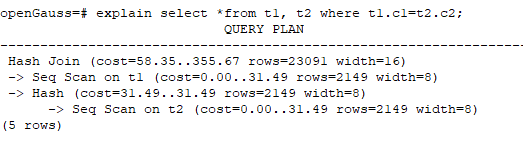
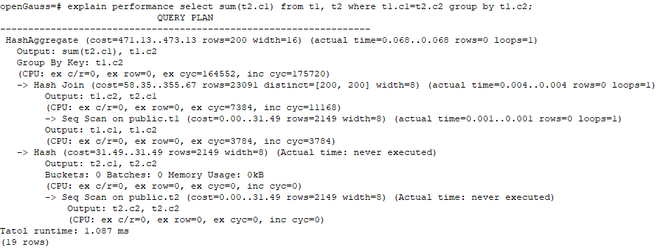

# Introduction to the SQL Execution Plan<a name="EN-US_TOPIC_0289900086"></a>

## Overview<a name="EN-US_TOPIC_0289900579"></a>

The SQL execution plan is a node tree, which displays detailed procedure when openGauss runs an SQL statement. A database operator indicates one step.

You can run the  **EXPLAIN**  command to view the execution plan generated for each query by an optimizer. The output of  **EXPLAIN**  has one row for each execution node, showing the basic node type and the cost estimation that the optimizer made for the execution of this node, as shown in  [Figure 1](#en-us_topic_0283137711_en-us_topic_0237121510_en-us_topic_0073548187_en-us_topic_0040046537_fig27100601101634).

**Figure  1**  SQL execution plan example<a name="en-us_topic_0283137711_en-us_topic_0237121510_en-us_topic_0073548187_en-us_topic_0040046537_fig27100601101634"></a>  


- Nodes at the bottom level are scan nodes. They scan tables and return raw rows. The types of scan nodes \(sequential scans and index scans\) vary depending on the table access methods. Objects scanned by the bottom layer nodes may not be row-store data \(not directly read from a table\), such as  **VALUES**  clauses and functions that return rows, which have their own types of scan nodes.
- If the query requires join, aggregation, sorting, or other operations on the raw rows, there will be other nodes above the scan nodes to perform these operations. In addition, there is more than one way to perform these operations, so different types of execution nodes may be displayed here.
- The first row \(the upper-layer node\) estimates the total execution cost of the execution plan. Such an estimate indicates the value that the optimizer tries to minimize.

### Execution Plan Information<a name="en-us_topic_0283137711_en-us_topic_0237121510_en-us_topic_0073548187_section1708958594911"></a>

In addition to setting different display formats for an execution plan, you can use different  **EXPLAIN**  syntax to display execution plan information in detail. The following lists the common  **EXPLAIN**  syntax. For details about more  **EXPLAIN**  syntax, see  [EXPLAIN](https://docs.opengauss.org/en/docs/latest-lite/sql_reference/explain.html).

- EXPLAIN  _statement_: only generates an execution plan and does not execute. The  _statement_  indicates SQL statements.
- EXPLAIN ANALYZE  _statement_: generates and executes an execution plan, and displays the execution summary. Then actual execution time statistics are added to the display, including the total elapsed time expended within each plan node \(in milliseconds\) and the total number of rows it actually returned.
- EXPLAIN PERFORMANCE  _statement_: generates and executes the execution plan, and displays all execution information.

To measure the run time cost of each node in the execution plan, the current execution of  **EXPLAIN ANALYZE**  or  **EXPLAIN PERFORMANCE**  adds profiling overhead to query execution. Running  **EXPLAIN ANALYZE**  or  **EXPLAIN PERFORMANCE**  on a query sometimes takes longer time than executing the query normally. The amount of overhead depends on the nature of the query, as well as the platform being used.

Therefore, if an SQL statement is not finished after being running for a long time, run the  **EXPLAIN**  statement to view the execution plan and then locate the fault. If the SQL statement has been properly executed, run the  **EXPLAIN ANALYZE**  or  **EXPLAIN PERFORMANCE**  statement to check the execution plan and information to locate the fault.

The  **EXPLAIN PERFORMANCE**  lightweight execution is consistent with  **EXPLAIN PERFORMANCE**  but greatly reduces the time spent on performance analysis.

## Description<a name="EN-US_TOPIC_0289899920"></a>

As described in  [Overview](#overview),  **EXPLAIN**  displays the execution plan, but will not actually run SQL statements.  **EXPLAIN ANALYZE**  and  **EXPLAIN PERFORMANCE**  both will actually run SQL statements and return the execution information. This section describes the execution plan and execution information in detail.

### Execution Plans<a name="en-us_topic_0283137659_en-us_topic_0237121511_en-us_topic_0073548188_section5369140493714"></a>

The following SQL statement is used as an example:

```
SELECT * FROM t1, t2 WHERE t1.c1 = t2.c2;
```

Run the  **EXPLAIN**  command and the output is as follows:



**Interpretation of the execution plan level \(vertical\)**:

1. Layer 1:  **Seq Scan on t2**

    The table scan operator scans the table  **t2**  using  **Seq Scan**. At this layer, data in the table  **t2**  is read from a buffer or disk, and then transferred to the upper-layer node for calculation.

2. Layer 2:  **Hash**

    Hash operator. It is used to calculate the hash value of the operator transferred from the lower layer for subsequent hash join operations.

3. Layer 3:  **Seq Scan on t1**

    The table scan operator scans the table  **t1**  using  **Seq Scan**. At this layer, data in the table  **t1**  is read from a buffer or disk, and then transferred to the upper-layer node for hash join calculation.

4. Layer 4:  **Hash Join**

    Join operator. It is used to join data in the  **t1**  and  **t2**  tables using the hash join method and output the result data.

**Keywords in the execution plan**:

1. Table access modes
    - Seq Scan

        Scans all rows of the table in sequence.

    - Index Scan

        The optimizer uses a two-step plan: the child plan node visits an index to find the locations of rows matching the index condition, and then the upper plan node actually fetches those rows from the table itself. Fetching rows separately is much more expensive than reading them sequentially, but because not all pages of the table have to be visited, this is still cheaper than a sequential scan. The upper-layer planning node sorts index-identified rows based on their physical locations before reading them. This minimizes the independent capturing overhead.

        If there are separate indexes on multiple columns referenced in  **WHERE**, the optimizer might choose to use an  **AND**  or  **OR**  combination of the indexes. However, this requires the visiting of both indexes, so it is not necessarily a win compared to using just one index and treating the other condition as a filter.

        The following index scans featured with different sorting mechanisms are involved:

        - Bitmap index scan

            Fetches data pages using a bitmap.

        - Index scan using index\_name

            Fetches table rows in index order, which makes them even more expensive to read. However, there are so few rows that the extra cost of sorting the row locations is unnecessary. This plan type is used mainly for queries fetching just a single row and queries having an  **ORDER BY**  condition that matches the index order, because no extra sorting step is needed to satisfy  **ORDER BY**.

2. Table connection modes
    - Nested Loop

        A nested loop is used for queries that have a smaller data set connected. In a nested loop join, the foreign table drives the internal table and each row returned from the foreign table should have a matching row in the internal table. The returned result set of all queries should be less than 10,000. The table that returns a smaller subset will work as a foreign table, and indexes are recommended for connection columns of the internal table.

    - \(Sonic\) Hash Join

        A hash join is used for large tables. The optimizer uses a hash join, in which rows of one table are entered into an in-memory hash table, after which the other table is scanned and the hash table is probed for matches to each row. Sonic and non-Sonic hash joins differ in their hash table structures, which do not affect the execution result set.

    - Merge Join

        In most cases, the execution performance of a merge join is lower than that of a hash join. However, if the source data has been pre-sorted and no more sorting is needed during the merge join, its performance excels.

3. Operators
    - sort

        Sorts the result set.

    - filter

        The  **EXPLAIN**  output shows the  **WHERE**  clause being applied as a  **Filter**  condition attached to the  **Seq Scan**  plan node. This means that the plan node checks the condition for each row it scans, and returns only the ones that meet the condition. The estimated number of output rows has been reduced because of the  **WHERE**  clause. However, the scan will still have to visit all 10,000 rows, as a result, the cost is not decreased. It increases a bit \(by 10,000 x  **cpu\_operator\_cost**\) to reflect the extra CPU time spent on checking the  **WHERE**  condition.

    - LIMIT

        Limits the number of output execution results. If a  **LIMIT**  condition is added, not all rows are retrieved.

### Execution Information<a name="en-us_topic_0283137659_en-us_topic_0237121511_en-us_topic_0073548188_section665450193752"></a>

The following SQL statement is used as an example:

```
select sum(t2.c1) from t1,t2 where t1.c1=t2.c2 group by t1.c2;
```

The output of running  **EXPLAIN PERFORMANCE**  is as follows:


