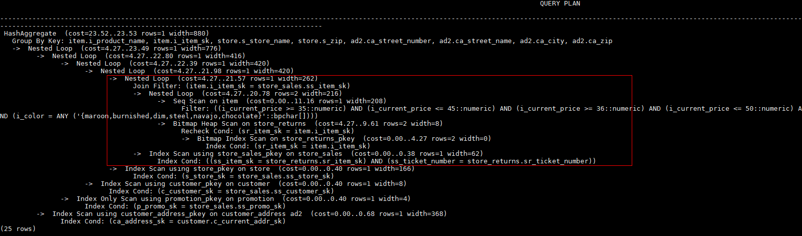

# Join方式的Hint<a name="ZH-CN_TOPIC_0289899985"></a>

## 功能描述<a name="zh-cn_topic_0283137375_zh-cn_topic_0237121534_section290819468377"></a>

指明Join使用的方法，可以为Nested Loop，Hash Join和Merge Join。

## 语法格式<a name="zh-cn_topic_0283137375_zh-cn_topic_0237121534_section3654114133815"></a>

```
[no] nestloop|hashjoin|mergejoin(table_list)
```

## 参数说明<a name="zh-cn_topic_0283137375_zh-cn_topic_0237121534_section35948678143011"></a>

- **no**表示hint的join方式不使用。

- **table\_list**为表示hint表集合的字符串，该字符串中的表与[join\_table\_list](join_order_hints.md#zh-cn_topic_0283136909_zh-cn_topic_0237121533_section1280444714345)相同，只是中间不允许出现括号指定join的优先级。

例如：

no nestloop\(t1 t2 t3\)表示：生成t1，t2，t3三表连接计划时，不使用nestloop。三表连接计划可能是t2 t3先join，再跟t1 join，或t1 t2先join，再跟t3 join。此hint只hint最后一次join的join方式，对于两表连接的方法不hint。如果需要，可以单独指定，例如：任意表均不允许nestloop连接，且希望t2 t3先join，则增加hint：no nestloop\(t2 t3\)。

## 示例<a name="zh-cn_topic_0283137375_zh-cn_topic_0237121534_section1127715590585"></a>

对[示例](plan_hint_optimization_overview.md#zh-cn_topic_0283137554_zh-cn_topic_0237121532_section671421102912)中原语句使用如下hint:

```
explain
select /*+ nestloop(store_sales store_returns item) */ i_product_name product_name ...
```

该hint表示：生成store\_sales，store\_returns和item三表的结果集时，最后的两表关联使用nestloop。生成计划如下所示：



>[!TIP]须知
>
>在mysql兼容性下，当查询的列的类型为set时，禁用mergejoin计划，即使用hint提示走mergejoin也无效。
