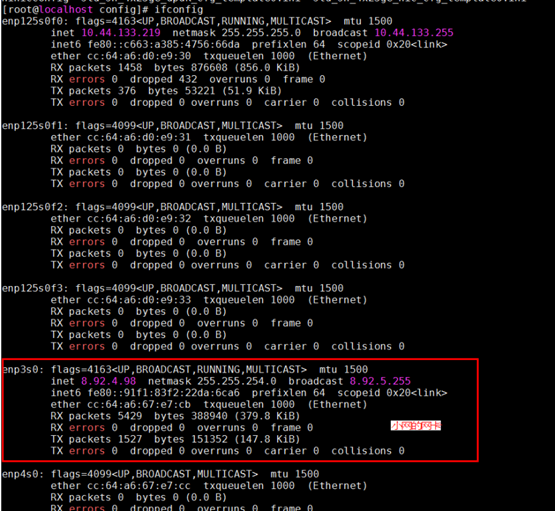
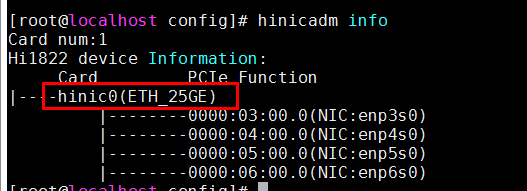

# 网络配置<a name="ZH-CN_TOPIC_0289900835"></a>

## 网卡多中断队列设置<a name="ZH-CN_TOPIC_0289900555"></a>

针对泰山单核能力不足，核数又较多的情况，产品需要在服务器端，客户端均使用网卡多中断队列（默认16队列）的规格，网卡至少为千兆网卡，客户端与服务端光纤互连。

当前推荐的配置为：

- 服务器端网卡配置16中断队列。
- 客户端网卡配置48中断队列。

### 操作步骤<a name="zh-cn_topic_0283137185_zh-cn_topic_0263913270_section38551240"></a>

1. 下载[IN500\_solution\_5.1.0.SPC401.zip](https://support.huawei.com/enterprise/zh/software/250968786-ESW2000173161)。
2. 解压IN500\_solution\_5.1.0.SPC401.zip，进入tools\\linux\_arm目录。
3. 解压nic - ZIP ，在root用户下安装hinicadm。

    

4. 确定当前连接的物理端口对应哪个网卡，不同硬件平台的网口和网卡名有差别。以当前举例的服务器为例，当前使用enp3s0的小网网口，属于hinic0网卡。

    

    

5. 进入config目录， 利用配置工具hinicconfig配置中断队列FW配置文件。根据实际需要进行修改。
    - 64队列配置文件：std\_sh\_4x25ge\_dpdk\_cfg\_template0.ini；
    - 16队列配置文件：std\_sh\_4x25ge\_nic\_cfg\_template0.ini；

    1. 修改系统支持的最大中断队列数。
        1. 对hinic0卡配置为不同队列数（默认16队列，可以按需要调整）

            ```
            ./hinicconfig hinic0 -f std_sh_4x25ge_dpdk_cfg_template0.ini
            ```

        2. 执行命令**reboot**重启操作系统使生效。
        3. 执行命令ethtool -l enp3s0查看是否修改成功，比如下图表示修改为64。

            

    2. 修改当前使用的队列数。

        执行如下命令，将网卡的中断队列调整为48个。

        ```
        ethtool -L enp3s0 combined 48
        ```

        >[!NOTE]说明
        >不同平台，不同应用的优化值可能不同，当前128核的平台，服务器端调优值为16，客户端调优值为48。

## 中断调优<a name="ZH-CN_TOPIC_0289900743"></a>

1. 在openGauss数据库CPU占比90%以上的情况下，CPU成为瓶颈，需要开启offloading，将网络分片offloading到网卡上。

    执行如下命令，开启tso，lro，gro，gso特性。

    ```
    ethtool –K enp3s0 tso on 
    ethtool –K enp3s0 lro on 
    ethtool –K enp3s0 gro on 
    ethtool –K enp3s0 gso on
    ```

2. 执行如下命令，将网卡中断队列与CPU核进行绑定。

    ```
    sh bind_net_irq.sh  16
    ```

## 网卡固件确认与更新<a name="ZH-CN_TOPIC_0289900065"></a>

1. 执行命令**ethtool -i enp3s0**确认当前环境的网卡固件版本是否为2.4.1.0，如果不是2.4.1.0，建议更换为2.4.1.0，以获得更佳性能。

    ```
    # ethtool -i enp3s0 
    driver: hinic                                 
    version: 2.3.2.11                             
    firmware-version: 2.4.1.0                     
    expansion-rom-version:                        
    bus-info: 0000:03:00.0                       
    ```

2. **更新网卡固件。**
    1. 在..\\firmware\\update\_bin路径下，获取cfg\_data\_nic\_prd\_1h\_4x25G.bin文件。
    2. 使用root用户执行如下命令更新网卡固件。

        ```
        hinicadm updatefw -i <物理网卡设备名> -f <固件文件路径>
        ```

        涉及的参数说明如下：

        - “物理网卡设备名”为网卡在系统中的名称，例如“hinic0”表示第一张网卡，“hinic1”表示第二张网卡，查找方法参见前文[网卡多中断队列设置](#网卡多中断队列设置)。
        - “固件文件路径”为cfg\_data\_nic\_prd\_1h\_4x25G.bin文件的路径。

        例如：

        ```
        #  
        Please do not remove driver or network device  
        Loading...  
        [>>>>>>>>>>>>>>>>>>>>>>>>>>>>>>>>>>>>>>>>>>>>>>>>>>]  [100%] [\]  
        Loading firmware image succeed.  
        Please reboot OS to take firmware effect.
        ```

    3. 重启服务器，再确认网卡固件版本成功更新为2.4.1.0。

        ```
        # ethtool -i enp3s0 
        driver: hinic                                 
        version: 2.3.2.11                             
        firmware-version: 2.4.1.0                     
        expansion-rom-version:                        
        bus-info: 0000:03:00.0    
        ```
