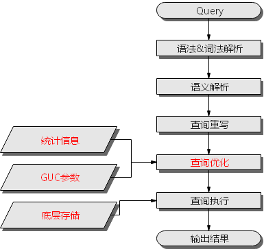

# Query执行流程<a name="ZH-CN_TOPIC_0289900900"></a>

SQL引擎从接受SQL语句到执行SQL语句需要经历的步骤如[图1](#zh-cn_topic_0283137202_fig1295418215491)和[表1](#zh-cn_topic_0283137202_zh-cn_topic_0237121508_zh-cn_topic_0073320637_zh-cn_topic_0071158048_table11198623152535)所示。其中，红色字体部分为DBA可以介入实施调优的环节。

**图 1**  SQL引擎执行查询类SQL语句的流程<a name="zh-cn_topic_0283137202_fig1295418215491"></a>  


**表 1**  SQL引擎执行查询类SQL语句的步骤说明

<a name="zh-cn_topic_0283137202_zh-cn_topic_0237121508_zh-cn_topic_0073320637_zh-cn_topic_0071158048_table11198623152535"></a>
<table><thead align="left"><tr id="zh-cn_topic_0283137202_zh-cn_topic_0237121508_zh-cn_topic_0073320637_zh-cn_topic_0071158048_row59395253152535"><th class="cellrowborder" valign="top" width="27.400000000000002%" id="mcps1.2.3.1.1"><p id="zh-cn_topic_0283137202_zh-cn_topic_0237121508_zh-cn_topic_0073320637_zh-cn_topic_0071158048_p13922500152535"><a name="zh-cn_topic_0283137202_zh-cn_topic_0237121508_zh-cn_topic_0073320637_zh-cn_topic_0071158048_p13922500152535"></a><a name="zh-cn_topic_0283137202_zh-cn_topic_0237121508_zh-cn_topic_0073320637_zh-cn_topic_0071158048_p13922500152535"></a>步骤</p>
</th>
<th class="cellrowborder" valign="top" width="72.6%" id="mcps1.2.3.1.2"><p id="zh-cn_topic_0283137202_zh-cn_topic_0237121508_zh-cn_topic_0073320637_zh-cn_topic_0071158048_p53980687152535"><a name="zh-cn_topic_0283137202_zh-cn_topic_0237121508_zh-cn_topic_0073320637_zh-cn_topic_0071158048_p53980687152535"></a><a name="zh-cn_topic_0283137202_zh-cn_topic_0237121508_zh-cn_topic_0073320637_zh-cn_topic_0071158048_p53980687152535"></a>说明</p>
</th>
</tr>
</thead>
<tbody><tr id="zh-cn_topic_0283137202_zh-cn_topic_0237121508_zh-cn_topic_0073320637_zh-cn_topic_0071158048_row16064139152535"><td class="cellrowborder" valign="top" width="27.400000000000002%" headers="mcps1.2.3.1.1 "><p id="zh-cn_topic_0283137202_zh-cn_topic_0237121508_zh-cn_topic_0073320637_zh-cn_topic_0071158048_p26126919152535"><a name="zh-cn_topic_0283137202_zh-cn_topic_0237121508_zh-cn_topic_0073320637_zh-cn_topic_0071158048_p26126919152535"></a><a name="zh-cn_topic_0283137202_zh-cn_topic_0237121508_zh-cn_topic_0073320637_zh-cn_topic_0071158048_p26126919152535"></a>1、语法&amp;词法解析</p>
</td>
<td class="cellrowborder" valign="top" width="72.6%" headers="mcps1.2.3.1.2 "><p id="zh-cn_topic_0283137202_zh-cn_topic_0237121508_zh-cn_topic_0073320637_zh-cn_topic_0071158048_p35905662152535"><a name="zh-cn_topic_0283137202_zh-cn_topic_0237121508_zh-cn_topic_0073320637_zh-cn_topic_0071158048_p35905662152535"></a><a name="zh-cn_topic_0283137202_zh-cn_topic_0237121508_zh-cn_topic_0073320637_zh-cn_topic_0071158048_p35905662152535"></a>按照约定的SQL语句规则，把输入的SQL语句从字符串转化为格式化结构(Stmt)。</p>
</td>
</tr>
<tr id="zh-cn_topic_0283137202_zh-cn_topic_0237121508_zh-cn_topic_0073320637_zh-cn_topic_0071158048_row54715508152535"><td class="cellrowborder" valign="top" width="27.400000000000002%" headers="mcps1.2.3.1.1 "><p id="zh-cn_topic_0283137202_zh-cn_topic_0237121508_zh-cn_topic_0073320637_zh-cn_topic_0071158048_p2771186152535"><a name="zh-cn_topic_0283137202_zh-cn_topic_0237121508_zh-cn_topic_0073320637_zh-cn_topic_0071158048_p2771186152535"></a><a name="zh-cn_topic_0283137202_zh-cn_topic_0237121508_zh-cn_topic_0073320637_zh-cn_topic_0071158048_p2771186152535"></a>2、语义解析</p>
</td>
<td class="cellrowborder" valign="top" width="72.6%" headers="mcps1.2.3.1.2 "><p id="zh-cn_topic_0283137202_zh-cn_topic_0237121508_zh-cn_topic_0073320637_zh-cn_topic_0071158048_p23139488152535"><a name="zh-cn_topic_0283137202_zh-cn_topic_0237121508_zh-cn_topic_0073320637_zh-cn_topic_0071158048_p23139488152535"></a><a name="zh-cn_topic_0283137202_zh-cn_topic_0237121508_zh-cn_topic_0073320637_zh-cn_topic_0071158048_p23139488152535"></a>将“语法&amp;词法解析”输出的格式化结构转化为数据库可以识别的对象。</p>
</td>
</tr>
<tr id="zh-cn_topic_0283137202_zh-cn_topic_0237121508_zh-cn_topic_0073320637_zh-cn_topic_0071158048_row6928800152535"><td class="cellrowborder" valign="top" width="27.400000000000002%" headers="mcps1.2.3.1.1 "><p id="zh-cn_topic_0283137202_zh-cn_topic_0237121508_zh-cn_topic_0073320637_zh-cn_topic_0071158048_p24361946152535"><a name="zh-cn_topic_0283137202_zh-cn_topic_0237121508_zh-cn_topic_0073320637_zh-cn_topic_0071158048_p24361946152535"></a><a name="zh-cn_topic_0283137202_zh-cn_topic_0237121508_zh-cn_topic_0073320637_zh-cn_topic_0071158048_p24361946152535"></a>3、查询重写</p>
</td>
<td class="cellrowborder" valign="top" width="72.6%" headers="mcps1.2.3.1.2 "><p id="zh-cn_topic_0283137202_zh-cn_topic_0237121508_zh-cn_topic_0073320637_zh-cn_topic_0071158048_p27160600152535"><a name="zh-cn_topic_0283137202_zh-cn_topic_0237121508_zh-cn_topic_0073320637_zh-cn_topic_0071158048_p27160600152535"></a><a name="zh-cn_topic_0283137202_zh-cn_topic_0237121508_zh-cn_topic_0073320637_zh-cn_topic_0071158048_p27160600152535"></a>根据规则把“语义解析”的输出等价转化为执行上更为优化的结构。</p>
</td>
</tr>
<tr id="zh-cn_topic_0283137202_zh-cn_topic_0237121508_zh-cn_topic_0073320637_zh-cn_topic_0071158048_row43118812152535"><td class="cellrowborder" valign="top" width="27.400000000000002%" headers="mcps1.2.3.1.1 "><p id="zh-cn_topic_0283137202_zh-cn_topic_0237121508_zh-cn_topic_0073320637_zh-cn_topic_0071158048_p2962908152535"><a name="zh-cn_topic_0283137202_zh-cn_topic_0237121508_zh-cn_topic_0073320637_zh-cn_topic_0071158048_p2962908152535"></a><a name="zh-cn_topic_0283137202_zh-cn_topic_0237121508_zh-cn_topic_0073320637_zh-cn_topic_0071158048_p2962908152535"></a>4、查询优化</p>
</td>
<td class="cellrowborder" valign="top" width="72.6%" headers="mcps1.2.3.1.2 "><p id="zh-cn_topic_0283137202_zh-cn_topic_0237121508_zh-cn_topic_0073320637_zh-cn_topic_0071158048_p38669013152535"><a name="zh-cn_topic_0283137202_zh-cn_topic_0237121508_zh-cn_topic_0073320637_zh-cn_topic_0071158048_p38669013152535"></a><a name="zh-cn_topic_0283137202_zh-cn_topic_0237121508_zh-cn_topic_0073320637_zh-cn_topic_0071158048_p38669013152535"></a>根据“查询重写”的输出和数据库内部的统计信息规划SQL语句具体的执行方式，也就是执行计划。统计信息和GUC参数对查询优化（执行计划）的影响，请参见<a href="#zh-cn_topic_0283137202_zh-cn_topic_0237121508_zh-cn_topic_0073320637_zh-cn_topic_0071158048_section4423891162533">调优手段之统计信息</a>和<a href="#zh-cn_topic_0283137202_zh-cn_topic_0237121508_zh-cn_topic_0073320637_zh-cn_topic_0071158048_section31995703163247">调优手段之GUC参数</a>。</p>
</td>
</tr>
<tr id="zh-cn_topic_0283137202_zh-cn_topic_0237121508_zh-cn_topic_0073320637_zh-cn_topic_0071158048_row12476798152535"><td class="cellrowborder" valign="top" width="27.400000000000002%" headers="mcps1.2.3.1.1 "><p id="zh-cn_topic_0283137202_zh-cn_topic_0237121508_zh-cn_topic_0073320637_zh-cn_topic_0071158048_p3987678152535"><a name="zh-cn_topic_0283137202_zh-cn_topic_0237121508_zh-cn_topic_0073320637_zh-cn_topic_0071158048_p3987678152535"></a><a name="zh-cn_topic_0283137202_zh-cn_topic_0237121508_zh-cn_topic_0073320637_zh-cn_topic_0071158048_p3987678152535"></a>5、查询执行</p>
</td>
<td class="cellrowborder" valign="top" width="72.6%" headers="mcps1.2.3.1.2 "><p id="zh-cn_topic_0283137202_zh-cn_topic_0237121508_zh-cn_topic_0073320637_zh-cn_topic_0071158048_p54566474152535"><a name="zh-cn_topic_0283137202_zh-cn_topic_0237121508_zh-cn_topic_0073320637_zh-cn_topic_0071158048_p54566474152535"></a><a name="zh-cn_topic_0283137202_zh-cn_topic_0237121508_zh-cn_topic_0073320637_zh-cn_topic_0071158048_p54566474152535"></a>根据“查询优化”规划的执行路径执行SQL查询语句。底层存储方式的选择合理性，将影响查询执行效率。详见<a href="#zh-cn_topic_0283137202_zh-cn_topic_0237121508_zh-cn_topic_0073320637_zh-cn_topic_0071158048_section46729206162627">调优手段之底层存储</a>。</p>
</td>
</tr>
</tbody>
</table>

## 调优手段之统计信息<a name="zh-cn_topic_0283137202_zh-cn_topic_0237121508_zh-cn_topic_0073320637_zh-cn_topic_0071158048_section4423891162533"></a>

openGauss优化器是典型的基于代价的优化 \(Cost-Based Optimization，简称CBO\)。在这种优化器模型下，数据库根据表的元组数、字段宽度、NULL记录比率、distinct值、MCV值、HB值等表的特征值，以及一定的代价计算模型，计算出每一个执行步骤的不同执行方式的输出元组数和执行代价\(cost\)，进而选出整体执行代价最小/首元组返回代价最小的执行方式进行执行。这些特征值就是统计信息。从上面描述可以看出统计信息是查询优化的核心输入，准确的统计信息将帮助规划器选择最合适的查询规划，一般来说我们通过analyze语法收集整个表或者表的若干个字段的统计信息，周期性地运行ANALYZE，或者在对表的大部分内容做了更改之后马上运行它是个好习惯。

## 调优手段之GUC参数<a name="zh-cn_topic_0283137202_zh-cn_topic_0237121508_zh-cn_topic_0073320637_zh-cn_topic_0071158048_section31995703163247"></a>

查询优化的主要目的是为查询语句选择高效的执行方式。

如下SQL语句:

```
select count(1) 
from customer inner join store_sales on (ss_customer_sk = c_customer_sk);
```

在执行customer inner join store\_sales的时候，openGauss支持Nested Loop、Merge Join和Hash Join三种不同的Join方式。优化器会根据表customer和表store\_sales的统计信息估算结果集的大小以及每种join方式的执行代价，然后对比选出执行代价最小的执行计划。

正如前面所说，执行代价计算都是基于一定的模型和统计信息进行估算，当因为某些原因代价估算不能反映真实的cost的时候，我们就需要通过guc参数设置的方式让执行计划倾向更优规划。

## 调优手段之底层存储<a name="zh-cn_topic_0283137202_zh-cn_topic_0237121508_zh-cn_topic_0073320637_zh-cn_topic_0071158048_section46729206162627"></a>

openGauss的表支持行存表、列存表，底层存储方式的选择严格依赖于客户的具体业务场景。一般来说计算型业务查询场景\(以关联、聚合操作为主\)建议使用列存表；点查询、大批量UPDATE/DELETE业务场景适合行存表。

对于每种存储方式还有对应的存储层优化手段，这部分会在后续的调优章节深入介绍。

## 调优手段之SQL重写<a name="zh-cn_topic_0283137202_zh-cn_topic_0237121508_zh-cn_topic_0073320637_zh-cn_topic_0071158048_section29538542162942"></a>

除了上述干预SQL引擎所生成执行计划的执行性能外，根据数据库的SQL执行机制以及大量的实践发现，有些场景下，在保证客户业务SQL逻辑的前提下，通过一定规则由DBA重写SQL语句，可以大幅度的提升SQL语句的性能。

这种调优场景对DBA的要求比较高，需要对客户业务有足够的了解，同时也需要扎实的SQL语句基本功，后续会介绍几个常见的SQL改写场景。
