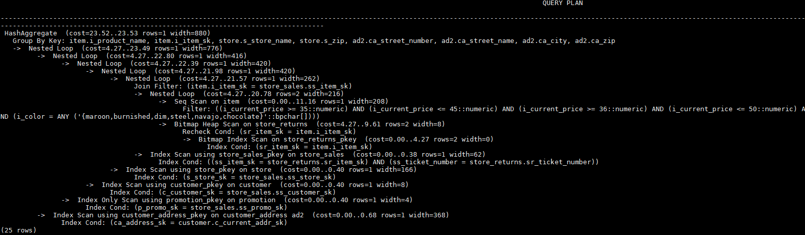

# 行数的Hint<a name="ZH-CN_TOPIC_0289900383"></a>

## 功能描述<a name="zh-cn_topic_0283137731_zh-cn_topic_0237121535_section290819468377"></a>

指明中间结果集的大小，支持绝对值和相对值的hint。

## 语法格式<a name="zh-cn_topic_0283137731_zh-cn_topic_0237121535_section6280155403"></a>

```
rows(table_list #|+|-|* const)
```

## 参数说明<a name="zh-cn_topic_0283137731_zh-cn_topic_0237121535_section55696776143642"></a>

- **\#**,**+**,**-**,**\***，进行行数估算hint的四种操作符号。\#表示直接使用后面的行数进行hint。+,-,\*表示对原来估算的行数进行加、减、乘操作，运算后的行数最小值为1行。table\_list为hint对应的单表或多表join结果集，与[Join方式的Hint](join_operation_hints.md)中[table\_list](join_operation_hints.md#zh-cn_topic_0283137375_zh-cn_topic_0237121534_section35948678143011)相同。

- **const**可以是任意非负数，支持科学计数法。

例如：

rows\(t1 \#5\)表示：指定t1表的结果集为5行。

rows\(t1 t2 t3 \*1000\)表示：指定t1, t2, t3 join完的结果集的行数乘以1000。

## 建议<a name="zh-cn_topic_0283137731_zh-cn_topic_0237121535_section99281150122819"></a>

- 推荐使用两个表\*的hint。对于两个表的采用\*操作符的hint，只要两个表出现在join的两端，都会触发hint。例如：设置hint为rows\(t1 t2 \* 3\)，对于\(t1 t3 t4\)和\(t2 t5 t6\)join时，由于t1和t2出现在join的两端，所以其join的结果集也会应用该hint规则乘以3。
- rows hint支持在单表、多表、function table及subquery scan table的结果集上指定hint。

## 示例<a name="zh-cn_topic_0283137731_zh-cn_topic_0237121535_section1127715590585"></a>

对[示例](plan_hint_optimization_overview.md#zh-cn_topic_0283137554_zh-cn_topic_0237121532_section671421102912)中原语句使用如下hint：

```
explain
select /*+ rows(store_sales store_returns *50) */ i_product_name product_name ...
```

该hint表示：store\_sales，store\_returns关联的结果集估算行数在原估算行数基础上乘以50。生成计划如下所示：


