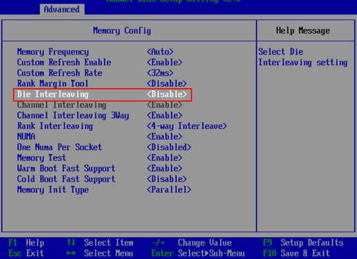

# BIOS Configuration

1. Restore BIOS factory defaults.
2. Modify the BIOS settings as follows:
    1. Choose  **BIOS**  \>  **Advanced**  \>  **MISC Config**  and set  **Support** **Smmu**  to  **Disabled**, as shown in  [Figure 1](#en-us_topic_0263913266_fig1464144318512).

        **Figure  1**  Modifying BIOS settings \(1\)  
        

    2. Choose  **BIOS**  \>  **Advanced**  \>  **MISC Config**  and set  **CPU Prefetching Configuration**  to  **Disabled**, as shown in  [Figure 1](#en-us_topic_0263913266_fig1464144318512).
    3. Choose  **BIOS**  \>  **Advanced**  \>  **Memory Config**  and set  **Die Interleaving**  to  **Disable**, as shown in  [Figure 1](#en-us_topic_0263913266_fig1464144318512).

        **Figure  2**  Modifying BIOS settings \(2\)  
        

3. Restart the BIOS.
