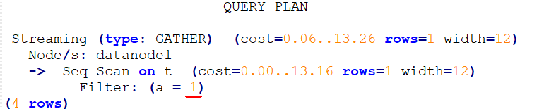
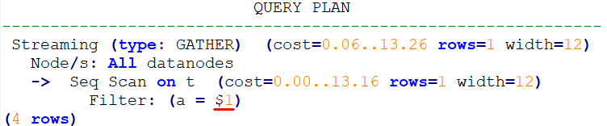

# Hint for Selecting the Custom Plan or Generic Plan<a name="EN-US_TOPIC_0000001096560522"></a>

## Function<a name="section290819468377"></a>

For query statements and DML statements executed in PBE mode, the optimizer generates a custom plan or generic plan based on factors such as rules, costs, and parameters. You can use the hint of  **use\_cplan**  or  **use\_gplan**  to specify the plan to execute.

## Syntax<a name="section530131664410"></a>

- To select the custom plan, run the following statement:

    ```
    use_cplan
    ```

- To select the generic plan, run the following statement:

    ```
    use_gplan
    ```

>[!NOTE]NOTE 
>
>- For SQL statements that are executed in non-PBE mode, setting this hint does not affect the execution mode.
>- This hint has a higher priority than cost-based selection and the  **plan\_cache\_mode**  parameter. That is, this hint does not take effect for statements for which  **plan\_cache\_mode**  cannot be forcibly set to specify an execution mode.

## Examples<a name="section41303128143838"></a>

Forcibly use the custom plan.

```
set enable_fast_query_shipping = off;
create table t (a int, b int, c int);
prepare p as select /*+ use_cplan */ * from t where a = $1;
explain execute p(1);
```

In the following plan, the filtering condition is the actual value of the input parameter, that is, the plan is a custom plan.



Forcibly use the generic plan.

```
deallocate p;
prepare p as select /*+ use_gplan */ * from t where a = $1;
explain execute p(1);
```

In the following plan, the filtering condition is the input parameter to be added, that is, the plan is a Generic plan.


