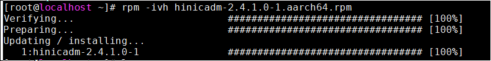
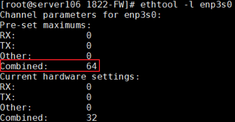

# Network Configuration<a name="EN-US_TOPIC_0283137708"></a>

## NIC Multi-Queue Interruption Settings<a name="EN-US_TOPIC_0283137185"></a>

The single-core capability of TaiShan servers is insufficient and the number of cores is large. Therefore, NIC multi-queue interruption \(16 queues by default\) needs to be deployed on the server and the client. The client and server must be configured with at least GE NICs and are connected through optical fibers.

The recommended configuration is as follows:

- The NIC on the server is configured with 16 interrupt queues.
- The NIC on the client is configured with 48 interrupt queues.

### Procedure<a name="en-us_topic_0263913270_section38551240"></a>

1. Download  [IN500\_solution\_5.1.0.SPC401.zip](https://support.huawei.com/enterprise/zh/software/250968786-ESW2000173161).
2. Decompress  **IN500\_solution\_5.1.0.SPC401.zip**  and go to the  **tools\\linux\_arm**  directory.
3. Decompress the  **nic-ZIP**  package and install the hinicadm as user  **root**.

    

4. Check the NIC corresponding to the connected physical port. The network port and the NIC name vary according to different hardware platforms. Take the following server as an example. The private network port enp3s0 is used and belongs to the hinic0 NIC.

    

    

5. Go to the  **config**  directory and use the hinicconfig tool to configure the interrupt queue FW configuration file. Modify the value according to the actual situation.
    - 64-queue configuration file:  **std\_sh\_4x25ge\_dpdk\_cfg\_template0.ini**
    - 16-queue configuration file:  **std\_sh\_4x25ge\_nic\_cfg\_template0.ini**

    1. Modify the maximum number of interrupt queues supported by the system.
        1. Set the number of queues for hinic0 to different values. \(The default value is  **16**  and it can be changed as needed.\)

            ```
            ./hinicconfig hinic0 -f std_sh_4x25ge_dpdk_cfg_template0.ini
            ```

        2. Run the  **reboot**  command to restart OS for the modification to take effect.
        3. Run the  **ethtool -l enp3s0**  command to check whether the modification is successful. For example, the following figure shows that the value is changed to  **64**.

            

    2. Modify the number of queues in use.

        Run the following command to change the number of NIC interrupt queues to  **48**:

        ```
        ethtool -L enp3s0 combined 48
        ```

        >[!NOTE]NOTE 
        >The optimized value varies depending on the platform and application. For the current 128-core platform, the optimized value is  **16**  for the server and  **48**  for the client.

## Interrupt Optimization<a name="EN-US_TOPIC_0283137668"></a>

1. When the CPU usage of the openGauss database is greater than 90%, the CPU becomes a bottleneck. In this case, you need to enable offloading to offload network slices to the NIC.

    Run the following commands to enable the tso, lro, gro and gso features.

    ```
    ethtool –K enp3s0 tso on 
    ethtool –K enp3s0 lro on 
    ethtool –K enp3s0 gro on 
    ethtool –K enp3s0 gso on
    ```

2. Run the following command to bind the NIC interrupt queues to the CPU core.

    ```
    sh bind_net_irq.sh  16
    ```

## Confirming and Updating the NIC Firmware<a name="EN-US_TOPIC_0283137245"></a>

1. Run the  **ethtool -i enp3s0**  command to check whether the NIC firmware version in the current environment is 2.4.1.0. If not, you are advised to replace it with 2.4.1.0 for better performance.

    ```
    # ethtool -i enp3s0 
    driver: hinic                                 
    version: 2.3.2.11                             
    firmware-version: 2.4.1.0                     
    expansion-rom-version:                        
    bus-info: 0000:03:00.0                       
    ```

2. **Update the NIC firmware.**
    1. Obtain the  **cfg\_data\_nic\_prd\_1h\_4x25G.bin**  file from  **..\\firmware\\update\_bin**.
    2. Run the following command as the root user to update the NIC firmware.

        ```
        hinicadm updatefw -i <physical NIC device name> -f <firmware file path>
        ```

        The involved parameters are described as follows:

        - _physical NIC device name_  indicates the name of the NIC in the system. For example,  **hinic0**  indicates the first NIC and  **hinic1**  indicates the second NIC. For details about how to query the NIC name, see the preceding description  [NIC Multi-Queue Interruption Settings](#nic-multi-queue-interruption-settings).
        - _firmware file path_  indicates the file path of the  **cfg\_data\_nic\_prd\_1h\_4x25G.bin**  file.

        For example:

        ```
        #  
        Please do not remove driver or network device  
        Loading...  
        [>>>>>>>>>>>>>>>>>>>>>>>>>>>>>>>>>>>>>>>>>>>>>>>>>>]  [100%] [\]  
        Loading firmware image succeed.  
        Please reboot OS to take firmware effect.
        ```

    3. Restart the server and verify that the NIC firmware version is successfully updated to 2.4.1.0.

        ```
        # ethtool -i enp3s0 
        driver: hinic                                 
        version: 2.3.2.11                             
        firmware-version: 2.4.1.0                     
        expansion-rom-version:                        
        bus-info: 0000:03:00.0    
        ```
