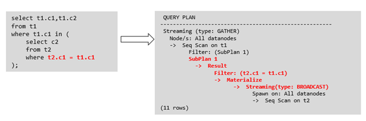
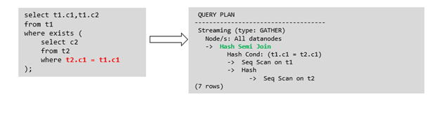

# Optimizing Subqueries<a name="EN-US_TOPIC_0245374560"></a>

## Background<a name="en-us_topic_0237121525_en-us_topic_0118337169_s7525ddd98a4f4ee784a4ca2ffbec1296"></a>

When an application runs a SQL statement to operate the database, a large number of subqueries are used because they are more clear than table join. Especially in complicated query statements, subqueries have more complete and independent semantics, which makes SQL statements clearer and easier to understand. Therefore, subqueries are widely used.

In openGauss, subqueries can also be called sublinks based on the location of subqueries in SQL statements.

- Subquery: corresponds to a range table \(RangeTblEntry\) in the query parse tree. That is, a subquery is a  **SELECT**  statement following immediately after the  **FROM**  keyword.
- Sublink: corresponds to an expression in the query parsing tree. That is, a sublink is a statement in the  **WHERE**  or  **ON**  clause or in the target list.

    In conclusion, a subquery is a RangeTblEntry and a sublink is an expression in the query parsing tree. A sublink can be found in constraint conditions and expressions. In openGauss, sublinks can be classified into the following types:

    - exist\_sublink: corresponds to the  **EXIST**  and  **NOT EXIST**  statements.
    - any\_sublink: corresponding to the  _op_ **ALL\(SELECT...\)**  statement.  _op_  can be the  **IN**,  **<**,  **\>**, or  **=**  operator.
    - all\_sublink: corresponding to the  _op_ **ALL\(SELECT...\)**  statement.  _op_  can be the  **IN**,  **<**,  **\>**, or  **=**  operator.
    - rowcompare\_sublink: corresponds to the  **RECORD **_op_** \(SELECT...\)**  statement.
    - expr\_sublink: corresponds to the  **\(SELECT**_with a single target list item..._**\)**  statement.
    - array\_sublink: corresponds to the  **ARRAY\(SELECT...\)**  statement.
    - cte\_sublink: corresponds to the  **WITH\(...\)**  query statement.

    The sublinks commonly used in OLAP and HTAP are exist\_sublink and any\_sublink. The sublinks are pulled up by the optimization engine of openGauss. Because of the flexible use of subqueries in SQL statements, complex subqueries may affect query performance. Subqueries are classified into non-correlated subqueries and correlated subqueries.

    - **Non-correlated subqueries**

        The execution of a subquery is independent from attributes of the outer query. In this way, a subquery can be executed before outer queries.

        For example:

        ```
        select t1.c1,t1.c2
        from t1
        where t1.c1 in (
            select c2
            from t2
            where t2.c2 IN (2,3,4)
        );
                                      QUERY PLAN
        ----------------------------------------------------------------
         Hash Join 
           Hash Cond: (t1.c1 = t2.c2)
           ->  Seq Scan on t1 
                 Filter: (c1 = ANY ('{2,3,4}'::integer[]))
           ->  Hash 
                 ->  HashAggregate 
                       Group By Key: t2.c2
                       ->  Seq Scan on t2  
                             Filter: (c2 = ANY ('{2,3,4}'::integer[]))
        (9 rows)
        
        ```

    - **Correlated subqueries**

        The execution of a subquery depends on some attributes \(used as  **AND**  conditions of the subquery\) of outer queries. In the following example,  **t1.c1**  in the  **t2.c1 = t1.c1**  condition is a correlated attribute. Such a subquery depends on outer queries and needs to be executed once for each outer query.

        For example:

        ```
        select t1.c1,t1.c2
        from t1
        where t1.c1 in (
            select c2
            from t2
            where t2.c1 = t1.c1 AND t2.c2 in (2,3,4)
        );
                                       QUERY PLAN
        ------------------------------------------------------------------------
         Seq Scan on t1
           Filter: (SubPlan 1)
           SubPlan 1
             ->  Seq Scan on t2
                   Filter: ((c1 = t1.c1) AND (c2 = ANY ('{2,3,4}'::integer[])))
        (5 rows)
        
        ```

## Sublink Optimization on openGauss<a name="en-us_topic_0237121525_en-us_topic_0118337169_section8751034123616"></a>

To optimize a sublink, a subquery is pulled up to join with tables in outer queries, preventing the subquery from being converted into a plan involving subplans and broadcast. You can run the  **EXPLAIN**  statement to check whether a sublink is converted into such a plan.

For example:



Replace the execution plan on the right of the arrow with the following execution plan:

```
QUERY PLAN
--------------------------------
Seq Scan on t1
Filter: (SubPlan 1)
SubPlan 1
->  Seq Scan on t2
Filter: (c1 = t1.c1)
(5 rows)
```

- **Sublink-release scenarios supported by openGauss**
    - Pulling up the  **IN**  sublink

        - The subquery cannot contain columns in the outer query \(columns in more outer queries are allowed\).
        - The subquery cannot contain volatile functions.

        

        Replace the execution plan on the right of the arrow with the following execution plan:

        ```
        QUERY PLAN
        --------------------------------------
        Hash Join
        Hash Cond: (t1.c1 = t2.c2)
        ->  Seq Scan on t1
        ->  Hash
        ->  HashAggregate
        Group By Key: t2.c2
        ->  Seq Scan on t2
        Filter: (c1 = 1)
        (8 rows)
        ```

    - Pulling up the  **EXISTS**  sublink

        The  **WHERE**  clause must contain a column in the outer query. Other parts of the subquery cannot contain the column. Other restrictions are as follows:

        - The subquery must contain the  **FROM**  clause.
        - The subquery cannot contain the  **WITH**  clause.
        - The subquery cannot contain aggregate functions.
        - The subquery cannot contain a  **SET**,  **SORT**,  **LIMIT**,  **WindowAgg**, or  **HAVING**  operation.
        - The subquery cannot contain volatile functions.

        

        Replace the execution plan on the right of the arrow with the following execution plan:

        QUERY PLAN

        -----------------------------------

        Hash Join

        Hash Cond: \(t1.c1 = t2.c1\)

        -\>  Seq Scan on t1

        -\>  Hash

        -\>  HashAggregate

        Group By Key: t2.c1

        -\>  Seq Scan on t2

        \(7 rows\)

    - Pulling up an equivalent correlated query containing aggregate functions

        The  **WHERE**  condition of the subquery must contain a column from the outer query. Equivalence comparison must be performed between this column and related columns in tables of the subquery. These conditions must be connected using  **AND**. Other parts of the subquery cannot contain the column. Other restrictions are as follows:

        - The columns in the expression in the  **WHERE**  condition of the subquery must exist in tables.
        - After the  **SELECT**  keyword of the subquery, there must be only one output column. The output column must be an aggregate function \(for example,  **MAX**\), and the parameter \(for example,  **t2.c2**\) of the aggregate function cannot be columns of a table \(for example,  **t1**\) in outer queries. The aggregate function cannot be  **COUNT**.

            For example, the following subquery can be pulled up:

            ```
            select * from t1 where c1 >(
                   select max(t2.c1) from t2 where t2.c1=t1.c1
            );
            ```

            The following subquery cannot be pulled up because the subquery has no aggregate function:

            ```
            select * from t1 where c1 >(
                   select  t2.c1 from t2 where t2.c1=t1.c1
            );
            ```

            The following subquery cannot be pulled up because the subquery has two output columns:

            ```
            select * from t1 where (c1,c2) >(
                   select  max(t2.c1),min(t2.c2) from t2 where t2.c1=t1.c1
            );
            ```

        - The subquery must be a  **FROM**  clause.
        - The subquery cannot contain a  **GROUP BY**,  **HAVING**, or  **SET**  operation.
        - The subquery can only be an inner join.

            For example, the following subquery cannot be pulled up:

            ```
            select * from t1 where c1 >(
                   select max(t2.c1) from t2 full join t3 on (t2.c2=t3.c2) where t2.c1=t1.c1
            );
            ```

        - The target list of the subquery cannot contain the function that returns a set.
        - The  **WHERE**  condition of the subquery must contain a column from the outer query. Equivalence comparison must be performed between this column and related columns in tables of the subquery. These conditions must be connected using  **AND**. Other parts of the subquery cannot contain the column. For example, the following subquery can be pulled up:

            ```
            select * from t3 where t3.c1=(
                    select t1.c1
                    from t1 where c1 >(
                            select max(t2.c1) from t2 where t2.c1=t1.c1 
            ));
            ```

            If another condition is added to the subquery in the previous example, the subquery cannot be pulled up because the subquery references to the column in the outer query. For example:

            ```
            select * from t3 where t3.c1=(
                    select t1.c1
                    from t1 where c1 >(
                           select max(t2.c1) from t2 where t2.c1=t1.c1 and t3.c1>t2.c2
            
            ));
            ```

    - Pulling up a sublink in the  **OR**  clause

        If the  **WHERE**  condition contains an  **EXIST**  correlated sublink connected by  **OR**,

        for example:

        ```
        select a, c from t1
        where t1.a = (select avg(a) from t3 where t1.b = t3.b) or
        exists (select * from t4 where t1.c = t4.c);
        ```

        the process of pulling up such a sublink is as follows:

        1. Extract  **opExpr**  from the  **OR**  clause in the  **WHERE** condition. The value is  **t1.a = \(select avg\(a\) from t3 where t1.b = t3.b\)**.
        2. The  **opExpr**  contains a subquery. If the subquery can be pulled up, the subquery is rewritten as  **select avg\(a\), t3.b from t3 group by t3.b**, generating the  **NOT NULL**  condition  **t3.b is not null**. The  **opExpr**  is replaced with this  **NOT NULL**  condition. In this case, the SQL statement changes to:

            ```
            select a, c
            from t1 left join (select avg(a) avg, t3.b from t3 group by t3.b)  as t3 on (t1.a = avg and t1.b = t3.b)
            where t3.b is not null or exists (select * from t4 where t1.c = t4.c);
            ```

        3. Extract the  **EXISTS**  sublink  **exists \(select \* from t4 where t1.c = t4.c\)**  from the  **OR**  clause to check whether the sublink can be pulled up. If it can be pulled up, it is converted into  **select t4.c from t4 group by t4.c**, generating the  **NOT NULL**  condition  **t4.c is not null**. In this case, the SQL statement changes to:

            ```
            select a, c
            from t1 left join (select avg(a) avg, t3.b from t3 group by t3.b)  as t3 on (t1.a = avg and t1.b = t3.b)
            left join (select t4.c from t4 group by t4.c) where t3.b is not null or t4.c is not null;
            ```

- **Sublink-release scenarios not supported by openGauss**

    Except the sublinks described above, all the other sublinks cannot be pulled up. In this case, a join subquery is planned as the combination of subplans and broadcast. As a result, if tables in the subquery have a large amount of data, query performance may be poor.

    If a correlated subquery joins with two tables in outer queries, the subquery cannot be pulled up. You need to change the outer query into a  **WITH**  clause and then perform the join.

    For example:

    ```
    select distinct t1.a, t2.a
    from t1 left join t2 on t1.a=t2.a and not exists (select a,b from test1 where test1.a=t1.a and test1.b=t2.a);
    ```

    The outer query is changed into:

    ```
    with temp as
    (
            select * from (select t1.a as a, t2.a as b from t1 left join t2 on t1.a=t2.a)
    
    )
    select distinct a,b
    from temp
    where not exists (select a,b from test1 where temp.a=test1.a and temp.b=test1.b);
    ```

    - The subquery \(without  **COUNT**\) in the target list cannot be pulled up.

        For example:

        ```
        explain (costs off)
        select (select c2 from t2 where t1.c1 = t2.c1) ssq, t1.c2
        from t1
        where t1.c2 > 10;
        ```

        The execution plan is as follows:

        ```
        explain (costs off)
        select (select c2 from t2 where t1.c1 = t2.c1) ssq, t1.c2
        from t1
        where t1.c2 > 10;
                   QUERY PLAN
        --------------------------------
         Seq Scan on t1
           Filter: (c2 > 10)
           SubPlan 1
             ->  Seq Scan on t2
                   Filter: (t1.c1 = c1)
        (5 rows)
        ```

        The correlated subquery is displayed in the target list \(query return list\). Values need to be returned even if the condition  **t1.c1=t2.c1**  is not met. Therefore, use left outer join to join  **T1**  and  **T2**  so that SSQ can return padding values when the condition  **t1.c1=t2.c1**  is not met.

        >[!NOTE]NOTE   
        >ScalarSubQuery \(SSQ\) and Correlated-ScalarSubQuery \(CSSQ\) are described as follows:  
        >- SSQ: a sublink that returns a scalar value of a single row with a single column  
        >- CSSQ: an SSQ containing correlation conditions  

        The preceding SQL statement can be changed into:

        ```
        with ssq as
        (
            select t2.c2 from t2
        )
        select ssq.c2, t1.c2
        from t1 left join ssq on t1.c1 = ssq.c2
        where t1.c2 > 10;
        ```

        The execution plan after the change is as follows:

        ```
                   QUERY PLAN
        ---------------------------------
         Hash Right Join
           Hash Cond: (ssq.c2 = t1.c1)
           CTE ssq
             ->  Seq Scan on t2
           ->  CTE Scan on ssq
           ->  Hash
                 ->  Seq Scan on t1
                       Filter: (c2 > 10)
        (8 rows)
        ```

        In the preceding example, the SSQ in the target list is pulled up to right join, preventing poor performance caused by the plan involving subplans when the table \(**T2**\) in the subquery is too large.

    - The subquery \(with  **COUNT**\) in the target list cannot be pulled up.

        For example:

        ```
        select (select count(*) from t2 where t2.c1=t1.c1) cnt, t1.c1, t3.c1
        from t1,t3
        where t1.c1=t3.c1 order by cnt, t1.c1;
        ```

        The execution plan is as follows:

        ```
                         QUERY PLAN
        --------------------------------------------
         Sort
           Sort Key: ((SubPlan 1)), t1.c1
           ->  Hash Join
                 Hash Cond: (t1.c1 = t3.c1)
                 ->  Seq Scan on t1
                 ->  Hash
                       ->  Seq Scan on t3
                 SubPlan 1
                   ->  Aggregate
                         ->  Seq Scan on t2
                               Filter: (c1 = t1.c1)
        (11 rows)
        ```

        The correlated subquery is displayed in the target list \(query return list\). Values need to be returned even if the condition  **t1.c1=t2.c1**  is not met. Therefore, use left outer join to join  **T1**  and  **T2**  so that SSQ can return padding values when the condition  **t1.c1=t2.c1**  is not met. However,  **COUNT**  is used, which requires that  **0**  is returned when the condition is not met. Therefore,  **case-when NULL then 0 else count\(\*\)**  can be used.

        The preceding SQL statement can be changed into:

        ```
        with ssq as
        (
            select count(*) cnt, c1 from t2 group by c1
        )
        select case when
                    ssq.cnt is null then 0
                    else ssq.cnt
               end cnt, t1.c1, t3.c1
        from t1 left join ssq on ssq.c1 = t1.c1,t3
        where t1.c1 = t3.c1
        order by ssq.cnt, t1.c1;
        ```

        The execution plan after the change is as follows:

        ```
                        QUERY PLAN
        -------------------------------------------
         Sort
           Sort Key: ssq.cnt, t1.c1
           CTE ssq
             ->  HashAggregate
                   Group By Key: t2.c1
                   ->  Seq Scan on t2
           ->  Hash Join
                 Hash Cond: (t1.c1 = t3.c1)
                 ->  Hash Left Join
                       Hash Cond: (t1.c1 = ssq.c1)
                       ->  Seq Scan on t1
                       ->  Hash
                             ->  CTE Scan on ssq
                 ->  Hash
                       ->  Seq Scan on t3
        (15 rows)
        ```

    - Non-equivalent correlated subqueries cannot be pulled up.

        For example:

        ```
        select t1.c1, t1.c2
        from t1
        where t1.c1 = (select agg() from t2.c2 > t1.c2);
        ```

        Non-equivalent correlated subqueries cannot be pulled up. You can perform join twice \(one CorrelationKey and one rownum self-join\) to rewrite the statement.

        You can rewrite the statement in either of the following ways:

        - Subquery rewriting

            ```
            select t1.c1, t1.c2
            from t1, (
                select t1.rowid, agg() aggref
                from t1,t2
                where t1.c2 > t2.c2 group by t1.rowid
            ) dt /* derived table */
            where t1.rowid = dt.rowid AND t1.c1 = dt.aggref;
            ```

        - CTE rewriting

            ```
            WITH dt as
            (
                select t1.rowid, agg() aggref
                from t1,t2
                where t1.c2 > t2.c2 group by t1.rowid
            )
            select t1.c1, t1.c2
            from t1, derived_table
            where t1.rowid = derived_table.rowid AND
            t1.c1 = derived_table.aggref;
            ```

    >[!TIP]NOTICE   
    >- If the AGG type is  **COUNT\(\*\)**,  **0**  is used for data padding when  **CASE-WHEN**  is not matched. If the type is not  **COUNT\(\*\)**,  **NULL**  is used.  
    >- CTE rewriting works better by using share scan.  

## More Optimization Examples<a name="en-us_topic_0237121525_en-us_topic_0118337169_s3ec9cccc30fd42868396c57d931f3089"></a>

Modify the  **SELECT**  statement by changing the subquery to a  **JOIN**  relationship between the primary table and the parent query or modifying the subquery to improve the query performance. Ensure that the subquery to be used is semantically correct.

```
explain (costs off) select * from t1 where t1.c1 in (select t2.c1 from t2 where t1.c1 = t2.c2);
           QUERY PLAN
--------------------------------
 Seq Scan on t1
   Filter: (SubPlan 1)
   SubPlan 1
     ->  Seq Scan on t2
           Filter: (t1.c1 = c2)
(5 rows)
```

In the preceding example, a subplan is used. To remove the subplan, you can modify the statement as follows:

```
explain (costs off) select * from t1 where exists (select t2.c1 from t2 where t1.c1 = t2.c2 and t1.c1 = t2.c1);
                QUERY PLAN
------------------------------------------
 Hash Join
   Hash Cond: (t1.c1 = t2.c2)
   ->  Seq Scan on t1
   ->  Hash
         ->  HashAggregate
               Group By Key: t2.c2, t2.c1
               ->  Seq Scan on t2
                     Filter: (c2 = c1)
(8 rows)

```

In this way, the subplan is replaced by the hash-join between the two tables, greatly improving the execution efficiency.
