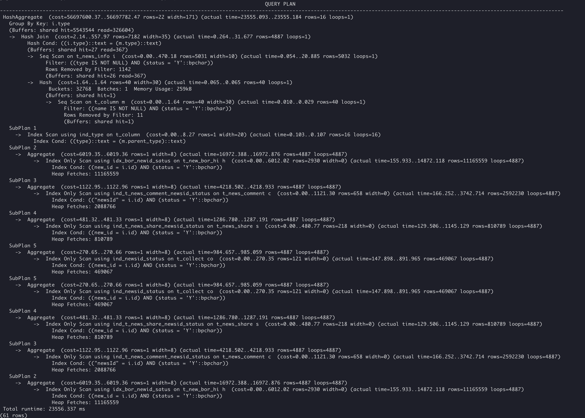
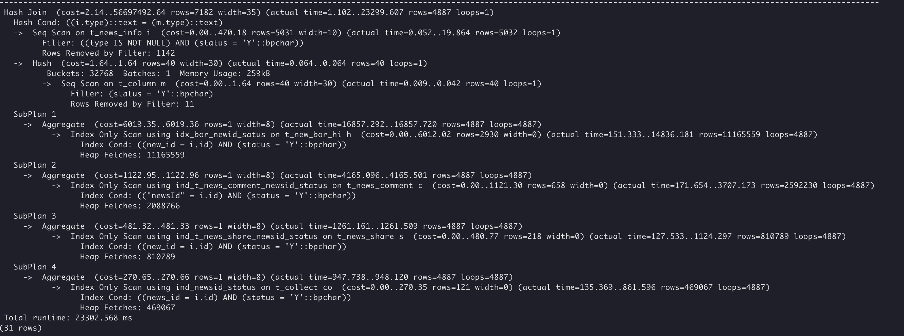
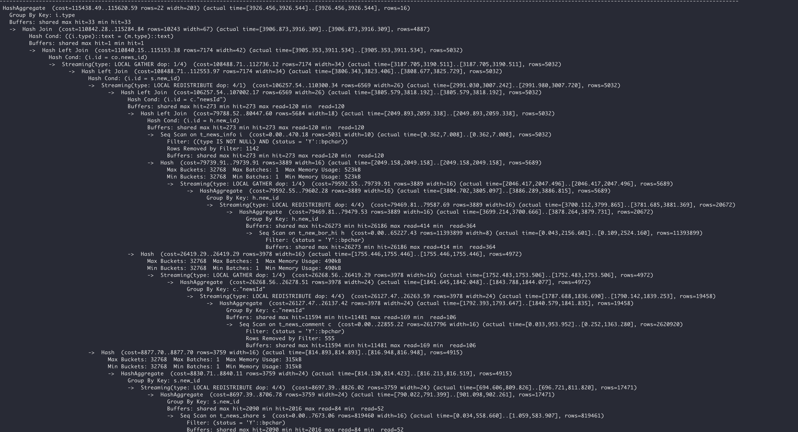
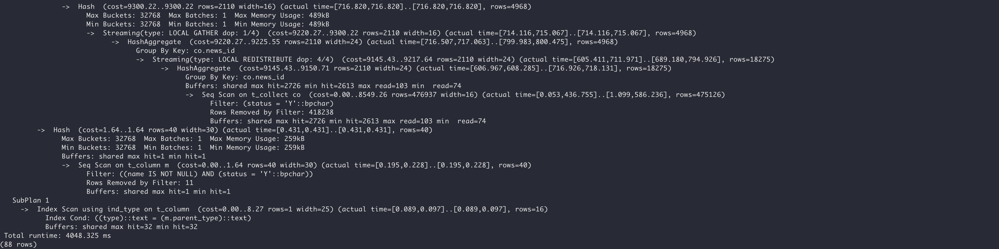

# Case Study: Rewriting SQL to Eliminate Subqueries and Enable Parallel Query

<!-- md-trans-meta sourceCommit=unknown translatedAt=2026-07-17T06:49:19.970Z -->

## Symptom

The following complex multi‑table join query has multiple subqueries and suffers from performance issues — it takes over 23 seconds.


```sql
SELECT
    count( a.id ) AS newsCount,
    a.type1 AS type,
    a.NAME AS typeName,
    ifnull( a.parentType, '0' ) AS parentType,
    a.columnType AS columnType,
    ( SELECT NAME FROM t_column WHERE type = a.parentType ) AS parentTypeName,
    SUM( a.countRead1 ) AS countRead,
    SUM( a.countComment1 ) AS countComment,
    SUM( a.countShare1 ) AS countShare,
    SUM( a.countCollect1 ) AS countCollect
FROM (
    SELECT 
        i.id AS id,
        i.type AS type1,
        m.NAME AS NAME,
        m.parent_type AS parentType,
        m.column_type AS columnType,
        ( SELECT count(*) FROM t_new_bor_hi h WHERE h.STATUS = 'Y' AND h.new_id = i.id ) countRead1,
        ( SELECT count(*) FROM t_news_comment c WHERE c.STATUS = 'Y' AND c.newsId = i.id ) countComment1,
        ( SELECT count(*) FROM t_news_share s WHERE s.STATUS = 'Y' AND s.new_id = i.id ) countShare1,
        ( SELECT count(*) FROM t_collect co WHERE co.STATUS = 'Y' AND co.news_id = i.id ) countCollect1
    FROM t_news_info i 
    JOIN t_column m ON m.type = i.type AND m.STATUS = 'Y'
    WHERE NAME IS NOT NULL AND i.STATUS = 'Y' and i.type is not null ) a
GROUP BY a.type1;
```

## Analysis

The original execution plan:




The plan shows that the query contains many subqueries, and most of the time is spent on this part:


```sql
SELECT
    i.id AS id,
    i.type AS type1,
    m.NAME AS NAME,
    m.parent_type AS parentType,
    m.column_type AS columnType,
    ( SELECT count(*) FROM t_new_bor_hi h WHERE h.STATUS = 'Y' AND h.new_id = i.id ) countRead1,
    ( SELECT count(*) FROM t_news_comment c WHERE c.STATUS = 'Y' AND c.newsId = i.id ) countComment1,
    ( SELECT count(*) FROM t_news_share s WHERE s.STATUS = 'Y' AND s.new_id = i.id ) countShare1,
    ( SELECT count(*) FROM t_collect co WHERE co.STATUS = 'Y' AND co.news_id = i.id ) countCollect1
FROM t_news_info i
JOIN t_Column m ON m.type = i.type AND m.STATUS = 'Y'
WHERE NAME IS NOT NULL AND i.STATUS = 'Y' and i.type is not null
```

Subquery execution plan:



In this scenario, simply rewriting the query to eliminate subqueries doesn't improve performance much. Also, parallel query (Symmetric Multi-Processing, SMP) doesn't support subquery operators, so the original SQL can't use parallelism directly. The solution is to restructure the SQL to remove subqueries first, then enable parallel execution.


Move the following subqueries from the inner `FROM` clause:


```sql
    ( SELECT count(*) FROM t_new_bor_hi h WHERE h.STATUS = 'Y' AND h.new_id = i.id ) countRead1,
    ( SELECT count(*) FROM t_news_comment c WHERE c.STATUS = 'Y' AND c.newsId = i.id ) countComment1,
    ( SELECT count(*) FROM t_news_share s WHERE s.STATUS = 'Y' AND s.new_id = i.id ) countShare1,
    ( SELECT count(*) FROM t_collect co WHERE co.STATUS = 'Y' AND co.news_id = i.id ) countCollect1
```

to the outer `SELECT` clause. The rewritten SQL (with an added `ORDER BY` for result comparison):


```sql
SELECT
    count( a.id ) AS newsCount,
    a.type1 AS type,
    a.NAME AS typeName,
    ifnull( a.parentType, '0' ) AS parentType,
    a.columnType AS columnType,
    ( SELECT NAME FROM t_column WHERE type = a.parentType ) AS parentTypeName,
    SUM( (SELECT count(*) FROM t_new_bor_hi h WHERE h.STATUS = 'Y' AND h.new_id = a.id) ) AS countRead,
    SUM( (SELECT count( c.id ) FROM t_news_comment c WHERE c.STATUS = 'Y' AND c.newsId = a.id) ) AS countComment,
    SUM( (SELECT count( s.id ) FROM t_news_share s WHERE s.STATUS = 'Y' AND s.new_id = a.id) ) AS countShare,
    SUM( (SELECT count( co.id ) FROM t_collect co WHERE co.STATUS = 'Y' AND co.news_id = a.id) ) AS countCollect
FROM (
    SELECT
        i.id AS id,
        i.type AS type1,
        m.NAME AS NAME,
        m.parent_type AS parentType,
        m.column_type AS columnType
    FROM t_news_info i
    LEFT JOIN t_column m ON m.type = i.type AND m.STATUS = 'Y'
    WHERE NAME IS NOT NULL AND i.STATUS ='Y' and i.type is not null ) a
GROUP BY a.type1 order by newsCount;
```

Also apply the following session‑level settings:


- Enable parallelism by setting the parallel degree:


```sql
set query_dop = 4;
```

- Enable SQL rewrite rules:

```sql
set rewrite_rule='magicset,intargetlist';
```

The final execution plan:




Compared with the original SQL, the rewritten version (with `ORDER BY` added) finishes in about 4 seconds — a roughly 5x improvement. Result verification shows the output is correct.
