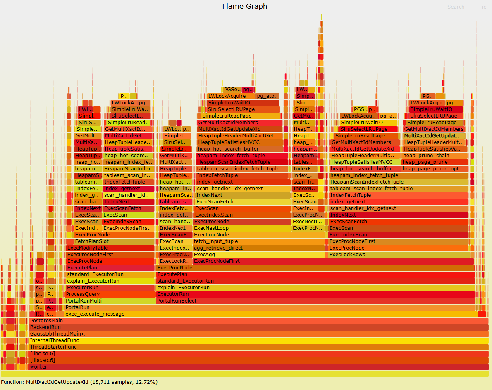

# **Case Study: Tuning Subtransaction TPCC Performance**

<!-- md-trans-meta sourceCommit=unknown translatedAt=2026-07-17T06:49:22.453Z -->

## Symptom

When running TPCC with the benchmark tool, enabling `autosave="always"` in the JDBC config causes a significant performance drop.

In a 30‑minute TPCC test with 500 warehouses and 200 concurrent connections, under the same database parameters, disabling `autosave="always"` gave a tpmC of 585,258.37, while enabling it dropped tpmC to 18,322.86 — a degradation of over 96%.

## Analysis

With `autosave="always"` enabled, the database flame graph shows that `SimpleLruWaitIO` accounts for 66.5% of CPU time. The hotspot trace is: GetMultiXactIdMembers → SimpleLruWaitIO → SimpleLruWaitIO → LWLockAcquire.

`MultiXactId` can be thought of as a multi‑transaction ID. It typically comes into play with `SELECT FOR SHARE` or `SELECT FOR UPDATE`. When a worker thread tries to take a row lock on a tuple, and the tuple's xmax is not empty, the system generates a `MultiXactId` and replaces xmax with it. In other words, one `MultiXactId` means multiple transaction IDs hold locks on the same row.

openGauss uses multixact offset log and multixact member log to store MultiXactId information. These logs are cached using the SLRU (Simple Least Recently Used) mechanism — similar to the buffer manager for data pages. The multixact offset SLRU has 8 pages by default; the member SLRU has 16. The two structures are protected by the MultiXactOffsetCtlLock and MultiXactMemberCtrlLock locks respectively, which control page swapping in and out of the SLRU cache.

Different transaction ID combinations produce different MultiXactIds. In high‑concurrency subtransaction cases, the number of transaction IDs grows, and MultiXactId counts multiply accordingly. In the same test environment, enabling `autosave` generates 532 MB of multixact member log and 271 MB of multixact offset log. With `autosave` disabled, the total multixact log size stays under 8 KB.

When worker threads perform visibility checks or row‑lock operations that involve MultiXactId, they may need to fetch MultiXactId information from the SLRU cache. If the required page is not in memory, the system has to swap out existing pages, causing severe lock contention and frequent disk I/O.



## Recommendation

Starting from openGauss 7.0.0-RC1, a new parameter `num_slru_buffers` is introduced to control the maximum number of cache slots for multixact‑related logs. By increasing this value, you can reduce lock contention and frequent disk I/O caused by SLRU page thrashing.


Recommended settings for this case:

```
num_slru_buffers='MXACT_OFFSET=256,MXACT_MEMBER=1024'
```

With the same test conditions (500 warehouses, 200 concurrent connections, 30‑minute TPCC run), setting `num_slru_buffers='MXACT_OFFSET=256,MXACT_MEMBER=1024'` brings tpmC up to 210,545.61 — a significant improvement.