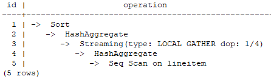

# Configuring the Parallel Query Function

<!-- md-trans-meta sourceCommit=unknown translatedAt=2026-07-17T06:49:32.505Z -->

The SMP parallel technology of openGauss leverages the multi-core CPU architecture of computers to implement multi-threaded parallel computing, thereby fully utilizing CPU resources to improve query performance. In complex query scenarios, a single query takes a long time to execute and the system concurrency is low. By implementing operator-level parallelism through the SMP parallel execution technology, the query execution time can be effectively reduced, and both query performance and resource utilization can be improved. The overall implementation concept of the SMP parallel technology is as follows: for query operators that can be parallelized, data is partitioned into shards, several worker threads are started to perform computations separately, and finally the results are aggregated and returned to the frontend. SMP parallel execution adds data interaction operators (Stream) to enable data exchange among multiple worker threads, ensuring query correctness and completing the overall query.

## Applicable Scenarios and Restrictions <a name="section136321654121411"></a>

The SMP feature improves performance through operator parallelism, while consuming more system resources, including CPU, memory, and I/O. Essentially, SMP is a technique that trades resources for time. In appropriate scenarios with sufficient resources, it can achieve significant performance improvements. However, in inappropriate scenarios or when resources are insufficient, it may instead cause performance degradation. The SMP feature is suitable for analytical query scenarios, which are characterized by long individual query durations and low service concurrency. SMP parallel technology can reduce query latency and improve system throughput. However, in transactional high-concurrency service scenarios, since the latency of individual queries is inherently short, using multi-threaded parallel technology may increase query latency and reduce system throughput.

- Applicable scenarios
    - Operators supporting parallelism: The following operators in the plan support parallelism.
        - Scan: Sequential scans on row-store ordinary tables, row-store partitioned tables, column-store ordinary tables, and column-store partitioned tables are supported.
        - Join: HashJoin, NestLoop
        - Agg: HashAgg, SortAgg, PlainAgg, WindowAgg (only supports partition by, does not support order by).
        - Stream: Local Redistribute, Local Broadcast
        - Others: Result, Subqueryscan, Unique, Material, Setop, Append, VectoRow

    - SMP-specific operators: To implement parallelism, new Stream operators for data exchange between parallel threads are added for use by the SMP feature. These newly added operators can be regarded as subclasses of the Stream operator.
        - Local Gather: Implements data aggregation from parallel threads within an instance.
        - Local Redistribute: Redistributes data among threads within an instance based on the distribution key.
        - Local Broadcast: Broadcasts data to each thread within an instance.
        - Local RoundRobin: Implements round-robin data distribution among threads within an instance.

    - Example: The parallel plan of TPCH Q1 is used as an illustration.

        

        In this plan, parallelism is implemented for the Scan and HashAgg operators, and a Local Gather data exchange operator is added. Operator 3 is the Local Gather operator, marked with "dop: 1/4", indicating that the degree of parallelism of the sending threads for this operator is 4, while that of the receiving threads is 1. That is, the lower-level HashAggregate operator (Operator 4) executes with a degree of parallelism of 4, while the upper-level operators (Operators 1 and 2) execute serially. Operator 3 implements data aggregation from parallel threads within the instance.

        The parallelism status of each operator can be observed from the dop information indicated on the Stream operators in the plan.

- Non-Applicable Scenarios
    - Index scan does not support parallel execution.
    - MergeJoin does not support parallel execution. Starting from openGauss 7.0.0-RC1, if the optimal plan is MergeJoin, a serial plan is used instead.
    - WindowAgg with ORDER BY does not support parallel execution.
    - Only NO SCROLL cursors declared in cmd and cursor expressions used as input parameters of parallel functions support parallelism. Other cursors do not support parallel execution.
    - Parallelism is not supported for subqueries (subplan and initplan), nor for operators that contain subqueries.
    - Queries with median operations do not support parallel execution.
    - Queries with global temporary tables do not support parallel execution.
    - Updates of materialized views do not support parallel execution.

## Impact of Resources on SMP Performance<a name="section310105992016"></a>

The SMP architecture is a solution that trades surplus resources for time. After parallel execution is planned, resource consumption inevitably increases, including significant growth in CPU, memory, and I/O resource consumption. As the degree of parallelism increases, resource consumption also rises. When these resources become bottlenecks, SMP cannot improve performance and may instead cause overall performance degradation of the database instance. The following sections describe the impact of each type of resource on SMP performance.

- CPU Resources

    In typical customer scenarios where system CPU utilization is not high, the SMP parallel architecture can more fully utilize system CPU resources and improve system performance. However, when the database server has a small number of CPU cores and CPU utilization is already relatively high, enabling SMP parallelism may not only yield insignificant performance improvement but may also cause performance degradation due to resource contention among multiple threads.

- Memory Resources

    Parallel query execution increases memory usage, but the memory limit for each operator is still constrained by parameters such as work_mem. For example, if work_mem is set to 4 GB and the degree of parallelism is 2, the memory limit allocated to each parallel thread is 2 GB. When work_mem is small or system memory is insufficient, using SMP parallelism may cause data to spill to disk, leading to query performance degradation.

- I/O Resources

    Parallel scanning inevitably increases I/O resource consumption. Therefore, parallel scanning can improve scan performance only when I/O resources are sufficient.

## Impact of Other Factors on SMP Performance<a name="section190917443153263"></a>

In addition to resource factors, other factors may also affect SMP parallel performance, such as uneven partition data in partitioned tables and system concurrency.

- Impact of Data Skew on SMP Performance

    When severe data skew exists in the data, the parallel effect is poor. For example, if the data volume of a certain value in the join column of a table is far greater than that of other values, after parallelism is enabled, hash redistribution is performed on the table data based on the join column values. This causes the data volume of a certain parallel thread to be far greater than that of other threads, resulting in a long-tail problem and poor parallel performance.

- Impact of System Concurrency on SMP Performance

The SMP feature increases resource usage, while fewer resources remain available in high-concurrency scenarios. Therefore, enabling SMP parallelism in such scenarios leads to severe resource contention among queries. Once resource contention occurs—whether for CPU, I/O, or memory—it causes overall performance degradation. As a result, enabling SMP in high-concurrency scenarios often fails to deliver performance improvements and may even cause performance degradation.

# Usage Restrictions <a name="section545621551611"></a>

To leverage SMP for query performance improvement, the following conditions must be met:

The system must have sufficient resources, including CPU, memory, I/O, and network bandwidth. The SMP architecture is a solution that trades surplus resources for time. Planned parallelism inevitably increases resource consumption. When the aforementioned resources become bottlenecks, SMP cannot improve performance and may instead cause performance degradation. In the event of a resource bottleneck, it is recommended that SMP be disabled.

## Configuration Steps<a name="section58511820192718"></a>

1. Observe the current system load. If system resources are sufficient (resource utilization is less than 50%), proceed to [2](#li1174421213171); otherwise, exit.
2. <a name="li1174421213171"></a>Set query\_dop=1 (default value), and use explain to generate the execution plan. Check whether the plan meets the applicable scenarios described in [Applicable Scenarios and Restrictions](#section136321654121411). If it does, proceed to [3](#li998191911172).
3. <a name="li998191911172"></a>Set query\_dop=value. Regardless of resource conditions and plan characteristics, the system forcibly selects a dop of 1 or value.
4. Set an appropriate query\_dop value before executing a query that meets the conditions, and disable query\_dop after the statement execution is complete. An example is provided below.

    ```
    openGauss=# SET query_dop = 4;
    openGauss=# SELECT COUNT(*) FROM t1 GROUP BY a;
    ......
    openGauss=# SET query_dop = 1;
    ```

    >[!NOTE]Note  
    >- When resources are sufficient, a higher degree of parallelism leads to better performance improvement.  
    >- SMP parallelism supports session-level configuration. It is recommended that users enable SMP before executing qualifying queries and disable SMP after execution to avoid impacting services during peak business hours.  