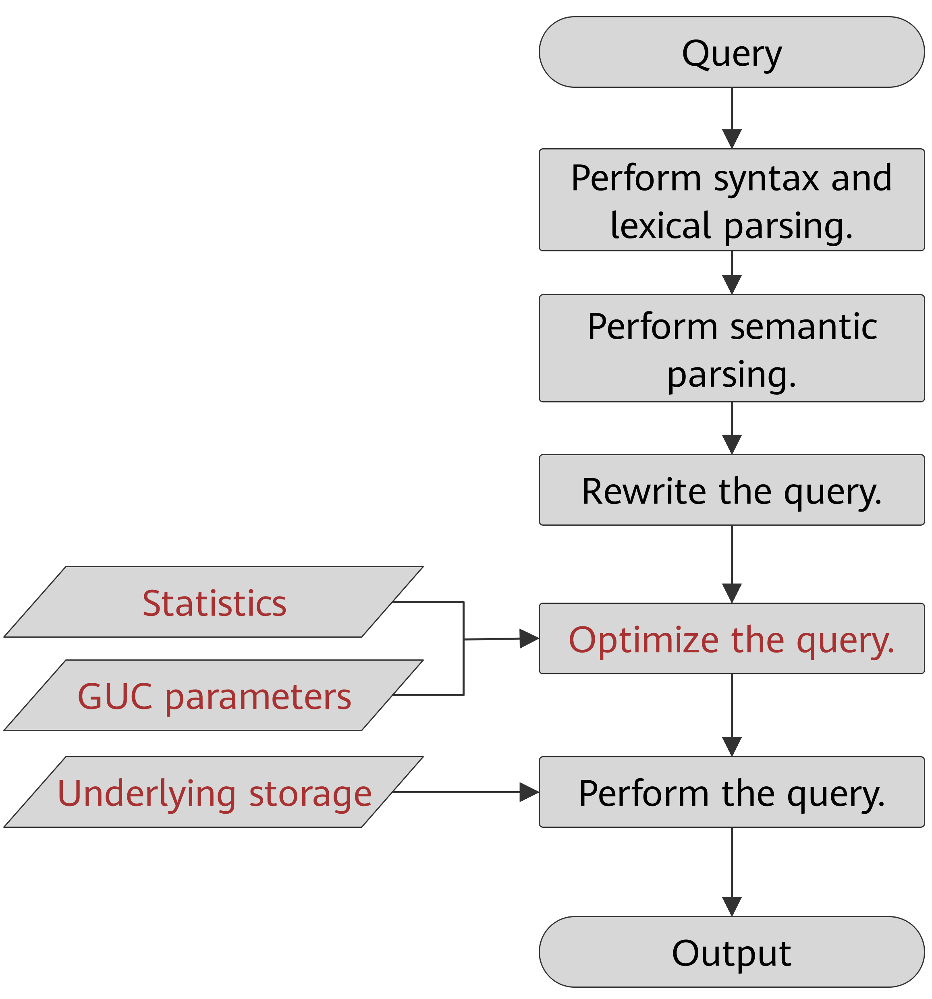

# Query Execution Process<a name="EN-US_TOPIC_0245374543"></a>

The process from receiving SQL statements to the statement execution by the SQL engine is shown in  [Figure 1](#en-us_topic_0237121508_en-us_topic_0073320637_en-us_topic_0071158048_fig29880521152348)  and described in  [Table 1](#en-us_topic_0237121508_en-us_topic_0073320637_en-us_topic_0071158048_table11198623152535). The texts in red are steps where database administrators can optimize queries.

**Figure  1**  Execution process of query-related SQL statements by the SQL engine<a name="en-us_topic_0237121508_en-us_topic_0073320637_en-us_topic_0071158048_fig29880521152348"></a>  


**Table  1**  Execution process of query-related SQL statements by the SQL engine

<a name="en-us_topic_0237121508_en-us_topic_0073320637_en-us_topic_0071158048_table11198623152535"></a>
<table><thead align="left"><tr id="en-us_topic_0237121508_en-us_topic_0073320637_en-us_topic_0071158048_row59395253152535"><th class="cellrowborder" valign="top" width="27.400000000000002%" id="mcps1.2.3.1.1"><p id="en-us_topic_0237121508_en-us_topic_0073320637_en-us_topic_0071158048_p13922500152535"><a name="en-us_topic_0237121508_en-us_topic_0073320637_en-us_topic_0071158048_p13922500152535"></a><a name="en-us_topic_0237121508_en-us_topic_0073320637_en-us_topic_0071158048_p13922500152535"></a>Step</p>
</th>
<th class="cellrowborder" valign="top" width="72.6%" id="mcps1.2.3.1.2"><p id="en-us_topic_0237121508_en-us_topic_0073320637_en-us_topic_0071158048_p53980687152535"><a name="en-us_topic_0237121508_en-us_topic_0073320637_en-us_topic_0071158048_p53980687152535"></a><a name="en-us_topic_0237121508_en-us_topic_0073320637_en-us_topic_0071158048_p53980687152535"></a>Description</p>
</th>
</tr>
</thead>
<tbody><tr id="en-us_topic_0237121508_en-us_topic_0073320637_en-us_topic_0071158048_row16064139152535"><td class="cellrowborder" valign="top" width="27.400000000000002%" headers="mcps1.2.3.1.1 "><p id="en-us_topic_0237121508_en-us_topic_0073320637_en-us_topic_0071158048_p26126919152535"><a name="en-us_topic_0237121508_en-us_topic_0073320637_en-us_topic_0071158048_p26126919152535"></a><a name="en-us_topic_0237121508_en-us_topic_0073320637_en-us_topic_0071158048_p26126919152535"></a>1. Perform syntax and lexical parsing.</p>
</td>
<td class="cellrowborder" valign="top" width="72.6%" headers="mcps1.2.3.1.2 "><p id="en-us_topic_0237121508_en-us_topic_0073320637_en-us_topic_0071158048_p35905662152535"><a name="en-us_topic_0237121508_en-us_topic_0073320637_en-us_topic_0071158048_p35905662152535"></a><a name="en-us_topic_0237121508_en-us_topic_0073320637_en-us_topic_0071158048_p35905662152535"></a>Converts the input SQL statements from the string data type to the formatted structure stmt based on the specified SQL statement rules.</p>
</td>
</tr>
<tr id="en-us_topic_0237121508_en-us_topic_0073320637_en-us_topic_0071158048_row54715508152535"><td class="cellrowborder" valign="top" width="27.400000000000002%" headers="mcps1.2.3.1.1 "><p id="en-us_topic_0237121508_en-us_topic_0073320637_en-us_topic_0071158048_p2771186152535"><a name="en-us_topic_0237121508_en-us_topic_0073320637_en-us_topic_0071158048_p2771186152535"></a><a name="en-us_topic_0237121508_en-us_topic_0073320637_en-us_topic_0071158048_p2771186152535"></a>2. Perform semantic parsing.</p>
</td>
<td class="cellrowborder" valign="top" width="72.6%" headers="mcps1.2.3.1.2 "><p id="en-us_topic_0237121508_en-us_topic_0073320637_en-us_topic_0071158048_p23139488152535"><a name="en-us_topic_0237121508_en-us_topic_0073320637_en-us_topic_0071158048_p23139488152535"></a><a name="en-us_topic_0237121508_en-us_topic_0073320637_en-us_topic_0071158048_p23139488152535"></a>Converts the formatted structure obtained from the previous step into objects that can be recognized by the database.</p>
</td>
</tr>
<tr id="en-us_topic_0237121508_en-us_topic_0073320637_en-us_topic_0071158048_row6928800152535"><td class="cellrowborder" valign="top" width="27.400000000000002%" headers="mcps1.2.3.1.1 "><p id="en-us_topic_0237121508_en-us_topic_0073320637_en-us_topic_0071158048_p24361946152535"><a name="en-us_topic_0237121508_en-us_topic_0073320637_en-us_topic_0071158048_p24361946152535"></a><a name="en-us_topic_0237121508_en-us_topic_0073320637_en-us_topic_0071158048_p24361946152535"></a>3. Rewrite the query statements.</p>
</td>
<td class="cellrowborder" valign="top" width="72.6%" headers="mcps1.2.3.1.2 "><p id="en-us_topic_0237121508_en-us_topic_0073320637_en-us_topic_0071158048_p27160600152535"><a name="en-us_topic_0237121508_en-us_topic_0073320637_en-us_topic_0071158048_p27160600152535"></a><a name="en-us_topic_0237121508_en-us_topic_0073320637_en-us_topic_0071158048_p27160600152535"></a>Converts the output of the previous step into the structure that optimizes the query execution.</p>
</td>
</tr>
<tr id="en-us_topic_0237121508_en-us_topic_0073320637_en-us_topic_0071158048_row43118812152535"><td class="cellrowborder" valign="top" width="27.400000000000002%" headers="mcps1.2.3.1.1 "><p id="en-us_topic_0237121508_en-us_topic_0073320637_en-us_topic_0071158048_p2962908152535"><a name="en-us_topic_0237121508_en-us_topic_0073320637_en-us_topic_0071158048_p2962908152535"></a><a name="en-us_topic_0237121508_en-us_topic_0073320637_en-us_topic_0071158048_p2962908152535"></a>4. Optimize the query.</p>
</td>
<td class="cellrowborder" valign="top" width="72.6%" headers="mcps1.2.3.1.2 "><p id="en-us_topic_0237121508_en-us_topic_0073320637_en-us_topic_0071158048_p38669013152535"><a name="en-us_topic_0237121508_en-us_topic_0073320637_en-us_topic_0071158048_p38669013152535"></a><a name="en-us_topic_0237121508_en-us_topic_0073320637_en-us_topic_0071158048_p38669013152535"></a>Determines the execution mode of SQL statements (the execution plan) based on the result obtained from the previous step and the internal database statistics. For details about how the internal database statistics and GUC parameters affect the query optimization (execution plan), see <a href="#en-us_topic_0237121508_en-us_topic_0073320637_en-us_topic_0071158048_section4423891162533">Optimizing Queries Using Statistics</a> and <a href="#en-us_topic_0237121508_en-us_topic_0073320637_en-us_topic_0071158048_section31995703163247">Optimizing Queries Using GUC parameters</a>.</p>
</td>
</tr>
<tr id="en-us_topic_0237121508_en-us_topic_0073320637_en-us_topic_0071158048_row12476798152535"><td class="cellrowborder" valign="top" width="27.400000000000002%" headers="mcps1.2.3.1.1 "><p id="en-us_topic_0237121508_en-us_topic_0073320637_en-us_topic_0071158048_p3987678152535"><a name="en-us_topic_0237121508_en-us_topic_0073320637_en-us_topic_0071158048_p3987678152535"></a><a name="en-us_topic_0237121508_en-us_topic_0073320637_en-us_topic_0071158048_p3987678152535"></a>5. Perform the query.</p>
</td>
<td class="cellrowborder" valign="top" width="72.6%" headers="mcps1.2.3.1.2 "><p id="en-us_topic_0237121508_en-us_topic_0073320637_en-us_topic_0071158048_p54566474152535"><a name="en-us_topic_0237121508_en-us_topic_0073320637_en-us_topic_0071158048_p54566474152535"></a><a name="en-us_topic_0237121508_en-us_topic_0073320637_en-us_topic_0071158048_p54566474152535"></a>Executes the SQL statements based on the execution path specified in the previous step. Selecting a proper underlying storage mode improves the query execution efficiency. For details, see <a href="#en-us_topic_0237121508_en-us_topic_0073320637_en-us_topic_0071158048_section46729206162627">Optimizing Queries Using the Underlying Storage</a>.</p>
</td>
</tr>
</tbody>
</table>

## Optimizing Queries Using Statistics<a name="en-us_topic_0237121508_en-us_topic_0073320637_en-us_topic_0071158048_section4423891162533"></a>

The openGauss optimizer is a typical Cost-based Optimization \(CBO\). By using CBO, the database calculates the number of tuples and the execution cost for each step under each execution plan based on the number of table tuples, column width, null record ratio, and characteristic values, such as distinct, MCV, and HB values, and certain cost calculation methods. The database then selects the execution plan that takes the lowest cost for the overall execution or for the return of the first tuple. These characteristic values are the statistics, which is the core for optimizing a query. Accurate statistics helps the planner select the most appropriate query plan. Generally, you can collect statistics of a table or that of some columns in a table using  **ANALYZE**. You are advised to periodically execute  **ANALYZE**  or execute it immediately after you modified most contents in a table.

## Optimizing Queries Using GUC parameters<a name="en-us_topic_0237121508_en-us_topic_0073320637_en-us_topic_0071158048_section31995703163247"></a>

Optimizing queries aims to select an efficient execution mode.

Take the following SQL statement as an example:

```
select count(1) 
from customer inner join store_sales on (ss_customer_sk = c_customer_sk);
```

During execution of  **customer inner join store\_sales**, openGauss supports nested loop, merge join, and hash join. The optimizer estimates the result set sizes and the execution cost for each join mode based on the statistics on the  **customer**  and  **store\_sales**  tables. It then compares the costs and selects the one costing the least.

As described in the preceding content, the execution cost is calculated based on certain methods and statistics. If the actual execution cost cannot be accurately estimated, you need to optimize the execution plan by setting the GUC parameters.

## Optimizing Queries Using the Underlying Storage<a name="en-us_topic_0237121508_en-us_topic_0073320637_en-us_topic_0071158048_section46729206162627"></a>

openGauss supports row- and column-store tables. The selection of an underlying storage mode strongly depends on specific customer service scenarios. You are advised to use column-store tables for computing service scenarios \(mainly involving association and aggregation operations\) and row-store tables for service scenarios, such as point queries and massive  **UPDATE**  or  **DELETE**  executions.

Optimization methods of each storage mode will be described in detail below.

## Optimizing Queries by Rewriting SQL Statements<a name="en-us_topic_0237121508_en-us_topic_0073320637_en-us_topic_0071158048_section29538542162942"></a>

Besides the preceding methods that improve the performance of the execution plan generated by the SQL engine, database administrators can also enhance SQL statement performance by rewriting SQL statements while retaining the original service logic based on the execution mechanism of the database and abundant practices.

This requires that database administrators know the customer services well and have professional knowledge of SQL statements. Below chapters will describe some common SQL rewriting scenarios.
