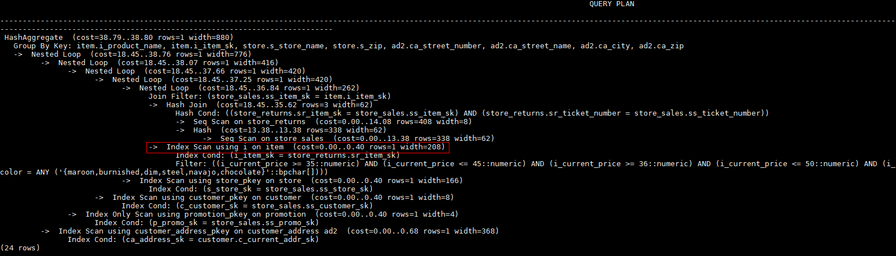

# Scan Operation Hints<a name="EN-US_TOPIC_0245374572"></a>

## Function<a name="en-us_topic_0237121537_section290819468377"></a>

These hints specify a scan operation, which can be  **tablescan**,  **indexscan**, or  **indexonlyscan**.

## Syntax<a name="en-us_topic_0237121537_section17380317104213"></a>

```
[no] tablescan|indexscan|indexonlyscan(table [index])
```

## Parameter Description<a name="en-us_topic_0237121537_section35087980143822"></a>

- **no**  indicates that the specified hint will not be used for a join.

- _table_  specifies the table to be scanned. You can specify only one table. Use a table alias \(if any\) instead of a table name.
- _index_  indicates the index for  **indexscan**  or  **indexonlyscan**. You can specify only one index.

>[!NOTE]NOTE   
>**indexscan**  and  **indexonlyscan**  hints can be used only when the specified index belongs to the table.  
>Scan operation hints can be used for row-store tables, column-store tables, OBS tables, and subquery tables.   

## Example<a name="en-us_topic_0237121537_section1127715590585"></a>

To specify an index-based hint for a scan, create an index named  **i**  on the  **i\_item\_sk**  column of the  **item**  table.

```
create index i on item(i_item_sk);
```

Hint the query plan in  [Example](plan_hint_optimization_overview.md#en-us_topic_0237121532_section671421102912)  as follows:

```
explain
select /*+ indexscan(item i) */ i_product_name product_name ...
```

**item**  is scanned based on an index. The optimized plan is as follows:


