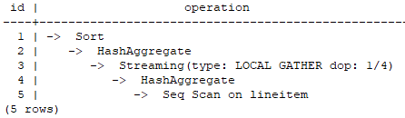

# SMP<a name="EN-US_TOPIC_0000001225414549"></a>

The Symmetric Multi-Processing \(SMP\) technology of openGauss uses the multi-core CPU architecture of a computer to implement multi-thread parallel computing, fully using CPU resources to improve query performance. In complex query scenarios, a single query takes long time and the system concurrency is low. Therefore, the SMP technology is used to implement operator-level parallel execution, which effectively reduces the query time and improves the query performance and resource utilization. The overall implementation of the SMP technology is as follows: For query operators that can be executed in parallel, data is sliced, multiple worker threads are started for computation, and then the results are summarized and returned to the frontend. The data interaction operator  **Stream**  is added to the SMP architecture to implement data exchange between multiple worker threads, ensuring the correctness and integrity of the query.

## Applicable Scenarios and Restrictions<a name="section136321654121411"></a>

The SMP feature improves the performance through operator parallelism and occupies more system resources, including CPU, memory, and I/O. Actually, SMP is a method consuming resources to save time. It improves system performance in applicable scenarios where resources are sufficient, but may deteriorate performance otherwise. SMP applies to analytical query scenarios where a single query takes a long time and the service concurrency is low. The SMP technology can reduce the query delay and improve the system throughput. However, in a transaction-related high-concurrency scenario, as the delay of each single query is short, using the SMP technology increases the query delay and reduces the system throughput.

- Applicable scenarios
    - Operators that support parallelism. The plan contains the following operators that support parallelism.
        - Scan: scans row-store ordinary tables, row-store partitioned tables, column-store ordinary tables, and column-store partitioned tables sequentially.
        - Join: HashJoin and NestLoop
        - Agg: HashAgg, SortAgg, PlainAgg, and WindowAgg \(which supports only  **partition by**, and does not support  **order by**\)
        - Stream: Local Redistribute and Local Broadcast
        - Others: Result, Subqueryscan, Unique, Material, Setop, Append, and VectoRow

    - SMP-specific operators: To execute queries in parallel, Stream operators are added for data exchange of the SMP feature. These new operators can be considered as the subtypes of Stream operators.
        - Local Gather aggregates data of parallel threads within an instance.
        - Local Redistribute redistributes data based on the distribution key across threads within an instance.
        - Local Broadcast broadcasts data to each thread within an instance.
        - Local RoundRobin distributes data in polling mode across threads within an instance.

    - The following uses the  **TPCH Q1**  parallel plan as an example.

         

        In this plan, the Scan and HashAgg operators are processed in parallel, and the Local Gather operator is added for data exchange. Operator 3 is a Local Gather operator. "dop: 1/4" indicates that the degree of parallelism of the sender thread is 4 and the degree of parallelism of the receiver thread is 1. That is, the lower-layer HashAggregate operator 4 is executed based on the degree of parallelism 4, the upper-layer operators 1 and 2 are executed in serial mode, and operator 3 aggregates data of parallel threads within the instance.

        You can view the parallelism situation of each operator in the dop information.

- Non-applicable scenarios
    - Index scanning cannot be executed in parallel.
    - MergeJoin cannot be executed in parallel.
    - WindowAgg order by cannot be executed in parallel.
    - The cursor cannot be executed in parallel.
    - Queries in stored procedures and functions cannot be executed in parallel.
    - Subplans and initplans cannot be queried in parallel, and operators that contain subqueries cannot be executed in parallel, either.
    - Query statements that contain the median operation cannot be executed in parallel.
    - Queries with global temporary tables cannot be executed in parallel.
    - Updating materialized views cannot be executed in parallel.

## Resource Restrictions on SMP Performance<a name="section310105992016"></a>

The SMP architecture consumes abundant resources to save time. After plans are executed in parallel, the resource consumption increases, covering the CPU, memory, and I/O resources. As the degree of parallelism grows, the resource consumption increases. If these resources become a bottleneck, the SMP architecture does not improve performance but may deteriorate the overall performance of the database instance. The following describes the various resource restrictions on the SMP performance:

- CPU

    In a general customer scenario where the system CPU usage is not high, using the SMP architecture will fully use the CPU resources to improve the system performance. If the number of CPU cores of the database server is small and the CPU usage is already high, enabling the SMP feature may deteriorate the system performance due to resource contention between multiple threads.

- Memory

    Parallel query causes high memory usage, but the memory usage of each operator is still subject to  **work\_mem**  and other parameters. Assuming that  **work\_mem**  is 4 GB and the degree of parallelism is 2, the memory usage of each thread in parallel is limited to 2 GB. When  **work\_mem**  is small or the system memory is not sufficient, using SMP may flush data to disks. As a result, the query performance deteriorates.

- I/O

    A parallel scan increases I/O resource consumption. It can improve scan performance only when I/O resources are sufficient.

## Other Factors Affecting the SMP Performance<a name="section190917443263"></a>

Besides resources, there are other factors that impact the SMP performance, such as uneven data distribution in a partitioned table and degree of parallelism.

- Data skew

    Severe data skew deteriorates SMP performance. For example, if the data volume of a value in the join column is much more than that of other values, the data volume of a parallel thread will be much more than that of others after Hash-based data redistribution, resulting in the long-tail issue and poor SMP performance.

- Degree of parallelism

    The SMP feature uses more resources, and remaining resources are insufficient in a high concurrency scenario. Therefore, enabling the SMP feature will result in severe resource contention among queries. Once resource contention occurs, no matter the CPU, I/O, or memory resources, all of them will result in entire performance deterioration. In the high concurrency scenario, enabling the SMP feature will not improve the performance and even may cause performance deterioration.

## Procedure<a name="section58511820192718"></a>

1. Observe the current system load situation. If resources are sufficient \(the resource usage is smaller than 50%\), perform step  [2](#li1174421213171). Otherwise, exit this system.
2. <a name="li1174421213171"></a>Set  **query\_dop**  to  **1**  \(default value\). Use  **explain**  to generate an execution plan and check whether the plan can be used in scenarios in  [Applicable Scenarios and Restrictions](#section136321654121411). If yes, go to step  [3](#li998191911172).
3. <a name="li998191911172"></a>Set  **query\_dop**  to  _value_. The degree of parallelism is 1 or  _value_  regardless of the resource usage and plan characteristics.
4. Before the query statement is executed, set  **query\_dop**  to an appropriate value. After the statement is executed, set  **query\_dop**  to disable the query. The following provides an example:

    ```
    openGauss=# SET query_dop = 4;
    openGauss=# SELECT COUNT(*) FROM t1 GROUP BY a;
    ......
    openGauss=# SET query_dop = 1;
    ```

    >[!NOTE]NOTE   
    >- If resources are sufficient, the higher the degree of parallelism, the better the performance.  
    >- The degree of parallelism supports session-level settings. You are advised to enable the SMP feature before executing a query that meets the requirements. After the execution is complete, disable the SMP feature. Otherwise, SMP may affect services in peak hours.  
