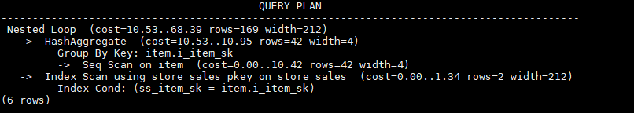

# Sublink Name Hints<a name="EN-US_TOPIC_0245374573"></a>

## Function<a name="en-us_topic_0237121538_section290819468377"></a>

These hints specify the name of a sublink block.

## Syntax<a name="en-us_topic_0237121538_section530131664410"></a>

```
blockname (table)
```

## Parameter Description<a name="en-us_topic_0237121538_section41303128143838"></a>

- _table_  specifies the name you have specified for a sublink block.

>[!NOTE]NOTE   
>
>- The  **blockname**  hint is used by an outer query only when a sublink is pulled up. Currently, only the  **Agg**  equivalent join,  **IN**, and  **EXISTS**  sublinks can be pulled up. This hint is usually used together with the hints described in the previous sections.  
>- The subquery after the  **FROM**  keyword is hinted by using the subquery alias. In this case,  **blockname**  becomes invalid.  
>- If a sublink contains multiple tables, the tables will be joined with the outer-query tables in a random sequence after the sublink is pulled up. In this case,  **blockname**  also becomes invalid.  

## Example<a name="en-us_topic_0237121538_section1127715590585"></a>

```
explain select /*+nestloop(store_sales tt) */ * from store_sales where ss_item_sk in (select /*+blockname(tt)*/ i_item_sk from item group by 1);
```

**tt**  indicates the sublink block name. After being pulled up, the sublink is joined with the outer-query table  **store\_sales**  by using  **nestloop**. The optimized plan is as follows:


