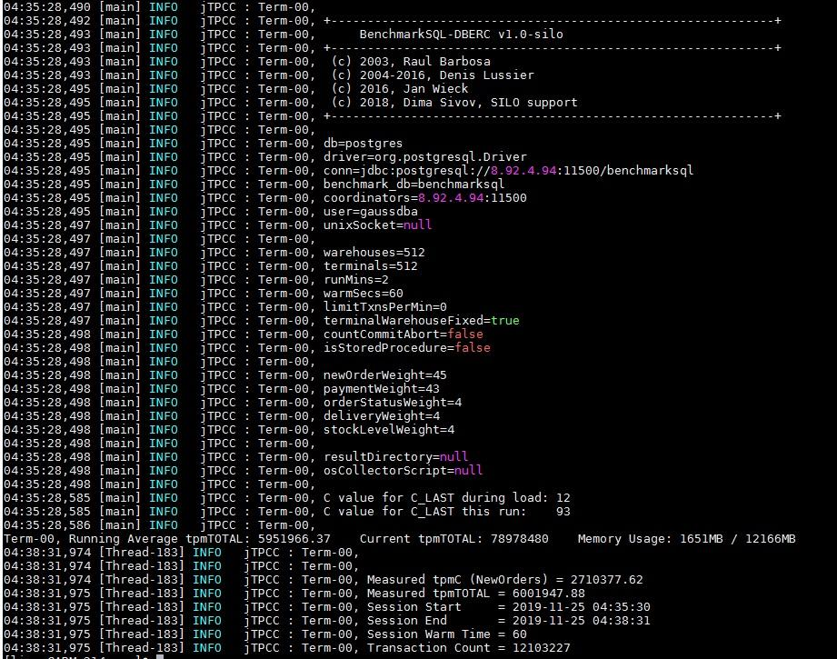
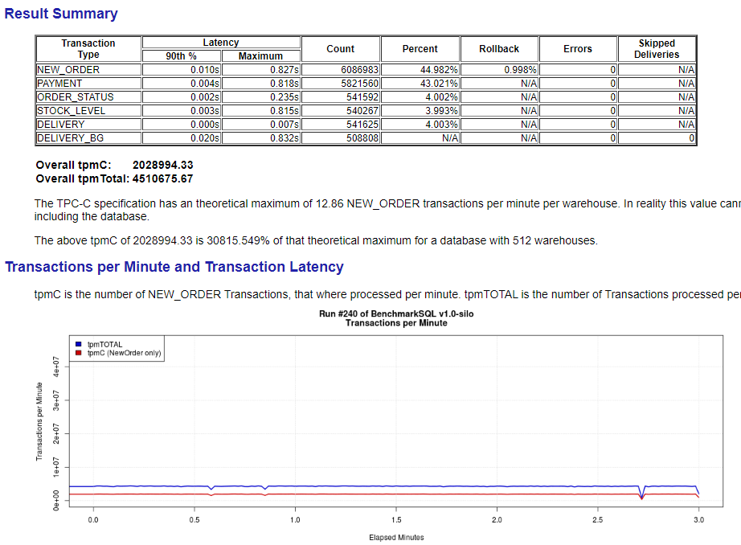
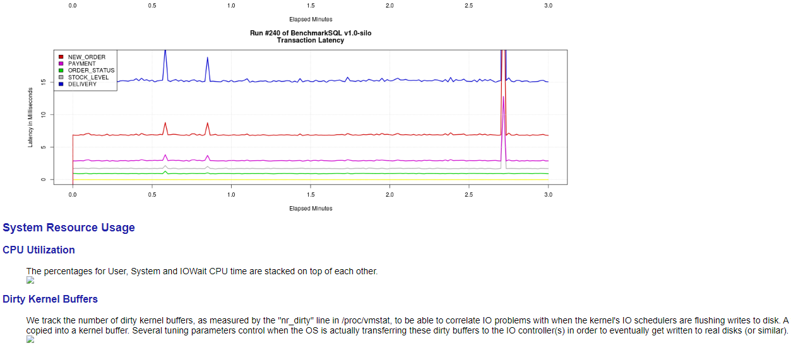

# Testing MOT TPC-C Performance

## TPC-C Introduction

The TPC-C Benchmark is an industry standard benchmark for measuring the performance of Online Transaction Processing \(OLTP\) systems. It is based on a complex database and a number of different transaction types that are executed on it. TPC-C is both a hardware‑independent and a software-independent benchmark and can thus be run on every test platform. An official overview of the benchmark model can be found at the tpc.org website here –  [http://www.tpc.org/default5.asp](http://www.tpc.org/default5.asp).

The database consists of nine tables of various structures and thus also nine types of data records. The size and quantity of the data records varies per table. A mix of five concurrent transactions of varying types and complexities is executed on the database, which are largely online or in part queued for deferred batch processing. Because these tables compete for limited system resources, many system components are stressed and data changes are executed in a variety of ways.

**Table  1**  TPC-C Database Structure

<table><thead align="left"><tr id="row58492392"><th class="cellrowborder" valign="top" width="25.25%" id="mcps1.2.3.1.1">
Table

</th>
<th class="cellrowborder" valign="top" width="74.75%" id="mcps1.2.3.1.2">
Number of Entries

</th>
</tr>
</thead>
<tbody><tr id="row26964482"><td class="cellrowborder" valign="top" width="25.25%" headers="mcps1.2.3.1.1 ">
Warehouse

</td>
<td class="cellrowborder" valign="top" width="74.75%" headers="mcps1.2.3.1.2 ">
n

</td>
</tr>
<tr id="row817225"><td class="cellrowborder" valign="top" width="25.25%" headers="mcps1.2.3.1.1 ">
Item

</td>
<td class="cellrowborder" valign="top" width="74.75%" headers="mcps1.2.3.1.2 ">
100,000

</td>
</tr>
<tr id="row5099437"><td class="cellrowborder" valign="top" width="25.25%" headers="mcps1.2.3.1.1 ">
Stock

</td>
<td class="cellrowborder" valign="top" width="74.75%" headers="mcps1.2.3.1.2 ">
n x 100,000

</td>
</tr>
<tr id="row66320226"><td class="cellrowborder" valign="top" width="25.25%" headers="mcps1.2.3.1.1 ">
District

</td>
<td class="cellrowborder" valign="top" width="74.75%" headers="mcps1.2.3.1.2 ">
n x 10

</td>
</tr>
<tr id="row5277541"><td class="cellrowborder" valign="top" width="25.25%" headers="mcps1.2.3.1.1 ">
Customer

</td>
<td class="cellrowborder" valign="top" width="74.75%" headers="mcps1.2.3.1.2 ">
3,000 per district, 30,000 per warehouse

</td>
</tr>
<tr id="row47063994"><td class="cellrowborder" valign="top" width="25.25%" headers="mcps1.2.3.1.1 ">
Order

</td>
<td class="cellrowborder" valign="top" width="74.75%" headers="mcps1.2.3.1.2 ">
Number of customers (initial value)

</td>
</tr>
<tr id="row36671921"><td class="cellrowborder" valign="top" width="25.25%" headers="mcps1.2.3.1.1 ">
New order

</td>
<td class="cellrowborder" valign="top" width="74.75%" headers="mcps1.2.3.1.2 ">
30% of the orders (initial value)

</td>
</tr>
<tr id="row38551324"><td class="cellrowborder" valign="top" width="25.25%" headers="mcps1.2.3.1.1 ">
Order line

</td>
<td class="cellrowborder" valign="top" width="74.75%" headers="mcps1.2.3.1.2 ">
~ 10 per order

</td>
</tr>
<tr id="row17370009"><td class="cellrowborder" valign="top" width="25.25%" headers="mcps1.2.3.1.1 ">
History

</td>
<td class="cellrowborder" valign="top" width="74.75%" headers="mcps1.2.3.1.2 ">
Number of customers (initial value)

</td>
</tr>
</tbody>
</table>

The transaction mix represents the complete business processing of an order – from its entry through to its delivery. More specifically, the provided mix is designed to produce an equal number of new-order transactions and payment transactions and to produce a single delivery transaction, a single order-status transaction and a single stock-level transaction for every ten new-order transactions.

**Table  2**  TPC-C Transactions Ratio

<table><thead align="left"><tr id="row38413159"><th class="cellrowborder" valign="top" width="35.35%" id="mcps1.2.3.1.1">
Transaction Level ≥ 4%

</th>
<th class="cellrowborder" valign="top" width="64.64999999999999%" id="mcps1.2.3.1.2">
Share of All Transactions

</th>
</tr>
</thead>
<tbody><tr id="row12979352"><td class="cellrowborder" valign="top" width="35.35%" headers="mcps1.2.3.1.1 ">
TPC-C New order

</td>
<td class="cellrowborder" valign="top" width="64.64999999999999%" headers="mcps1.2.3.1.2 ">
≤ 45%

</td>
</tr>
<tr id="row34547936"><td class="cellrowborder" valign="top" width="35.35%" headers="mcps1.2.3.1.1 ">
Payment

</td>
<td class="cellrowborder" valign="top" width="64.64999999999999%" headers="mcps1.2.3.1.2 ">
≥ 43%

</td>
</tr>
<tr id="row45833411"><td class="cellrowborder" valign="top" width="35.35%" headers="mcps1.2.3.1.1 ">
Order status

</td>
<td class="cellrowborder" valign="top" width="64.64999999999999%" headers="mcps1.2.3.1.2 ">
≥ 4%

</td>
</tr>
<tr id="row50824398"><td class="cellrowborder" valign="top" width="35.35%" headers="mcps1.2.3.1.1 ">
Delivery

</td>
<td class="cellrowborder" valign="top" width="64.64999999999999%" headers="mcps1.2.3.1.2 ">
≥ 4% (batch)

</td>
</tr>
<tr id="row21489686"><td class="cellrowborder" valign="top" width="35.35%" headers="mcps1.2.3.1.1 ">
Stock level

</td>
<td class="cellrowborder" valign="top" width="64.64999999999999%" headers="mcps1.2.3.1.2 ">
≥ 4%

</td>
</tr>
</tbody>
</table>

There are two ways to execute the transactions –  **as stored procedures**  \(which allow higher throughput\) and in  **standard interactive SQL mode**.

**Performance Metric – tpm-C**

The tpm-C metric is the number of new-order transactions executed per minute. Given the required mix and a wide range of complexity and types among the transactions, this metric most closely simulates a comprehensive business activity, not just one or two transactions or computer operations. For this reason, the tpm-C metric is considered to be a measure of business throughput.

The tpm-C unit of measure is expressed as transactions-per-minute-C, whereas "C" stands for TPC-C specific benchmark.

>[!NOTE]NOTE 
>The official TPC-C Benchmark specification can be accessed at –  [http://www.tpc.org/tpc\_documents\_current\_versions/pdf/tpc-c\_v5.11.0.pdf](http://www.tpc.org/tpc_documents_current_versions/pdf/tpc-c_v5.11.0.pdf). Some of the rules of this specification are generally not fulfilled in the industry, because they are too strict for industry reality. For example, Scaling rules – \(a\) tpm-C / Warehouse must be \>9 and <12.86 \(implying that a very high warehouses rate is required in order to achieve a high tpm-C rate, which also means that an extremely large database and memory capacity are required\); and \(b\) 10x terminals x Warehouses \(implying a huge quantity of simulated clients\).

## System-Level Optimization

Follow the instructions in the  [MOT Server Optimization – x86](https://docs.opengauss.org/en/docs/latest/database_administration_guide/mot_server_optimization.html)  section. The following section describes the key system-level optimizations for deploying the openGauss database on a Huawei Taishan server and on a Euler 2.8 operating system for ultimate performance.

## BenchmarkSQL – An Open-Source TPC-C Tool

For example, to test TPCC, the  **BenchmarkSQL**  can be used, as follows –

- Download  **benchmarksql**  from the following link –  [https://osdn.net/frs/g\_redir.php?m=kent&f=benchmarksql%2Fbenchmarksql-5.0.zip](https://osdn.net/frs/g_redir.php?m=kent&f=benchmarksql%2Fbenchmarksql-5.0.zip)
- The schema creation scripts in the  **benchmarksql**  tool need to be adjusted to MOT syntax and unsupported DDLs need to be avoided. The adjusted scripts can be directly downloaded from the following link –  [https://opengauss.obs.cn-south-1.myhuaweicloud.com/1.0.0/MOT-TPCC-Benchmark.tar.gz](https://opengauss.obs.cn-south-1.myhuaweicloud.com/1.0.0/MOT-TPCC-Benchmark.tar.gz). The contents of this tar file includes sql.common.opengauss.mot folder and jTPCCTData.java file as well as a sample configuration file postgresql.conf and a TPCC properties file props.mot for reference.
- Place the sql.common.opengauss.mot folder in the same level as sql.common under run folder and replace the file src/client/jTPCCTData.java with the downloaded java file.
- Edit the file runDatabaseBuild.sh under run folder to remove  **extraHistID**  from  **AFTER\_LOAD**  list to avoid unsupported alter table DDL.
- Replace the JDBC driver under lib/postgres folder with the openGauss JDBC driver available from the following link –  [https://opengauss.org/en/download/](https://opengauss.org/en/download/).

The only change done in the downloaded java file \(compared to the original one\) was to comment the error log printing for serialization and duplicate key errors. These errors are normal in case of MOT, since it uses Optimistic Concurrency Control \(OCC\) mechanism.

>[!NOTE]NOTE 
>The benchmark test is executed using a standard interactive SQL mode without stored procedures.

## Running the Benchmark

Anyone can run the benchmark by starting up the server and running the  **benchmarksql**  scripts.

To run the benchmark –

1. Go to the  **benchmarksql**  run folder and rename sql.common to sql.common.orig.
2. Create a link sql.common to sql.common.opengauss.mot in order to test MOT.
3. Start up the database server.
4. Configure the props.pg file in the client.
5. Run the benchmark.

## Results Report

- Results in CLI

    BenchmarkSQL results should appear as follows –

    

    Over time, the benchmark measures and averages the committed transactions. The example above benchmarks for two minutes.

    The score is  **2.71M tmp-C**  \(new-orders per-minute\), which is 45% of the total committed transactions, meaning the  **tpmTOTAL**.

- Detailed Result Report

    The following is an example of a detailed result report –

    **Figure  1**  Detailed Result Report  
    

    

    BenchmarkSQL collects detailed performance statistics and operating system performance data \(if configured\).

    This information can show the latency of the queries, and thus expose bottlenecks related to storage/network/CPU.

- Results of TPC-C of MOT on Huawei Taishan 2480

    Our TPC-C benchmark dated 01-May-2020 with an openGauss database installed on Taishan 2480 server \(a 4-socket ARM/Kunpeng server\), achieved a throughput of 4.79M tpm‑C.

    A near linear scalability was demonstrated, as shown below –

    **Figure  2**  Results of TPC-C of MOT on Huawei Taishan 2480  
    
