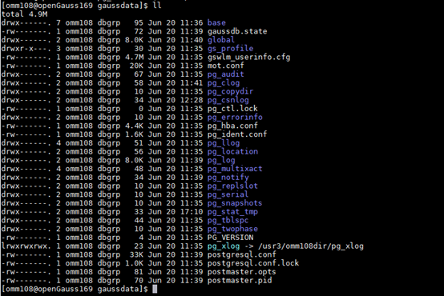
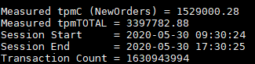

# Testing TPC-C Performance<a name="EN-US_TOPIC_0283137363"></a>

1. Download the TPC-C standard test tool BenchmarkSQL 5.0.
2. Replace \*.jar in the  **lib/postgresql**  directory with the \*.jar package adapted to the openGauss.

    ```
    $ pwd 
    /your path/benchmarksql-5.0/lib/postgres 
    $ ls 
    postgresql.jar #openGauss jdbc driver
    postgresql-9.3-1102.jdbc41.jar.bak #Backup .jar file.
    ```

    The JDBC version package adapted to openGauss is obtained from  [openGauss-x.x.x-JDBC .tar.gz](https://opengauss.org/zh/download/).

3. Go to the root directory of benchmarksql-5.0 and run the  **ant**  command for compilation.

    ```
    $ cd /your path/benchmarksql-5.0/ 
    $ ant
    ```

    After the compilation is successful, the build and dist directories are generated.

4. Create the BenchmarkSQL configuration file. Before using the BenchmarkSQL, you need to configure the database information, including the database account, password, port number and database name.

    ```
    $ cd /your path/benchmarksql-5.0/run 
    $ cp props.pg props.opengauss.1000w 
    $ vim props.opengauss.1000w
    ```

    Copy a configuration file from  **props.pg**  and modify the file as follows. Information in italics can be changed according to the actual situation.

    ```
    db=postgres 
    driver=org.postgresql.Driver 
    // Modify the connection string, including IP address, port number, and database. In the following information, 8.92.4.238 is the IP address of the GE NIC on the database server.
    conn=jdbc:postgresql://8.92.4.238:21579/tpcc1000?prepareThreshold=1&batchMode=on&fetchsize=10 
    // Set the username and password for logging in to the database.
    user=bot 
    password=Gaussdba@Mpp 
      
    warehouses=1000 
    loadWorkers=200 
      
    // Set the maximum number of concurrences, which is the same as the maximum number of work tasks on the server.
    terminals=812 
    // To run a specified transaction for each terminal, runMins must be set to 0.
    runTxnsPerTerminal=0 
    // To specify the running time, runTxnsPerTerminal must be set to 0.
    runMins=5 
    // Total number of transactions per minute
    limitTxnsPerMin=0 
      
     
    // When the system runs in 4.x compatibility mode, set this parameter to True.
    // Set this parameter to false to evenly use the entire configured database.
    terminalWarehouseFixed=false 
      
    // The sum of the following five values is 100.
    // The default percentages of 45, 43, 4, 4, and 4 match the TPC-C specification.
    newOrderWeight=45 
    paymentWeight=43 
    orderStatusWeight=4 
    deliveryWeight=4 
    stockLevelWeight=4 
      
    // Create a folder to collect detailed result data.
    // Remove the content through comment.
    resultDirectory=my_result_%tY-%tm-%td_%tH%tM%tS 
    osCollectorScript=./misc/os_collector_linux.py 
    osCollectorInterval=1 
    // Collect OS load information.
    osCollectorSSHAddr=osuer@10.44.133.78    
    osCollectorDevices=net_enp3s0 blk_nvme0n1 blk_nvme1n1 blk_nvme2n1 blk_nvme3n1
    ```

5. Prepare for importing TPC-C data.

    Replace the files in BenchmarkSQL with the following file in  **benchmarksql-5.0/run/sql.common/**. This file mainly adds two tablespaces and some additional data attributes.

    ```
    CREATE TABLESPACE example2 relative location 'tablespace2';
    CREATE TABLESPACE example3 relative location 'tablespace3';
    
    create table bmsql_config (
      cfg_name    varchar(30),
      cfg_value   varchar(50)
    );
    
    create table bmsql_warehouse (
      w_id        integer   not null,
      w_ytd       decimal(12,2),
      w_tax       decimal(4,4),
      w_name      varchar(10),
      w_street_1  varchar(20),
      w_street_2  varchar(20),
      w_city      varchar(20),
      w_state     char(2),
      w_zip       char(9)
    ) WITH (FILLFACTOR=80);
    
    create table bmsql_district (
      d_w_id       integer       not null,
      d_id         integer       not null,
      d_ytd        decimal(12,2),
      d_tax        decimal(4,4),
      d_next_o_id  integer,
      d_name       varchar(10),
      d_street_1   varchar(20),
      d_street_2   varchar(20),
      d_city       varchar(20),
      d_state      char(2),
      d_zip        char(9)
     ) WITH (FILLFACTOR=80);
    
    create table bmsql_customer (
      c_w_id         integer        not null,
      c_d_id         integer        not null,
      c_id           integer        not null,
      c_discount     decimal(4,4),
      c_credit       char(2),
      c_last         varchar(16),
      c_first        varchar(16),
      c_credit_lim   decimal(12,2),
      c_balance      decimal(12,2),
      c_ytd_payment  decimal(12,2),
      c_payment_cnt  integer,
      c_delivery_cnt integer,
      c_street_1     varchar(20),
      c_street_2     varchar(20),
      c_city         varchar(20),
      c_state        char(2),
      c_zip          char(9),
      c_phone        char(16),
      c_since        timestamp,
      c_middle       char(2),
      c_data         varchar(500)
    ) WITH (FILLFACTOR=80) tablespace example2;
    
    create sequence bmsql_hist_id_seq;
    
    create table bmsql_history (
      hist_id  integer,
      h_c_id   integer,
      h_c_d_id integer,
      h_c_w_id integer,
      h_d_id   integer,
      h_w_id   integer,
      h_date   timestamp,
      h_amount decimal(6,2),
      h_data   varchar(24)
    ) WITH (FILLFACTOR=80);
    
    create table bmsql_new_order (
      no_w_id  integer   not null,
      no_d_id  integer   not null,
      no_o_id  integer   not null
    ) WITH (FILLFACTOR=80);
    
    create table bmsql_oorder (
      o_w_id       integer      not null,
      o_d_id       integer      not null,
      o_id         integer      not null,
      o_c_id       integer,
      o_carrier_id integer,
      o_ol_cnt     integer,
      o_all_local  integer,
      o_entry_d    timestamp
    ) WITH (FILLFACTOR=80);
    
    create table bmsql_order_line (
      ol_w_id         integer   not null,
      ol_d_id         integer   not null,
      ol_o_id         integer   not null,
      ol_number       integer   not null,
      ol_i_id         integer   not null,
      ol_delivery_d   timestamp,
      ol_amount       decimal(6,2),
      ol_supply_w_id  integer,
      ol_quantity     integer,
      ol_dist_info    char(24)
    ) WITH (FILLFACTOR=80);
    
    create table bmsql_item (
      i_id     integer      not null,
      i_name   varchar(24),
      i_price  decimal(5,2),
      i_data   varchar(50),
      i_im_id  integer
    );
    
    create table bmsql_stock (
      s_w_id       integer       not null,
      s_i_id       integer       not null,
      s_quantity   integer,
      s_ytd        integer,
      s_order_cnt  integer,
      s_remote_cnt integer,
      s_data       varchar(50),
      s_dist_01    char(24),
      s_dist_02    char(24),
      s_dist_03    char(24),
      s_dist_04    char(24),
      s_dist_05    char(24),
      s_dist_06    char(24),
      s_dist_07    char(24),
      s_dist_08    char(24),
      s_dist_09    char(24),
      s_dist_10    char(24)
    ) WITH (FILLFACTOR=80) tablespace example3;
    ```

6. Import data.
    1. Create a database user.

        ```
        create user bot identified by 'Gaussdba@Mpp' profile default; 
        alter user bot sysadmin; 
        create database tpcc1000 encoding 'UTF8' template=template0 owner tpcc5q;
        ```

    2. To import data, run the following command.

        ```
        ./runDatabaseBuild.sh props.opengauss.1000w
        ```

7. <a name="en-us_topic_0263913274_li11139125793619"></a>Back up data.

    To facilitate multiple tests and reduce the data import time, you can stop the database and copy the entire data directory to back up the database.

8. <a name="en-us_topic_0263913274_li1840654753618"></a>Partition data disks.

    During the performance test, data needs to be distributed to different storage media to increase the I/O throughput. There are four NVMe disks on the server. Therefore, data can be distributed to different disks. Place the  **pg\_xlog**,  **tablespace2**, and  **tablespace3**  directories on the other three NVMe disks and provide soft links pointing to the actual locations in the original locations.  **pg\_xlog**  is in the database directory, and  **tablespace2**  and  **tablespace3**  are in the  **pg\_location**  database directory. Run the following command to partition  **tablespace2**.

    ```
    mv $DATA_DIR/pg_location/tablespace2 $TABSPACE2_DIR/tablespace2 
    cd $DATA_DIR/pg_location/ 
    ln -svf $TABSPACE2_DIR/tablespace2 ./
    ```

    The following figure shows the creation result.

    

    

9. Run the TPC-C program.

    ```
    numactl –C 0-19,32-51,64-83,96-115 ./runBenchmark.sh props.opengauss.1000w
    ```

    The following figure shows the test result. The tpmC part is the test result.

    

10. <a name="en-us_topic_0263913274_li202511145123814"></a>Verify the correctness of the data test process.

    Use htop to monitor the CPU usage of the database server and TPC-C client. In the best performance test, the CPU usage of each service is very high \(\> 90%\). If the CPU usage does not meet the requirement, the core binding mode may be incorrect or other problems occur. In this case, locate the root cause and rectify the fault.

    The following figure shows the usage of all CPUs in the best performance test. The CPU in the yellow box processes network interruption.

    

11. If you need to perform the test again to avoid data interference, you can copy the data backed up in  [step 7](#en-us_topic_0263913274_li11139125793619)  to restore the data. Repeat  [step 8](#en-us_topic_0263913274_li1840654753618)  to  [step 10](#en-us_topic_0263913274_li202511145123814)  to perform the test again.
