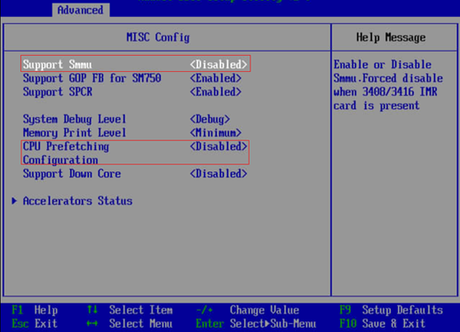

# BIOS配置

1. 恢复BIOS出厂设置。
2. 修改相关BIOS设置，如下所示：

   a. **BIOS\>Advanced\>MISC Config，配置Support Smmu为Disabled**，如[图1](#fig1464144318512)所示。

   **图 1**  修改BIOS设置（1）  
   

   b.**BIOS\>Advanced\>MISC Config，配置CPU Prefetching Configuration为Disabled**，如[图1](#fig1464144318512)所示。

   c.**BIOS\>Advanced\>Memory Config，配置Die Interleaving为Disable**，如[图2](#fig6430185319610)所示。

   **图 2**  修改BIOS设置（2）  
   

3. 重启操作系统。
