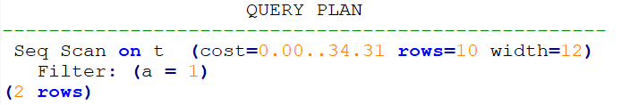
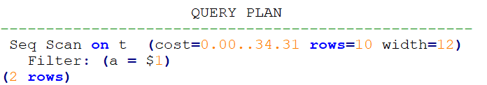

# Custom Plan和Generic Plan选择的Hint

## 功能描述<a name="section290819468377"></a>

对于以PBE方式执行的查询语句和DML语句，优化器会基于规则、代价、参数等因素选择生成Custom Plan或Generic Plan执行。用户可以通过use\_cplan/use\_gplan的hint指定使用哪种计划执行方式。

## 语法格式<a name="section530131664410"></a>

- 指定使用Custom Plan：

    ```
    use_cplan
    ```

- 指定使用Generic Plan：

    ```
    use_gplan
    ```

>[!NOTE]说明
> 
>- 对于非PBE方式执行的SQL语句，设置本hint不会影响执行方式。
>- 本Hint的优先级仅高于基于代价的选择和plan\_cache\_mode参数，即plan\_cache\_mode无法强制选择执行方式的语句本hint也无法生效。

## 示例<a name="section41303128143838"></a>

强制使用Custom Plan

```
create table t (a int, b int, c int);
prepare p as select /*+ use_cplan */ * from t where a = $1;
explain execute p(1);
```

计划如下。可以看到过滤条件为入参的实际值，即此计划为Custom Plan。



强制使用Generic Plan

```
deallocate p;
prepare p as select /*+ use_gplan */ * from t where a = $1;
explain execute p(1);
```

计划如下。可以看到过滤条件为待填充的入参，即此计划为Generic Plan。


