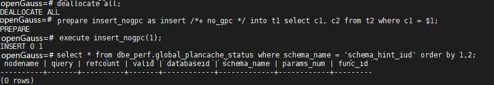

# 指定不使用全局计划缓存的Hint

## 功能描述<a name="section290819468377"></a>

全局计划缓存打开时，可以通过no\_gpc Hint来强制单个查询语句不在全局共享计划缓存，只保留会话生命周期的计划缓存。

## 语法格式<a name="section530131664410"></a>

```
no_gpc
```

>[!NOTE]说明
>本参数仅在enable\_global\_plancache=on时对PBE执行的语句生效。

## 示例<a name="section5736356154"></a>



dbe\_perf.global\_plancache\_status视图中无结果即没有计划被全局缓存。
