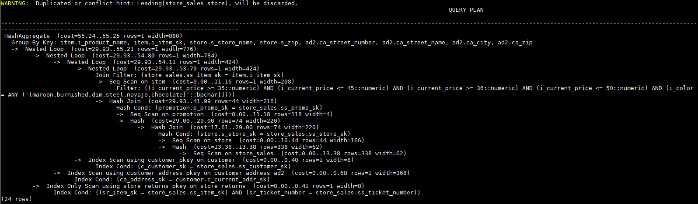

# Join顺序的Hint

## 功能描述<a name="zh-cn_topic_0237121533_section97491741123412"></a>

指明join的顺序，包括内外表顺序。

## 语法格式<a name="zh-cn_topic_0237121533_section128191729143517"></a>

- 仅指定join顺序，不指定内外表顺序。

```
leading(join_table_list) 
```

- 同时指定join顺序和内外表顺序，内外表顺序仅在最外层生效。

```
leading((join_table_list)) 
```

## 参数说明<a name="zh-cn_topic_0237121533_section1280444714345"></a>

**join\_table\_list**为表示表join顺序的hint字符串，可以包含当前层的任意个表（别名），或对于子查询提升的场景，也可以包含子查询的hint别名，同时任意表可以使用括号指定优先级，表之间使用空格分隔。

>[!TIP]须知  
>表只能用单个字符串表示，不能带schema。  
>表如果存在别名，需要优先使用别名来表示该表。  

join table list中指定的表需要满足以下要求，否则会报语义错误。

- list中的表必须在当前层或提升的子查询中存在。
- list中的表在当前层或提升的子查询中必须是唯一的。如果不唯一，需要使用不同的别名进行区分。
- 同一个表只能在list里出现一次。
- 如果表存在别名，则list中的表需要使用别名。

例如：

leading\(t1 t2 t3 t4 t5\)表示：t1、t2、t3、t4、t5先join，五表join顺序及内外表不限。

leading\(\(t1 t2 t3 t4 t5\)\)表示：t1和t2先join，t2做内表；再和t3 join，t3做内表；再和t4 join，t4做内表；再和t5 join，t5做内表。

leading\(t1 \(t2 t3 t4\) t5\)表示：t2、t3、t4先join，内外表不限；再和t1、t5 join，内外表不限。

leading\(\(t1 \(t2 t3 t4\) t5\)\)表示：t2、t3、t4先join，内外表不限；在最外层，t1再和t2、t3、t4的join表join，t1为外表，再和t5 join，t5为内表。

leading\(\(t1 \(t2 t3\) t4 t5\)\) leading\(\(t3 t2\)\)表示：t2、t3先join，t2做内表；然后再和t1 join，t2、t3的join表做内表；然后再依次跟t4、t5做join，t4、t5做内表。

## 示例<a name="zh-cn_topic_0237121533_section1127715590585"></a>

对[示例](plan_hint_optimization_overview.md#zh-cn_topic_0237121532_section671421102912)中原语句使用如下hint:

```
explain
select /*+ leading((((((store_sales store) promotion) item) customer) ad2) store_returns) leading((store store_sales))*/ i_product_name product_name ...
```

该hint表示：表之间的join关系是：store\_sales和store先join，store\_sales做内表，然后依次跟promotion, item, customer, ad2, store\_returns做join。生成计划如下所示：



图中计划顶端warning的提示详见[Hint的错误、冲突及告警](hint_errors_conflicts_and_other_warnings.md)的说明。
