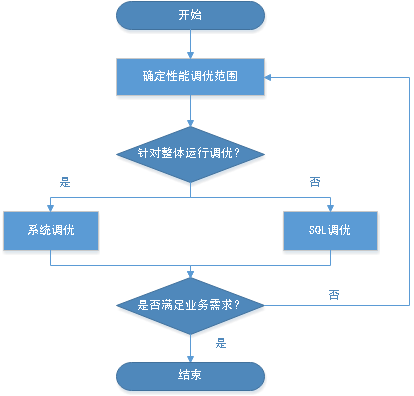

# 总体调优思路

openGauss的总体性能调优思路为性能瓶颈点分析、关键参数调整以及SQL调优。在调优过程中，通过系统资源、吞吐量、负载等因素来帮助定位和分析性能问题，使系统性能达到可接受的范围。

openGauss性能调优过程需要综合考虑多方面因素，因此，调优人员应对系统软件架构、软硬件配置、数据库配置参数、并发控制、查询处理和数据库应用有广泛而深刻的理解。

>[!TIP]须知  
>性能调优过程有时候需要重启openGauss，可能会中断当前业务。因此，业务上线后，当性能调优操作需要重启openGauss时，操作窗口时间需向管理部门提出申请，经批准后方可执行。  

## 调优流程

调优流程如[图1](#zh-cn_topic_0237121483_zh-cn_topic_0073253541_zh-cn_topic_0040046511_fig52278782113544)所示。

**图 1**  openGauss性能调优流程  

调优各阶段说明，如[表1](#zh-cn_topic_0237121483_zh-cn_topic_0073253541_zh-cn_topic_0040046511_table18747316113544)所示。

**表 1**  openGauss性能调优流程说明

<table><thead align="left"><tr id="zh-cn_topic_0237121483_zh-cn_topic_0073253541_zh-cn_topic_0040046511_row57564514113544"><th class="cellrowborder" valign="top" width="26%" id="mcps1.2.3.1.1">
阶段

</th>
<th class="cellrowborder" valign="top" width="74%" id="mcps1.2.3.1.2">
描述

</th>
</tr>
</thead>
<tbody><tr id="zh-cn_topic_0237121483_zh-cn_topic_0073253541_zh-cn_topic_0040046511_row30792195113544"><td class="cellrowborder" valign="top" width="26%" headers="mcps1.2.3.1.1 ">
<a href="determining_the_scope_of_performance_tuning.md">确定性能调优范围</a>

</td>
<td class="cellrowborder" valign="top" width="74%" headers="mcps1.2.3.1.2 ">
获取openGauss节点的CPU、内存、I/O和网络资源使用情况，确认这些资源是否已被充分利用，是否存在瓶颈点。

</td>
</tr>
<tr id="zh-cn_topic_0237121483_zh-cn_topic_0073253541_zh-cn_topic_0040046511_row7268277113544"><td class="cellrowborder" valign="top" width="26%" headers="mcps1.2.3.1.1 ">
<a href="optimizing_os_parameters.md">系统调优指南</a>

</td>
<td class="cellrowborder" valign="top" width="74%" headers="mcps1.2.3.1.2 ">
进行操作系统级以及数据库系统级的调优，更充分地利用机器的CPU、内存、I/O和网络资源，避免资源冲突，提升整个系统查询的吞吐量。

</td>
</tr>
<tr id="zh-cn_topic_0237121483_zh-cn_topic_0073253541_zh-cn_topic_0040046511_row23318170113544"><td class="cellrowborder" valign="top" width="26%" headers="mcps1.2.3.1.1 ">
<a href="sql_optimization.md">SQL调优指南</a>

</td>
<td class="cellrowborder" valign="top" width="74%" headers="mcps1.2.3.1.2 ">
审视业务所用SQL语句是否存在可优化空间，包括：

<ul id="zh-cn_topic_0237121483_zh-cn_topic_0073253541_zh-cn_topic_0040046511_ul42091895113544"><li>通过ANALYZE语句生成表统计信息：ANALYZE语句可收集与数据库中表内容相关的统计信息，统计结果存储在系统表PG_STATISTIC中。执行计划生成器会使用这些统计数据，以确定最有效的执行计划。</li><li>分析执行计划：EXPLAIN语句可显示SQL语句的执行计划，EXPLAIN PERFORMANCE语句可显示SQL语句中各算子的执行时间。</li><li>查找问题根因并进行调优：通过分析执行计划，找到可能存在的原因，进行针对性的调优，通常为调整数据库级SQL调优参数。</li><li>编写更优的SQL：介绍一些复杂查询中的中间临时数据缓存、结果集缓存、结果集合并等场景中的更优SQL语法。</li></ul>
</td>
</tr>
</tbody>
</table>
