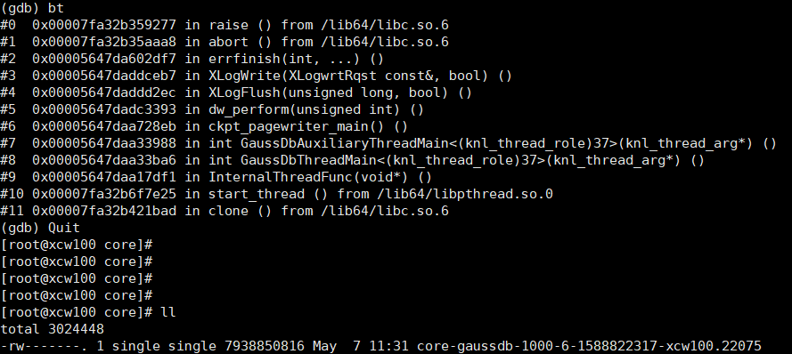

# core问题定位

## 磁盘满故障引起的core问题

### 问题现象<a name="zh-cn_topic_0283137100_zh-cn_topic_0059778167_s7a2ed06fefd0448fae90f40fe4291f8d"></a>

TPCC运行时，注入磁盘满故障，数据库进程gaussdb core掉，如下图所示。



### 原因分析<a name="zh-cn_topic_0283137100_zh-cn_topic_0059778167_s74d2dfcb815b4d8ca504c549a923e5ed"></a>

数据库本身机制，在磁盘满时，Xlog日志无法进行写入，通过panic日志退出程序。

### 处理办法<a name="zh-cn_topic_0283137100_section485620163250"></a>

外部监控磁盘使用状况，定时进行清理磁盘。

## GUC参数log_directory设置不正确引起的core问题

### 问题现象<a name="zh-cn_topic_0283137178_zh-cn_topic_0059778167_s7a2ed06fefd0448fae90f40fe4291f8d"></a>

数据库进程拉起后出现coredump，日志无内容。

### 原因分析<a name="zh-cn_topic_0283137178_zh-cn_topic_0059778167_s74d2dfcb815b4d8ca504c549a923e5ed"></a>

GUC参数log\_directory设置的路径不可读取或无访问权限，数据库在启动过程中进行校验失败，通过panic日志退出程序。

### 处理办法<a name="zh-cn_topic_0283137178_section485620163250"></a>

GUC参数log\_directory设置为合法路径，具体请参考[log\_directory](https://docs.opengauss.org/zh/docs/latest/database_reference/logging_destination.html#zh-cn_topic_0283136719_zh-cn_topic_0237124721_zh-cn_topic_0059778787_sfbedf09fcf1a4223a4538679f80f12a9)。

## 开启RemoveIPC引起的core问题

### 问题现象<a name="zh-cn_topic_0283136554_section54529241124"></a>

操作系统配置中RemoveIPC参数设置为yes，数据库运行过程中出现宕机，并显示如下日志消息。

```
FATAL: semctl(1463124609, 3, SETVAL, 0) failed: Invalid argument
```

### 原因分析<a name="zh-cn_topic_0283136554_section444545621213"></a>

当RemoveIPC参数设置为yes时，操作系统会在对应用户退出时删除IPC资源（共享内存和信号量），从而使得openGauss服务器使用的IPC资源被清理，引发数据库宕机。

### 处理分析<a name="zh-cn_topic_0283136554_section10754612151312"></a>

设置RemoveIPC参数为no。设置方法请参考《安装指南》中“安装准备\>准备软硬件安装环境\>修改操作系统配置”章节。
