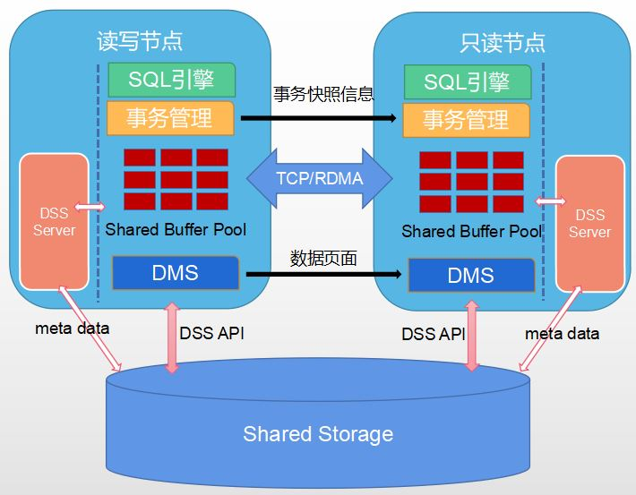

# 资源池化概述

## 可获得性

本特性自openGauss 3.1.1 版本开始引入。

## 特性简介

资源池化特性主要提供主备机共享一份存储的能力，提供一种新HA部署形态，解决传统HA部署下存储容量较单机翻倍的问题，满足降低存储容量及成本的诉求，同时备机支持实时一致性读。

## 架构介绍

资源池化整体架构图如下所示。

**图 1**  资源池化架构图  

- 磁阵设备并且已经安装ultrapath多路径软件，磁阵设备可用。
- 分布式存储服务DSS（Distributed Storage Service）

    DSS组件分为DSSAPI和DSSSERVER。DSSSERVER是独立进程，直接管理磁阵裸设备，并对外提供类似分布式文件系统的能力；DSSAPI是动态库，集成在数据库内部。DSS组件通过共享内存和客户端API动态库，为数据库提供创建文件、删除文件、扩展和收缩文件、读写文件的能力。

- 分布式内存服务DMS（Distributed Memory Service）

    DMS是动态库，集成在数据库内部，通过TCP/RDMA网络传输PAGE内容，将主备内存融合，提供内存池化能力，以此实现备机实时一致性读功能。

- 主备页面交换通过RDMA加速，依赖CX5网卡，并且依赖OCK  RDMA动态库。

## 功能特点

- 主备共享一份数据，显著降低传统HA的存储容量。
- 主备之间去除了日志复制功能，增加了主备页面交换功能，备机支持实时一致性读。
- 默认情况下，主备之间是通过TCP网络进行页面实时交换。为了降低页面交换的延迟，可选通过OCK RDMA动态库加速备机实时一致性的性能。

## 客户价值

解决传统HA部署下存储容量较单机部署翻倍的问题，减少了存储容量。备机支持实时一致性读，充分发挥主备多节点算力。

## 特性描述

- 资源池化依赖两个自研的公共组件实现主备共享一份存储的能力：
    - 分布式存储服务DSS（Distributed Storage Service）

        DSS分为DSSAPI和DSSSERVER，支持NoF/NoF+接口。DSSSERVER是独立进程，直接管理磁阵裸设备，并对外提供类似分布式文件系统的能力；DSSAPI是动态库，集成在数据库内部。DSS组件通过共享内存和客户端API动态库，为数据库提供创建文件、删除文件、扩展和收缩文件、读写文件的能力。

    - 分布式内存服务DMS（Distributed Memory Service）

        DMS是动态库，集成在数据库内部，通过TCP/RDMA网络传输PAGE内容，将主备内存融合，提供内存池化能力，以此实现备机实时一致性读功能。

- 存储池化通过分布式存储服务DSS组件实现主备共享一份存储。与传统建库相比，资源池化基于磁阵建库将目录分为三种类型，每实例独占且不共享、每实例独占且共享、所有实例共享。其中需要共享的目录均需存放到磁阵设备上，而不共享的目录存放在本地盘上。另外备机建库只需要建隶属于自己的目录，不需要再次创建所有实例共享的目录结构。资源池化新增了相关GUC参数，以及将系统表存储方式从页式切换到段页式。
- 内存池化通过分布式内存服务DMS组件实现主备页面实时交换，提供备机实时一致性能力。即主机事务提交后，在备机立即能够读到，不存在延迟读现象（事务隔离级别为Read-Committed）。
- 内存池化可选通过OCK RDMA降低DMS主备页面交换时延。TCP下的备机一致性读进行时延对比，开启OCK RDMA，备机一致性读时延至少要降低20%。

## 适用场景与限制

- 资源池化方案依赖于磁阵设备，磁阵的LUN需要支持SCSI3的PR协议（包括PR OUT（“PERSISTENT RESERVE OUT”）PR IN（“PERSISTENT RESERVE IN”）和INQUIRY）, 用于实现集群IO FENCE。除此之外，还需要支持SCSI3的CAW协议（COMPARE AND WRITE），用于实现共享磁盘锁。如Dorado 5000 V3磁阵设备。
- 资源池化实现的HA部署形态支持最高1主7备场景。
- 由于资源池化依赖类似分布式文件系统的功能来实现备机实时一致性读能力，因此要求文件元数据变更越少越好。基于性能考虑，本特性只支持段页式表。
- 只支持主备部署在同一磁阵设备上，不支持容灾部署，也不支持主备混合部署（如主和备部署在不同的磁阵设备上）。
- 主备页面交换通过RDMA加速，依赖CX5网卡，并且依赖OCK  RDMA动态库。
- 暂不支持备机重建及节点替换、节点修复等能力。
- 资源池化模式数据库和传统模式数据库不支持相互升级。
- 资源池化模式下gs\_xlogdump\_xid、gs\_xlogdump\_lsn、gs\_xlogdump\_tablepath、gs\_xlogdump\_parsepage\_tablepath、gs\_verify\_and\_tryrepair\_page、gs\_repair\_page、gs\_repair\_file函数功能不支持使用。
- 资源池化模式下T\_CreatePublicationStmt、T\_AlterPublicationStmt、T\_CreateSubscriptionStmt、T\_AlterSubscriptionStmt、T\_DropSubscriptionStmt订阅功能不支持使用。
- 资源池化模式下不支持全局临时表。
- 资源池化模式下Failover场景下，原主重新加入集群，需要等待Failover完成。
- 资源池化模式下Switchover场景下，如果在升主阶段出现失败（例如集群中其他节点重启导致本轮Switchover失败），原主节点需要重启。
- 资源池化模式下不支持hash索引。
- 资源池化模式下不支持级联备。
- 不支持ceph。
