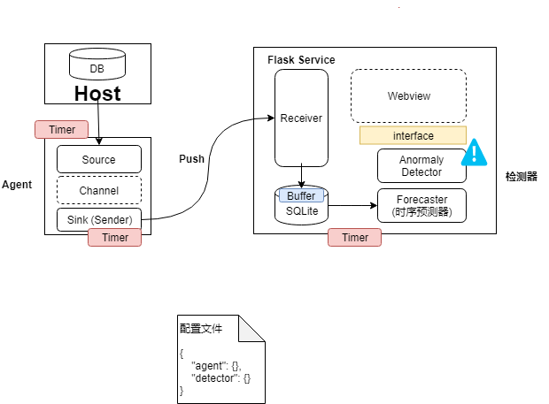

## Introduction to anomaly_detection

**anomaly_detection** is a monitor and anomaly detection tool based on timeseries-forecast algorithm aim at openGauss
metrics, such as IO-Read、IO-Write、CPU-Usage、Memory-Usage、Disk-Usage. anomaly_detection can monitor multi-metric at same
time, and forecast trend of metric in future, if the forecast value in future is beyond the specified scope, it can
notify user timely.

anomaly_detection is composed of two element, **agent** and **detector**, **agent** is deployed on same machine with openGauss,
**detector** can be divided into **server** and **monitor**, and it is deployed on any machine which can correspond with agent by _http_ or _https_, default method is __http__,
for security reason, we suggest to use _https_.

## anomaly_detection Installition

we suggest to use _anaconda_ to manage your python environment.

**agent**

    python3.6+
    python-dateutil
    configparse
    prettytable

**detector**

    python3.6+
    python-dateutil
    pandas
    flask
    flask_sqlalchemy
    flask_restful
    configparse
    prettytable
    pmdarima

notes:

using ```python -m pip install --upgrade pip``` to upgrade your pip.

you can use ```pip install -r requirements.txt``` to configure the  environment.

if you want to use `fprophet`, it is recommended to use ```conda install fbprophet``` 
to install `fbprophet`.


##Parameter explanation

use ```python main.py --help``` to get help:

    usage:
            python main.py start [--role {{agent,server,monitor}}]
            # start local service.
            python main.py stop [--role {{agent,server,monitor}}]
            # stop local service.
            python main.py start [--user USER] [--host HOST] [--project-path PROJECT_PATH] [--role {{agent,server,monitor}}]
            # start the remote service.
            python main.py stop [--user USER] [--host HOST] [--project-path PROJECT_PATH] [--role {{agent,server,monitor}}]
            # stop the remote service.
            python main.py deploy [--user USER] [--host HOST] [--project-path PROJECT_PATH]
            # deploy project in remote host.
            python main.py show_metrics
            # display all monitored metrics(can only be executed on 'detector' machine).
            python main.py forecast [--metric-name METRIC_NAME] [--forecast-periods FORECAST_PERIODS] [--forecast-method {{auto_arima, fbprophet}}] [--save-path SAVE_PATH]
            # forecast future trend of metric(can only be executed on 'detector' machine).
    
    
    abnomaly_detection: a timeseries forecast and anomaly detection tool.
    
    positional arguments:
      {start,stop,deploy,show_metrics,forecast}
    
    optional arguments:
      -h, --help            show this help message and exit
      --user USER           User of remote server.
      --host HOST           IP of remote server.
      --project-path PROJECT_PATH
                            Project location in remote server.
      --role {agent,server,monitor}
                            Run as 'agent', 'server', 'monitor'. notes: ensure the
                            normal operation of the openGauss in agent.
      --metric-name METRIC_NAME
                            Metric name to be predicted, if this parameter is not
                            provided, all metric in database will be predicted.
      --forecast-periods FORECAST_PERIODS
                            Forecast periods of metric, it should be integer plus
                            time unit format such as '1S', '2H', '10D'; now we
                            support time unit: S: Second, M: Minute, H: Hour, D:
                            Day, W: Week. notes: the specific value should be
                            determined to the trainnig data.if this parameter is
                            not provided, the default value '100S' will be used.
      --forecast-method FORECAST_METHOD
                            Forecast method, default method is 'auto_arima',if
                            want to use 'fbprophet', you should install fbprophet
                            first.
      --save-path SAVE_PATH
                            Save the results to this path using csv format, if
                            this parameter is not provided,, the result wil not be
                            saved.
      -v, --version         show program's version number and exit
    
    epilog:
         the 'a-detection.conf' and 'metric_task.conf' will be read when the program is running,
         the location of them is:
         a-detection.conf: xxx/a-detection.conf.
         metric_config: xxx/metric_task.conf.


## Introduction to a-detection.conf

the config is divided into section: `database`, `server`, `agent`, `forecast`, `log`, `security`.

in all sections in config, the `log` and `security` section is public, in addition to this, `agent` is used for
**agent** module, `database`, `server`, `forecast` is used in **detector** module. so you should note the
path in every section, make it clear that it is on **agent** or **detector**.

    [agent]
    # timer of source to collect metric info, unit is `second`
    source_timer_interval = 1
    # timer of sink to send data to server, unit is `second`
    sink_timer_interval = 1
    # maxsize of channel: default value is 300
    channel_capacity = 300

    [security]
    # config for https, if `tls` is False, use http instead, if `tls` is True, will
    # use `https` and you should provide available certificate in following path
    tls = False
    ca = ./certificate/ca/ca.crt
    server_cert = ./certificate/server/server.crt
    server_key = ./certificate/server/server.key
    agent_cert = ./certificate/agent/agent.crt
    agent_key = ./certificate/agent/agent.key

    [database]
    # location of sqlite
    database_path = ./data/metric.db
    # max rows of table in sqlite, in order to prevent table is too large
    max_rows = 100000
    # frequency to remove surplus rows in table
    max_flush_cache = 1000

    [server]
    host = 127.0.0.1
    # listen host of server
    listen_host = 0.0.0.0
    # listen port of server, make sure the port is not occupied
    listen_port = 8080

    [forecast]
    # forecast algorithm, support `fbprophet` and `auto_arima`, default is `auto_arima`,
    # you should install `fbprophet` module to use this method.
    predict_alg = auto_arima

    [log]
    # relative dirname of log
    log_dir = ./log


## Quick Guide

###1. Deploy certificate

if you want to correspond with 'https', you should set `tls = True` firstly, then you should own certificate and  place the certificate in the appropriate location(`./certificate/ca`, `./certificate/server`, `./certificate/agent`).
if `tls=False`, then will use 'http' method.

we provide demo [script](share) to generate certificate:

use [script](share/gen_ca_certificate.sh) to generate ca certificate and secret key. the same goes for other
certificates:

     sh gen_ca_certificate.sh

this script will create dirname `certificate` in project, it include three sub-dirname named `ca`, `server`, `agent`,
ca certificate and secret key will be placed in `./certificate/ca`.

you can also use your own ca certificate, just place it in `./certificate/ca`.

use [script](share/gen_certificate.sh) to generate server certificate and secret key:

     sh gen_certificate.sh # notes: the password of secret key will be saved in `certificate/pwf`.

after generating certificate and secret key, you should place it in corresponding sub-dirname(`./certificate/server` or
 `./certificate/agent`).

###2. Install openGauss

you should install openGauss before using anomaly_detection, in addition, you should set **PGDATA**(data directory) in environment variable.

###3. Deploy program

just as said above, the anomaly_detection is composed of two modules, respectively are **agent** and **detector**， the agent is
deployed with openGauss, and the detector can be deployed at any machine which can correspond with agent machine by 'http'.

you can copy the code to other machine or execute following command:

    python main.py deploy [--user USER] [--host HOST] [--project-path PROJECT_PATH]

###4 Start program

**detector** is devided into **server** and **monitor**,  and need to start or stop separately.

*step 1: start agent in machine which has installed openGauss*:

start the local agent service:

    python main.py start --role agent

start the remote agent service:

    python main.py start [--user USER] [--host HOST] [--project-path PROJECT_PATH] --role agent

*step 2: start server and monitor in detector machine*

start the local server and monitor service:

    python main.py start --role server
    python main.py start --role monitor

start the remote server and monitor service:

    python main.py start [--user USER] [--host HOST] [--project-path PROJECT_PATH] --role server
    python main.py start [--user USER] [--host HOST] [--project-path PROJECT_PATH] --role monitor

notes:
    `start` and `stop` operations are consistent, just replace `start` with `stop`
    you can also use [script](bin) to start/stop agent and detector process.


###5 Obeserve result

the program has four logs file, respectively are **agent.log**, **server.log**, **monitor.log**, **abnormal.log**.

agent.log: this log record running status of agent module.

server.log: this log record running status of app

monitor.log: this log record monitor status such as forecasting, detecting, etc.

abnormal.log: this log record abnormal status of monitor metric

###6 Other function

1. show the names of all metrics(use on detecotr):

    python main.py show_metrics

2. forecast metric(use on detector):

    python main.py forecast [--metric-name METRIC_NAME] [--forecast-periods FORECAST_PERIODS]
                            [--forecast-method {auto_arima, fbprophet}] [--save-path SAVE_PATH]


## Introduction to task

the monitor metric is defined in [task/metric_task.py](task/metric_task.py), the function should return metric value.

the monitor metric is configured in [task/metric_task.conf](task/metric_task.conf)

### How to add monitor metric

it is very easy to add metric that you want:

*step 1: write code in [task/metric_task.py](task/metric_task.py) which get the value of metric.*

*step 2: add metric config in [task/metric_task.conf](task/metric_task.conf)

    instruction of metric config:

    [cpu_usage]
    minimum = 20
    maximum = 100
    data_period = 2000
    forecast_interval = 20S
    forecast_period = 150S

    in the config of cpu_usage:

    'maximum': maximum allowable value of cpu_usage, it is considered as Exception if value is highed than it.
    'minimum': minimum allowable value of cpu_usage, it is considered as Exception if value is lower than it.
     note: you should at least provide one of it(just delete another), if not, the metric will not be monitored.

    'data_period': the value of 'data_period' reprensent time interval or length from now. for example, if we
                   want to get last 100 second data from now, then the value of 'data_period' is '100S'; if we want to get
                   last 20 days from now, then 'data_period' is '20D'; if we want to get last 1000 datasets, then the
                   'data_period' is 1000(must be integer, otherwise will use default value).
    'forecast_interval': the interval of predict operation. for example: if we want to predict 'cpu_usage' every
                         10 seconds, then the value of 'interval' is '10S'.

    'forecast_period': the forecast length, for example, if we want to forecast value of cpu_usage in the future
                       100 seconds at frequency of '1S', then the value of 'forecast_period' should be 100S.

    notes: 'S' -> second
           'M' -> minute
           'H' -> hour
           'D' -> day
           'W' -> week

for example:

if we want to monitor io_read of openGauss:

*step 1:*

    task/metric_task.py

    def io_read():
        child1 = subprocess.Popen(['pidstat', '-d'], stdout=subprocess.PIPE, shell=False)
        child2 = subprocess.Popen(['grep', 'gaussd[b]'], stdin=child1.stdout, stdout=subprocess.PIPE, shell=False)
        result = child2.communicate()
        if not result[0]:
            return 0.0
        else:
            return result[0].split()[3].decode('utf-8')

*step2:*

    task/metric_task.conf

    [io_read]
    minimum = 30
    maximum = 100
    data_period = 1000
    forecast_interval = 25S
    forecast_period = 200S

*step3:*

restart your project
