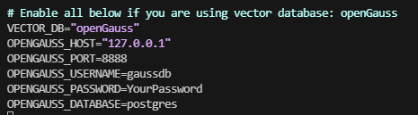
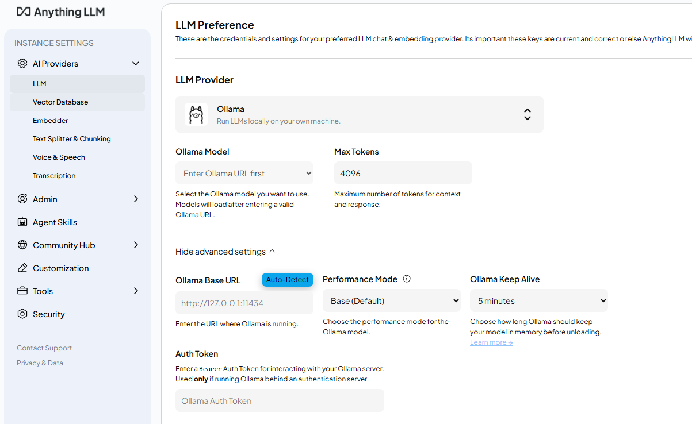

# Deploying AnythingLLM with openGauss

<!-- md-trans-meta sourceCommit=unknown translatedAt=2026-07-30T12:06:20.294Z pushedAt=2026-07-30T12:23:58.577Z -->

AnythingLLM is a full-stack app that can convert any document, resource (such as URL links, audio, video), or content fragment into context for any large language model (LLM) to use as reference during chat. This app allows you to customize your LLM and solve the "hallucination" problem of large models through the RAG solution of the openGauss vector database, while supporting multi-user management with different permission settings.

## openGauss Containerized Deployment

For details, see [Installing the Container Image](https://docs.opengauss.org/en/docs/latest/installation_guide/installing_the_container_image.html).

## AnythingLLM Deployment

### Obtaining the AnythingLLM Source Code

This document uses the openGauss-adapted AnythingLLM code to demonstrate the deployment process.

```bash
git clone https://github.com/SetnameWang/anything-llm.git -b 3479-add-opengauss-support
```

### Configuring Parameters

Enter the directory and modify parameters:

```bash
cd ./anything-llm/docker
cp .env.example .env
vim .env
```

Uncomment the following lines and configure the corresponding parameters:

```bash
VECTOR_DB="openGauss"
OPENGAUSS_HOST="127.0.0.1"
OPENGAUSS_PORT=8888
OPENGAUSS_USERNAME=
OPENGAUSS_PASSWORD=
OPENGAUSS_DATABASE=
```

If openGauss is installed using Docker, make modifications as shown in the following figure (`password` needs to be modified).



### Starting the Container

Run the following command to automatically pull the corresponding Docker image and start the service:

```bash
docker-compose up -d
```

Note: Failure here may be caused by the following reasons:

(1) Permission denied: After `docker compose`, some data is mapped through the `docker` folder. Docker started by a non-root user may fail due to permission issues. This can be resolved by setting appropriate permissions.

    ```bash
    # A stricter permission management policy is recommended. This is for demonstration purpose only.
    chmod 777 -R /path/to/anything-llm
    ```

1. During `docker compose`, dependency packages need to be downloaded from sources such as Docker Hub, npm, yarn, and GitHub. Inability to access these sources may cause errors. It is recommended to build the image in an environment with stable network connectivity.

After the container is started, execute `docker ps` to ensure all services are running properly.

### Creating a User and Logging In

Access the locally deployed AnythingLLM web service page:

```bash
http://your_server_ip:3001
```

After that, you can modify LLM parameters in the settings page. Once the LLM is configured, you can experience the RAG functionality.


