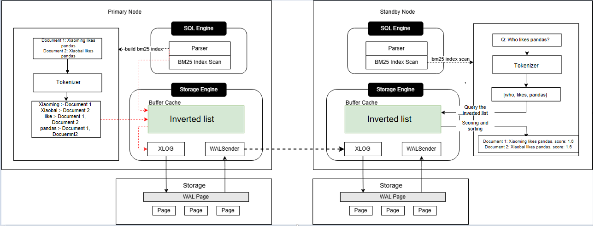

# BM25 Full-Text Search Indexing

<!-- md-trans-meta sourceCommit=unknown translatedAt=2026-07-30T12:06:28.721Z pushedAt=2026-07-30T12:23:58.581Z -->

## Availability

This feature is introduced since openGauss 7.0.0-RC2.

## Feature Description

**Figure 1 BM25 indexing design in primary/standby scenario**  

## Customer Value

Retrieval-Augmented Generation (RAG) is a technical framework that combines a retrieval system with a generative model. By retrieving relevant information from external knowledge bases, the generative model produces more accurate answers based on the retrieved information. An increasing number of enterprises are leveraging RAG technology to build their own intelligent knowledge QA, business recommendation, and other systems, thereby improving efficiency, optimizing user experience, and delivering precise services.

How to rapidly retrieve documents with high accuracy and high relevance from an external knowledge base, thereby enhancing the accuracy and responsiveness of RAG systems, has become a core requirement for enterprises. The Best Matching 25 (BM25) full-text search algorithm, which builds BM25 inverted indexes over document collections to enable fast and accurate retrieval of documents relevant to user queries, has become a mainstream choice for RAG systems.

openGauss introduces a new BM25 full-text search indexing feature. With a simple index creation command, users can build a BM25 index for a document collection, enabling fast document retrieval and supporting real-time updates of newly added documents into the index. Query response performance exceeds that of GIN indexes by tens or even hundreds of times. Additionally, the index data interfaces with the openGauss storage engine and supports primary-standby deployment, providing high availability, failover, and backup recovery capabilities to ensure business continuity.

## Feature Description

In openGauss standalone or primary/standby cluster scenarios, documents in the document library are tokenized, and inverted indexes are then built based on the tokenization results. During the scanning phase, documents are quickly searched based on the search terms.

- Build phase

    Users initiate a BM25 index build request. The primary node tokenizes the documents using a tokenizer, and builds an inverted index for each token — meaning each token corresponds to all document information containing that token. Parallel build is supported.

- Log-based index data synchronization

    To ensure index data is up-to-date, both index builds and row data modifications are synchronized to standby nodes via logs.

- Scanning phase

    Users initiate a BM25 index query request. The node internally tokenizes the user's question, retrieves the relevant inverted lists based on the tokenization results, then traverses the inverted lists to score and rank documents using the BM25 algorithm. Finally, the top-k documents with the highest scores are returned to the large model to generate the answer required by the user. Filter conditions such as `WHERE` clauses are also supported.

## Feature Enhancements

- Support for `WITH (dict_path='absolute path')` to specify a custom dictionary directory for the BM25 index.
- BM25 storage supports block-level optimization, improving space utilization in small-data scenarios through variable-sized blocks.
- The `7.0.0 LTS` version introduces index space optimization. This is an internal storage optimization and does not change SQL usage patterns.

## Feature Constraints

The specification constraints of BM25 full-text search are as follows:

- Tables: BM25 indexes can be built only on ordinary tables, not on partitioned tables. `astore` and `segment-page` tables are supported, while `ustore` tables, `column-store` tables, and `MOT` tables are not supported.
- Data types: Only the `text` field type is supported.
- Only single-column indexes can be built. Multi-column composite indexes are not supported, for example, `create index bm25_index on bm25_table using bm25(col1, col2)`.
- Only sorting in descending order is supported.
- Extreme RTO is not supported.
- Only exact term matching is supported; synonym-based retrieval and semantic relevance retrieval are not supported.
- Index creation and usage are compatible with A, B, C, and PG databases.
- Creating indexes with `CONCURRENTLY` is not supported.
- The `dict_path` option is supported for index creation, while other options are not currently supported.
- Modification of `dict_path` of an existing index is not supported. Due to tokenizer characteristics, existing indexes become invalid after a custom dictionary is modified, and the index must be dropped and rebuilt.
- When a custom dictionary is used via `dict_path`, the dictionary directory contents on the primary and standby nodes must be consistent, and `GAUSSHOME` must remain consistent across nodes.
- BM25 indexes created in older versions remain usable in newer versions. To achieve lower space occupancy, it is recommended to drop the old index and rebuild it.
- If an index query is executed while a batch insertion of documents has not yet been committed, document scores may fluctuate. If a batch insertion of documents fails and the transaction is rolled back, it is recommended to rebuild the index.
