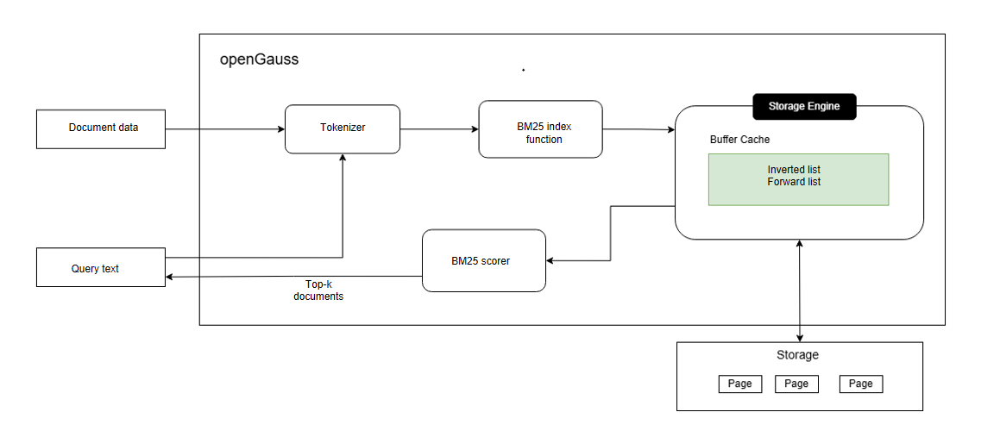

# BM25 Full-Text Search Indexing Implementation

<!-- md-trans-meta sourceCommit=unknown translatedAt=2026-07-30T12:06:25.772Z pushedAt=2026-07-30T12:23:58.579Z -->

This chapter mainly introduces the implementation of BM25 indexing in openGauss. The BM25 index consists of the following parts:

**1. Text data input**: Input text data to be inserted into the document collection or queried.

**2. Text tokenization**: For the input text, a tokenizer is used to convert it into individual terms.

**3. Construction of inverted index and forward index**: Built-in system functions obtain the tokenized terms and construct both forward index (`document -> [term1, term2,...]`) and inverted index (`term1 -> [document1, document2,...]`).

**4. Integration of forward and inverted indexes with the openGauss storage engine**: The index data is interfaced with openGauss storage for persistence, supporting primary-standby high availability, backup and recovery, and other capabilities.

**5. Index scanning**: During scanning, the BM25 algorithm scores the relevance between documents and the query text, and returns the ranked results.

## Tokenizer

openGauss BM25 integrates the open-source cppjieba tokenizer, utilizing the "Keyword Extraction", "Cut With HMM", and "CutForSearch" methods for tokenization, without requiring manual tokenization. The tokenization methods are implemented internally and do not support custom modification. The jieba tokenizer is an efficient and widely used tokenization tool that not only supports English tokenization but also effectively segments continuous Chinese text into independent words or phrases. Its design balances accuracy, flexibility, and ease of use, making it suitable for various scenarios such as natural language processing (NLP), text mining, and information retrieval. It primarily supports the following features:

- Precise mode: Based on a prefix dictionary and dynamic programming algorithm, it prioritizes outputting the most reasonable tokenization results, suitable for text analysis.
- Search engine mode: On the basis of the precise mode, it further splits long words to improve the recall rate of search-related content.
- Support for user-defined dictionaries, allowing the addition of domain-specific terms or new words to enhance domain adaptability.
- Advanced features such as keyword extraction are provided, extending post-tokenization processing capabilities.

## Forward Index and Inverted Index

Since the openGauss storage engine stores data in 8 KB pages, the forward and inverted index data is stored in the form of page-linked lists.

The `7.0.0 LTS` release introduces BM25 index space optimization, which improves space utilization in small-data scenarios through variable-sized block storage. Indexes created in older versions remain usable in newer versions. To achieve lower space occupancy, it is recommended to drop the old index and rebuild it.

**Forward index**:
The forward index primarily records the document information and terms contained within each document: `[key: doc_id] -> [ctid, (term1_location, ..., termN_location)]`.

- Records information such as the document ID and its position (`ctid`) in the row-store table, primarily used to return the actual document data and perform visibility checks during searches.
- Records which terms each document contains, primarily used to locate and delete the corresponding inverted index data for those terms when a document is deleted.

**Inverted index**:
The inverted index primarily records the mapping between terms and the list of documents containing those terms: `[term] -> [doc1, doc2, ..., docn]`.

- The document list records the term frequency and document length information for each document, used for BM25 scoring.
- The inverted index is primarily used for scanning: it matches the corresponding search terms, applies the BM25 algorithm to score all documents containing those terms, and returns the top-k documents with the highest relevance scores.
  