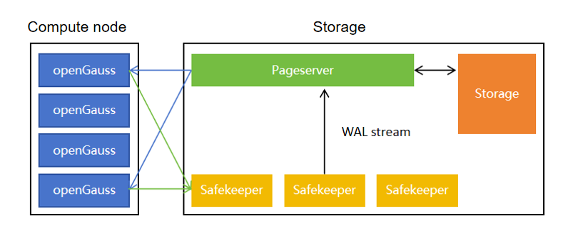

# Data Branch Architecture

<!-- md-trans-meta sourceCommit=unknown translatedAt=2026-07-30T12:07:19.184Z pushedAt=2026-07-30T12:23:58.592Z -->

## Architecture Overview

The data branch is implemented based on a storage-compute separation architecture. openGauss Compute is responsible for SQL parsing, optimization, execution, transaction processing, and WAL generation, while the Neon storage engine is responsible for page storage, WAL persistence, timeline management, and branch management.

In traditional databases, creating a branch typically requires copying the entire data directory. The larger the data volume, the higher the replication cost. The data branch abstracts database states into objects such as Tenant, Timeline, Branch, and LSN. A new branch is derived from a certain LSN of an existing Timeline. Data before the fork point can be shared, while writes after the fork point enter their respective Timelines, thereby achieving low-cost branch creation and write isolation between branches.

In the overall architecture, Compute does not retain complete data files. When executing SQL, if Compute needs to read a data page that does not exist in the local cache, it will request the page version under the specified Tenant, Timeline, and LSN from Pageserver. The WAL generated by writes first enters Safekeeper, which ensures reliable log storage, and is then consumed by Pageserver to construct new page versions.

## Architecture Diagram

## Core Components

### openGauss Compute

openGauss Compute is a compute-layer component that provides an external SQL connection entry and is responsible for query execution, transaction processing, DML/DDL execution, and WAL generation.

During runtime, Compute maintains necessary local caches but does not store complete database data files. When a query execution requires access to a data page, Compute first queries the local cache. If a page miss occurs in the cache, it requests the corresponding page from Pageserver. When performing writes, Compute generates WAL and sends WAL to Safekeeper.

### compute_ctl

`compute_ctl` is the startup controller of Compute, responsible for reading the Endpoint configuration, generating the parameters required for openGauss startup, and injecting information such as Tenant, Timeline, Pageserver, and Safekeeper into Compute.

Through `compute_ctl`, Compute can be bound to a specified Timeline. After creating a branch, a new Compute can be started for the new Timeline, allowing users to access different branches over connections.

### Pageserver

Pageserver is the core component of the page service, responsible for managing Tenants, Timelines, Branches, and page versions.

After consuming WAL, Pageserver constructs new page versions based on the log content and organizes page data into persistent layer files. When a read request arrives, Pageserver locates the page version according to the Tenant, Timeline, and LSN in the request, and returns it to Compute.

The data branch capability is primarily supported by Pageserver's Timeline management. When a new branch is created, Pageserver creates a new Timeline based on the specified LSN of the source Timeline. The new Timeline shares data before the fork point, while writes after the fork point only affect its own Timeline.

### Safekeeper

Safekeeper is the WAL persistence component, responsible for receiving WAL generated by Compute and ensuring reliable log storage before Pageserver consumes the WAL.

In a multi-replica configuration, Safekeeper provides higher WAL availability. During the commit process of Compute writes, it relies on acknowledgments from Safekeeper to confirm that WAL has been reliably stored. Pageserver subsequently builds page versions from the WAL, continuously advancing the state of data pages.

### Storage Broker

Storage Broker is a service discovery component among storage components, responsible for maintaining address and status information for storage-side components such as Pageserver and Safekeeper.

Pageserver and Safekeeper can obtain each other's reachability information through Storage Broker, reducing static configuration dependencies between components.

### Storage Controller

Storage Controller is a storage control plane component responsible for managing storage topology, node status, and Tenant/Timeline metadata.

Storage Controller can coordinate Pageserver state management, Tenant location management, and Timeline-related operations. It does not directly execute SQL or handle user data pages, but is instead responsible for control plane metadata and scheduling capabilities.

### Storage Controller DB

Storage Controller DB is the metadata database of Storage Controller, used to store control plane state, node information, and Tenant/Timeline-related metadata.

This component serves the control plane and does not participate in the user SQL execution path.

### Endpoint Storage

Endpoint Storage is used to store the startup configuration and metadata required for Endpoint operation. When `compute_ctl` starts Compute, it can retrieve information such as the bound Tenant, Timeline, connection addresses, and startup parameters from the Endpoint configuration.

An Endpoint associates "a connectable compute node" with "a specific Timeline." By accessing different Endpoints, users can access different data branches.

### Storage Backend

The storage backend is responsible for persisting Pageserver data, including Timeline layers, page versions, branch history data, and archival data.

In a local runtime environment, the storage backend can be a local file system; in larger-scale scenarios, it can also be extended to remote storage. Regardless of the underlying storage medium, Pageserver provides a unified interface for accessing pages by Tenant, Timeline, and LSN.

## Core Concepts

### Tenant

A Tenant is a tenant isolation unit. Data, Timelines, and Branches of different Tenants are isolated from each other.

### Timeline

A Timeline represents a timeline of database state evolution. Database writes generate WAL, and the Timeline advances as WAL is replayed.

### Branch

A Branch is a new Timeline derived from a specific LSN of an existing Timeline. After a branch is created, data before the fork point is shared with the source Timeline, while writes after the fork point go into the new Timeline.

### Endpoint

An Endpoint represents a connectable compute node instance. Each Endpoint is bound to a Tenant and a Timeline, and users access the data state of the corresponding branch through the Endpoint.

## Startup Process

When the data branching system starts up, components are initialized in the order of control plane, storage plane, and computing plane.

1. Initialize the local runtime directory and base configuration.
2. Start Storage Broker to provide service discovery capabilities for storage components.
3. Start Storage Controller and Storage Controller DB to prepare control plane metadata.
4. Start Pageserver to load or initialize the Tenant/Timeline-related states.
5. Start Safekeeper to prepare for receiving WAL generated by Compute.
6. Create a Tenant and a Main Timeline.
7. Create an Endpoint and bind it to the specified Timeline.
8. `compute_ctl` reads the Endpoint configuration and starts openGauss Compute.
9. Compute connects to Pageserver and Safekeeper, and provides SQL services externally.

## Write Data Flow

The write path centers on WAL, ensuring that page states can be continuously constructed from logs.

1. Client connects to openGauss Compute and sends SQL.
2. Compute executes SQL, completing transaction processing and data modification.
3. Compute generates WAL.
4. WAL is written to Safekeeper.
5. Safekeeper durably stores WAL and returns an acknowledgment to Compute.
6. Pageserver consumes WAL from Safekeeper.
7. Pageserver replays WAL and generates new page versions.
8. The visible state of the current Timeline advances.

## Read Data Flow

The read path centers on on-demand page retrieval, and Compute does not need to store complete data files.

1. Client connects to openGauss Compute and sends a query.
2. Compute accesses the required pages according to the execution plan.
3. Compute first queries the local cache.
4. If pages are missing from the cache, Compute requests pages from Pageserver via the Neon Extension.
5. Pageserver locates the page version based on the Tenant, Timeline, and LSN.
6. Pageserver returns the pages to Compute.
7. Compute completes SQL execution and returns the results to Client.

## Branch Creation Data Flow

Branch creation is essentially creating a new Timeline from a specific LSN on an existing Timeline.

1. User specifies the source branch and the creation point.
2. Pageserver determines the source Timeline and the fork point LSN.
3. Pageserver creates a new Timeline and records its parent Timeline and fork point.
4. The new Timeline shares data from the parent Timeline before the fork point.
5. A new Endpoint is created and bound to the new Timeline.
6. Once the new Endpoint is started, users can connect to and access the new branch.
7. Subsequent writes to the new branch only advance its own Timeline and do not affect the parent branch.

## Port Allocation

The following ports are common default ports for local source-code runtime. Actual ports can be adjusted via startup parameters or configuration files.

| Component | Default Port | Purpose |
| --- | --- | --- |
| openGauss Compute | `55432` | SQL connection |
| Branch Compute | `55434` or custom | Branch SQL connection |
| Storage Broker | `50051` | Service discovery and component communication |
| Pageserver PG interface | `6400` or `64000` | Compute page requests |
| Pageserver HTTP interface | `9898` | Tenant/Timeline/Branch management |
| Safekeeper WAL interface | `5454` | WAL reception |
| Safekeeper HTTP interface | `7676` | State and management |
| Storage Controller | `1234` | Storage control plane API |
| Endpoint Storage | `9993` | Endpoint metadata service |
| Compute control interface | `3080` | Compute auxiliary control |

## Architecture Features

- Storage-compute separation: Compute is responsible for SQL execution, while Pageserver handles page storage and version management.
- Low-cost branch creation: A new branch does not copy complete data; it only records the parent Timeline and the fork point.
- Historical data sharing: Data prior to the fork point can be reused by multiple branches.
- Branch write isolation: Writes after the fork point enter their respective Timelines.
- Reliable WAL persistence: Write logs are first sent to Safekeeper and then consumed by Pageserver.
- On-demand page loading: Compute requests pages from Pageserver only when a page fault occurs.
- Rapid Compute startup and shutdown: Once an Endpoint is bound to a specified Timeline, the corresponding branch is immediately accessible.
- Unified page version management: Pageserver centrally maintains data page versions across multiple Timelines.
  