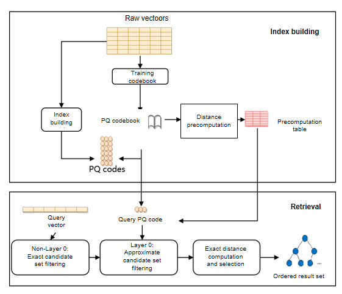
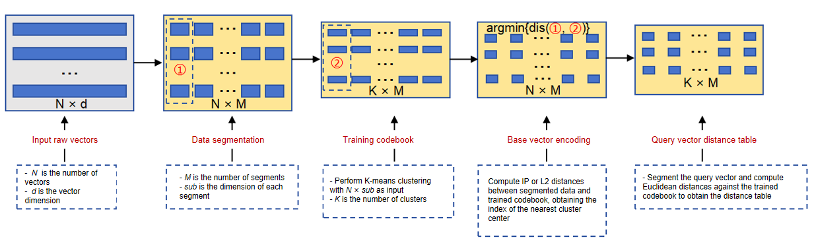
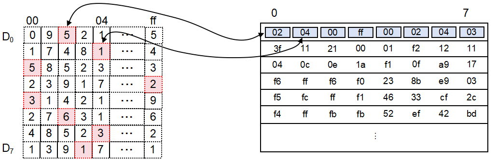
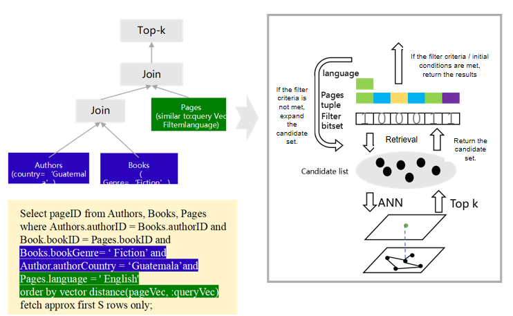
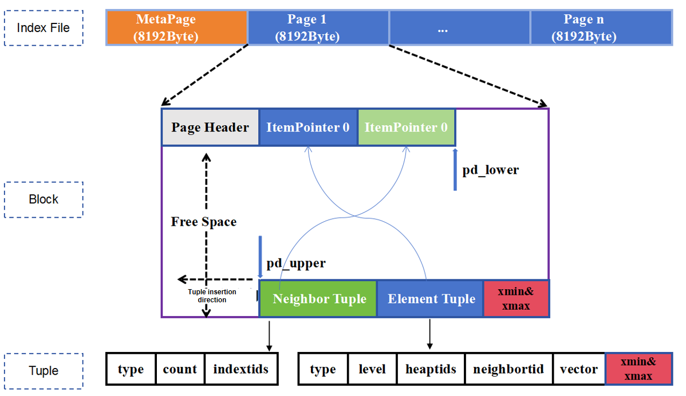
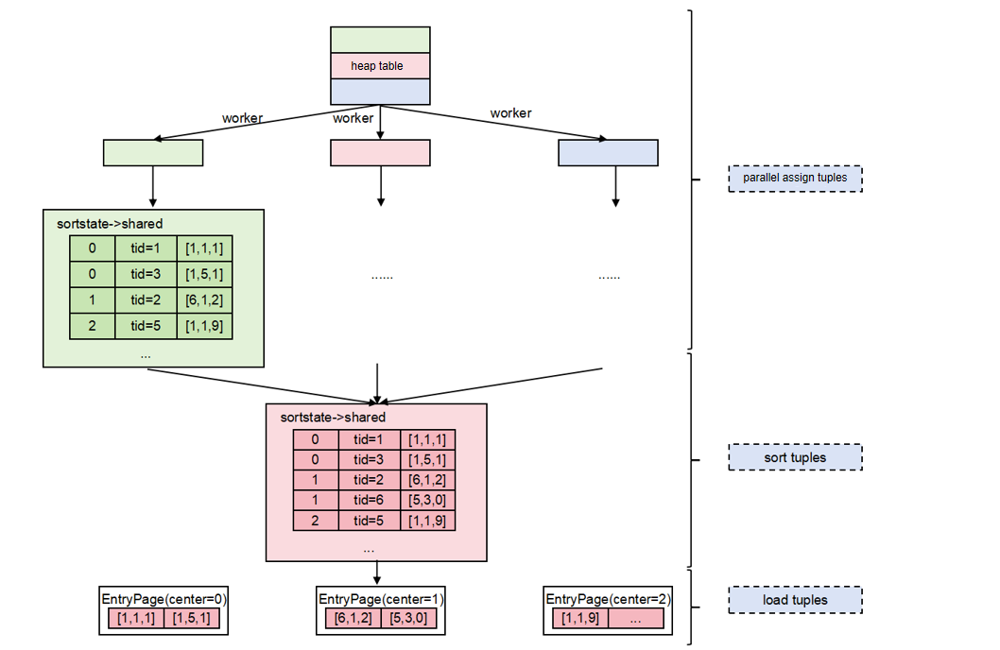

# Vector Storage Engine

<!-- md-trans-meta sourceCommit=unknown translatedAt=2026-07-30T12:07:53.741Z pushedAt=2026-07-30T12:23:58.604Z -->

## Architecture Design

### SQL Layer

- Embedding: Supports integration with DeepSeek, Qwen, and Pangu large models to convert high-dimensional data into vectors.
- Hybrid query: Generates hybrid scalar-vector queries based on RBO, supporting large-scale label filtering capabilities and vector query strategies based on filtering rates.
- Vector computation: Performs distance calculations such as Euclidean distance and cosine distance optimized by Kunpeng SVE/SME instructions.

### Storage Engine Layer

- Vector storage: Supports storage of vector data with up to 64,000 dimensions per page.
- Vector index: Supports multiple efficient ANN indexes.

### Hardware Acceleration Layer

- Retrieval is accelerated based on software-hardware co-optimization technologies such as BoostKit compression and vector instruction set on Kunpeng.

## BoostKit Acceleration

openGauss DataVec is deeply integrated with Kunpeng hardware, accelerating vector retrieval through software-hardware synergy technologies such as compression algorithms, re-ranking, and vectorized instruction acceleration.

**Figure 1** BoostKit-accelerated retrieval

  
    

### PQ Compression

Product Quantization (PQ) is a method for efficiently compressing high-dimensional vectors, suitable for similarity search on large-scale datasets. By partitioning high-dimensional vectors into multiple low-dimensional sub-vectors and performing independent clustering on each sub-vector, the original vector is represented as a series of centroids, significantly reducing memory usage and improving retrieval speed.

#### PQ Codebook Training

Training phase: The vector space is divided into several subspaces by dimension. Clustering is then performed in each subspace to obtain N centroids. Finally, distance calculations are performed between segmented base vectors and segmented query vectors against the segmented cluster centroids, generating the base index table and query distance table. The process is as follows

- Step 1: The original feature vectors are split into segments, resulting in a dimension of N × M, where N is the number of base vectors and M is the number of segments.
- Step 2: K-Means clustering is performed on the segmented data, typically with 28 = 256 cluster centroids. The dimension of the trained codebook after clustering is K × M, where K is the number of cluster centroids.
- Step 3: IP or L2 distance computation is performed between the segmented base vectors and the trained codebook to obtain distance values. The cluster centroid index with the minimum distance is selected, generating the base vector encoding table with dimensions N × M.
- Step 4: The query vector is segmented, and the same operation as in step3 is performed to generate a query vector distance table with dimensions K × M.

**Figure 2** PQ codebook training

  
    

#### PQ Retrieval

Retrieval phase: Using the base index table and query distance table generated during training, table lookup is performed to obtain the distances between the query vector and the base vectors. The distance between the query vector and any base vector can be obtained with just M table lookups and M additions.

**Figure 3**  PQ retrieval

  
    

#### Hierarchical Navigation + PQ Fusion Index

The PQ lookup table method is combined with the hierarchical navigation index, replacing vector distance calculations with table lookups to improve retrieval performance.

During index construction, the hierarchical navigation graph and the PQ index are built in parallel. During retrieval, the Flat solver is used to compute distances between the query vector and nodes in layers above layer 0, ensuring good entry points for layer 0. Since the number of nodes in the upper layers is small, this does not take much time. When performing retrieval at layer 0, the PQ solver codebook replaces distance computation, greatly improving computational efficiency.

To further improve retrieval accuracy, a two-stage re-ranking is performed on the candidate set obtained via PQ table lookup. The Flat solver updates the distances of elements in the candidate set, where the updated distances are the true distances between the candidate vectors and the query vector. The candidate set is then re-sorted and the final Top-K results are output.

### Vector Instruction Set Acceleration

Specifically, the Kunpeng instruction set includes a series of optimized instructions, such as NEON instructions and inline assembly, which can accelerate vector operations, data prefetching, and pipeline processing. By leveraging the hardware acceleration features and the optimized instruction set of the Kunpeng processor, the ANN algorithm is able to significantly improve performance and efficiency when processing large-scale datasets.

## Hybrid Scalar-Vector Query

DataVec is also capable of processing scalar data (such as numerical values and categories) and vector data (such as text, audio, and video) simultaneously. This hybrid query support enables users to combine different data types in a single query, enabling more complex and refined analysis.

**Figure 4**  Fused query

  
    

- SQL Join: Supports similarity search joined with relational data.
- Complex, Fused SQL:
  - Supports all types of workloads and data models, including Graph, Text, JSON, Spatial, Relational, etc.
  - Supports all SQL, including complex operations and functions: Window analytic functions, stored procedures, aggregation.
- Combined with vector search to form complex fused SQL:
  - A filter bitmap is initially generated based on scalar filter conditions, vector data is retrieved through the ANN retrieval algorithm, and data that satisfies both bitmap filtering and vector retrieval is returned; otherwise, the candidate set is expanded for another retrieval.

## In-Place Update Engine

ANN index pages append `xmin` and `xmax` fields at the end of each Element Tuple, supporting an in-place update engine. These fields play a critical role during index construction and querying, ensuring data visibility and consistency. In the actual implementation, when inserting new data, the system records the current transaction ID in the `xmin` field; when deleting data, the system updates the `xmax` field. The in-place update engine adopts an in-place update approach, which significantly saves space by separating rollback segments from data pages for storage, delivering efficient and stable I/O performance.

**Figure 5** ANN in-place update index page

  
    

## Parallel Index Construction

ANN supports parallel index construction by partitioning the dataset into several subsets assigned to different worker threads. Each thread computes independently and the results are merged to form the final global index, greatly improving efficiency when processing large-scale datasets.

- Data partitioning: Data is partitioned into subsets according to the number of worker threads.
- Parallel processing: The leader thread creates Bgworkers. Each Bgworker scans its data subset in parallel, computes distances between vectors, and adds them to the candidate set.
- Result merging: The leader thread merges and sorts the results from all threads and then persists them to pages.

**Figure 6**  ANN parallel index construction

  
    

## ANN Index Scan with SQL Bypass

ANN index scan supports SQL Bypass, improving retrieval performance by reusing execution operators and reducing stack call overhead.

- Supports both non-parameterized and parameterized SQL, including `Limit` parameterization.
- Does not support non-indexed retrieval.
- Does not support filters.
- Does not support `targetlist` containing expressions.
