# Deploying Your RAG Knowledge Base System with Qwen3 + openGauss

<!-- md-trans-meta sourceCommit=unknown translatedAt=2026-07-30T12:08:13.839Z pushedAt=2026-07-30T12:23:58.608Z -->

On April 29, 2025, Alibaba officially released the new-generation Tongyi Qianwen large model, the Qwen3 series. With its Mixture of Experts (MoE) architecture and hybrid reasoning mode as core breakthroughs, it has set new performance records for open-source large models worldwide. The Qwen3 series consists of two main branches:

1. **Qwen3 models**: Covering full sizes from 0.6B, 1.7B, 4B, 8B, 14B, 30B, 32B, to 235B. Among them, the Qwen3-4B model delivers performance comparable to the previous generation 72B model.
2. **Qwen3-MoE models**: Including versions such as 30B-A3B (with 3B activated parameters) and 235B-A22B (with 22B activated parameters). These achieve performance surpassing dense models of the same scale with only 10% activated parameters, while the inference cost is only one-third of DeepSeek-R1.

The core technical highlights of Qwen3 include:

- **Hybrid reasoning mode**: Supports dynamic switching between "deep thinking" (multi-step reasoning for complex problems) and "fast response" (second-level replies for simple tasks), reducing computing cost by up to 90%.
- **Comprehensive performance leadership**: Achieves 85.7 points on the AIME'24 math benchmark and 70.7 points on the LiveCodeBench v5 coding test, surpassing Grok-3 and Gemini-2.5-Pro, ranking first among global open-source models.
- **Multimodal and multilingual support**: Covers 119 languages and integrates visual understanding capabilities, adapting to cross-modal scenarios such as medical diagnosis and industrial quality inspection.

---
 
Following the release of Qwen3, the openGauss team, in collaboration with the Kunpeng community, completed end-to-end validation of the RAG solution based on Qwen3 in record time. This means developers can now pull the container image of the orchestration components based on openGauss with a single click, and leverage Qwen3 to deliver smooth RAG knowledge QA and reasoning experiences.

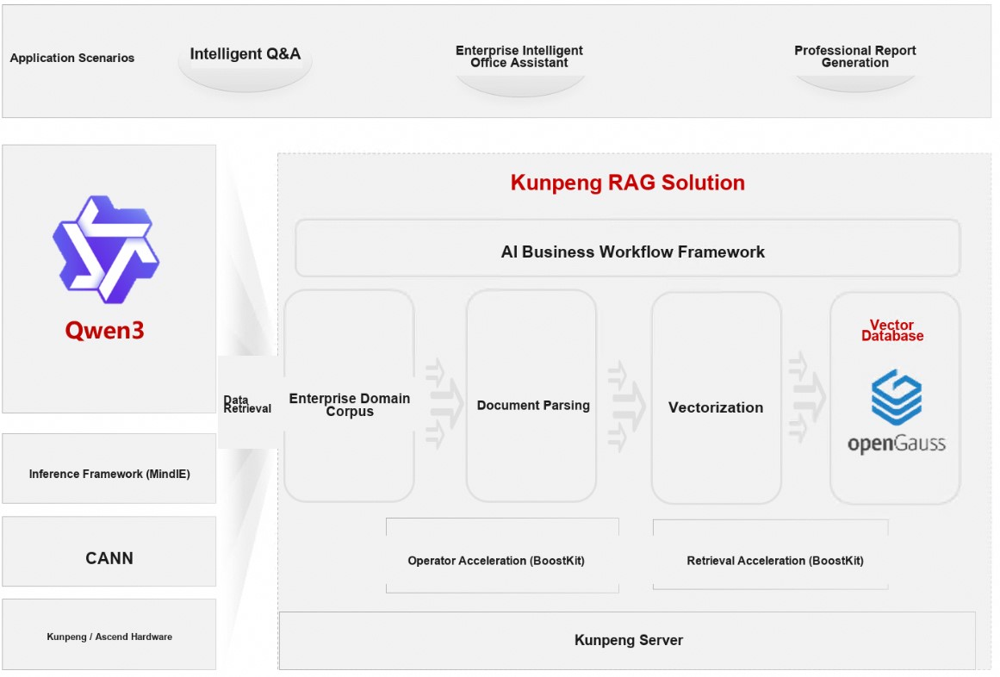

---

## Quick Experience with Qwen3

Before you begin, ensure that Ollama is properly installed and running. You can verify this by executing the following command:

```bash
ollama list
```

Start Qwen3 with a single command:

```bash
ollama run qwen3:latest
```

Once the model service is running, you can directly engage in a QA session to experience the latest Qwen3. An example of reasoning is shown below.

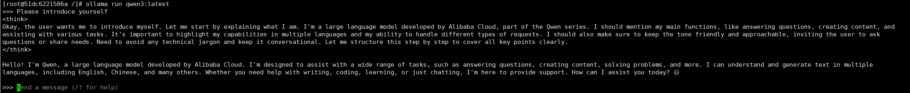

## Building the openGauss Knowledge Base

Please install Docker Compose in advance. If it is not yet installed, follow the instructions below for offline installation.

### Installing Docker Compose

Download the Docker Compose package.

```bash
wget https://github.com/docker/compose/releases/download/v2.33.1/docker-compose-linux-aarch64
```

Install Docker Compose.

```bash
mv docker-compose-linux-aarch64 /usr/bin/docker-compose
chmod +x /usr/bin/docker-compose
```

### Deploying Orchestration Component

1. Download the [Dify 1.1.3](https://github.com/langgenius/dify/tree/1.1.3) package, click "Download ZIP" to download the compressed package and upload it to the server.

    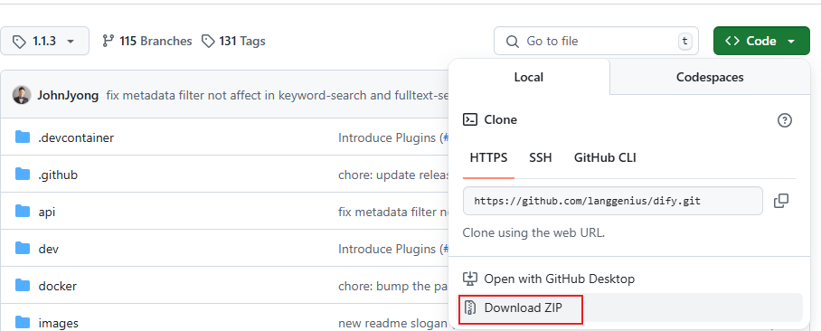

2. Create a directory and extract the package.

    ```bash
    mkdir /usr/local/dify
    unzip dify-1.1.3.zip -d /usr/local/dify/
    cd /usr/local/dify/dify-1.1.3
    ```

3. Extract the package, navigate to the Dify source code directory, and run the following commands to perform installation and deployment.

    ```bash
    cd docker
    cp .env.example .env
    vim .env
    ```

    Modify line 387 of the `.env` file to `VECTORE_STORE=opengauss`

    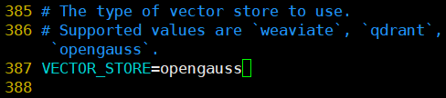

4. Run the services in background mode.
The command will download Docker images online and start the corresponding services. It takes approximately 30 minutes, depending on actual network conditions. This command automatically launches the openGauss service, so no manual deployment is required.

    ```bash
    docker-compose up -d
    ```

## Online QA

1. Access the locally deployed Dify web service page.

    ```bash
    http://your_server_ip
    ```

2. Create an administrator account by simply entering your email and password.

3. Connect the LLM service. On the main interface, click your username in the upper right corner, then click "Settings" to enter the settings page. Click "Model Providers", select "Ollama", and click the "Install" button.

    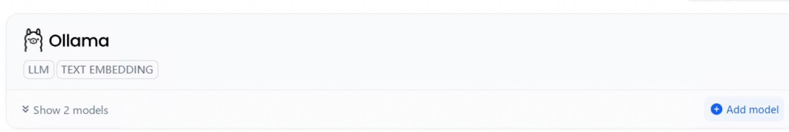

    After installation, on the "Add Model" page, select "LLM" for "Model Type" and configure the Qwen3 model.

    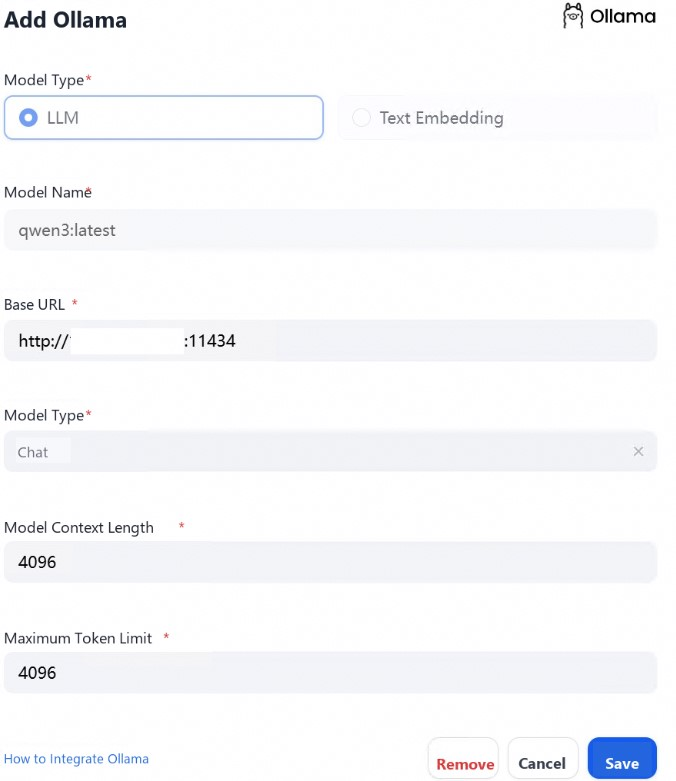

4. Connect to the embedding service. on the "Add Model" page, select "Text Embedding" for "Model Type".

    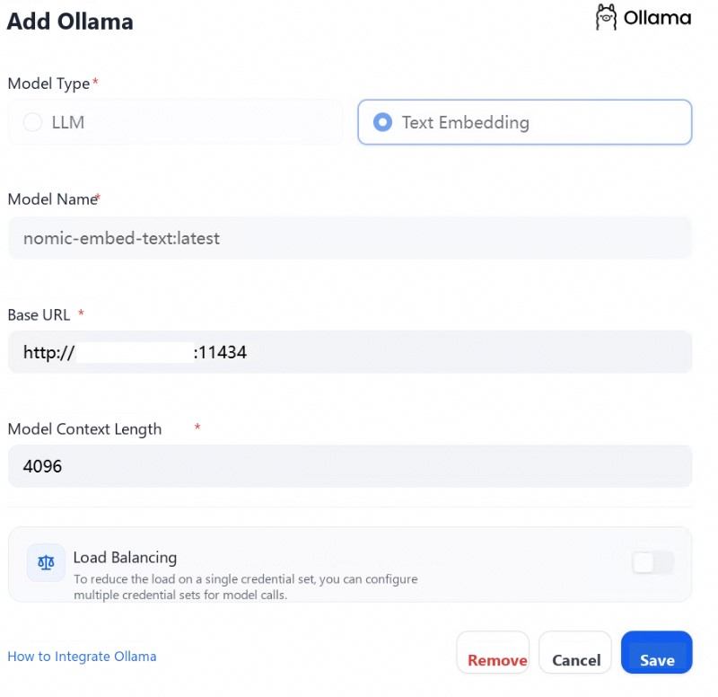

5. Create an app. Click "Create App" on the left side of the Dify platform homepage, select "Chat Assistant", and assign it a simple name.

    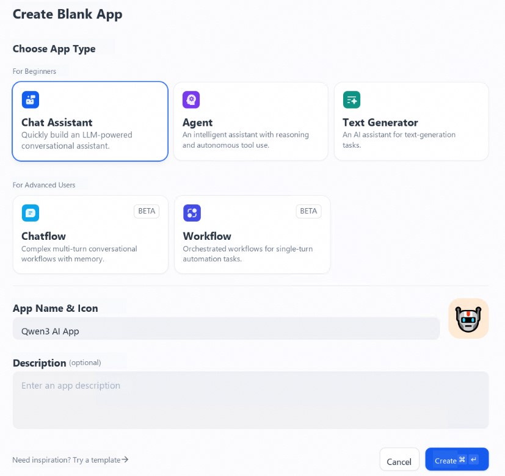

6. Select an LLM. Click the "Model" dropdown box in the upper right corner and select Qwen3.

    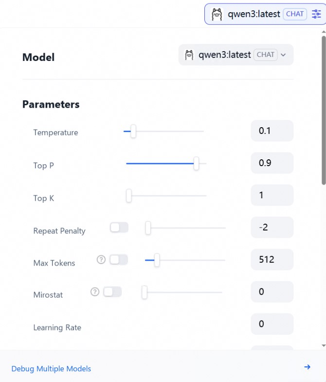

7. Start a conversation. 
    Once the configuration is complete, you can interact in the chat window. Enter "What is the business scope of XX Fashion Company?" and the output will be displayed as shown below, completing one round of conversational interaction. This conversation did not yet use the RAG feature. If you need to enable RAG for this chat assistant application, you will need to associate it with a knowledge base. For detailed steps, refer to the 'Integrating a Knowledge Base into the Application' process below."

    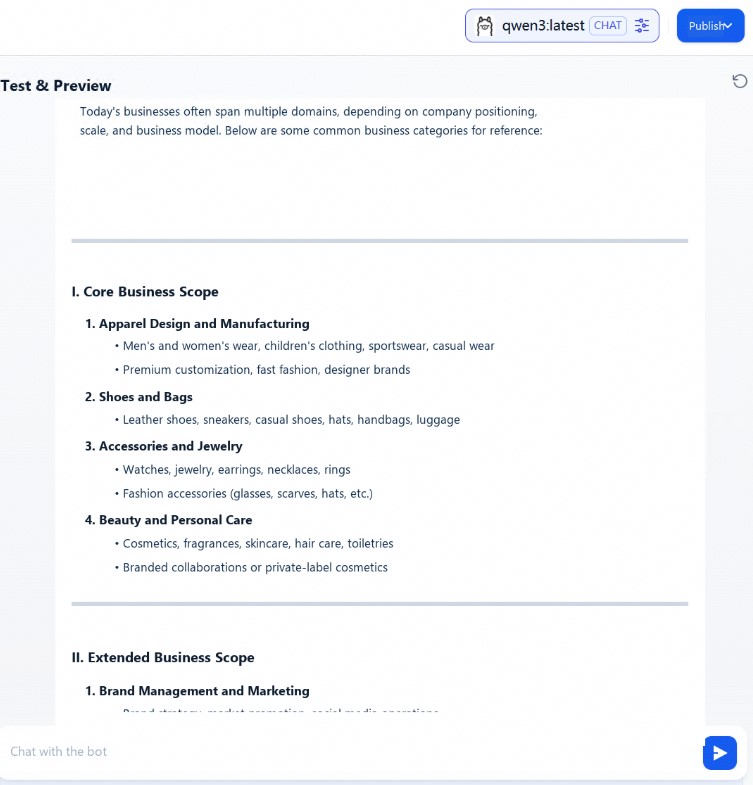

    A knowledge base can be provided as external knowledge to a large language model for accurately answering user questions. You can associate an existing knowledge base with any app type in Dify.

8. Add a knowledge base. To obtain more accurate answers, import detailed information about the XX Company.

    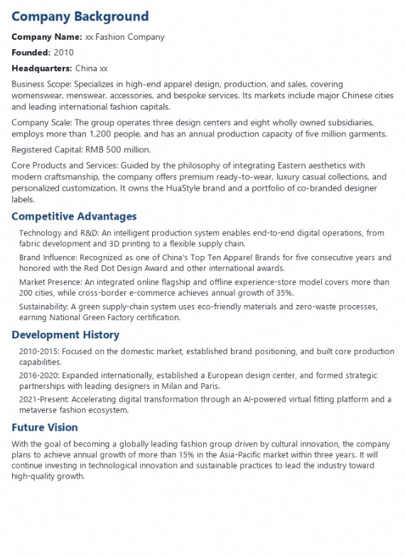

    Wait for the knowledge import to complete.

    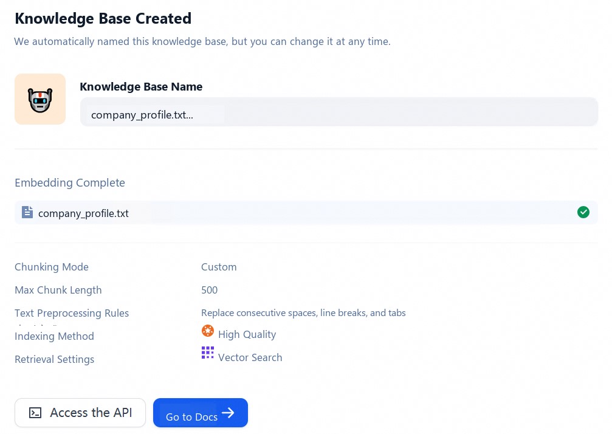

    Then, on the orchestration page of the chat assistant app created above, click the "Add" button in the "Context" area to add a knowledge base.

    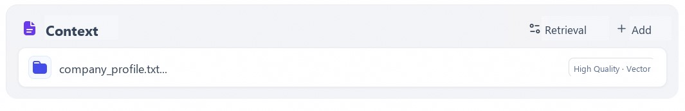

9. Start a conversation.
    The LLM will first retrieve context relevant to the question from the knowledge base, then summarize and produce a higher-quality answer based on that context. Enter the same question "What is the business scope of XX Fashion Company?" in the dialog box, and the output is as follows:

    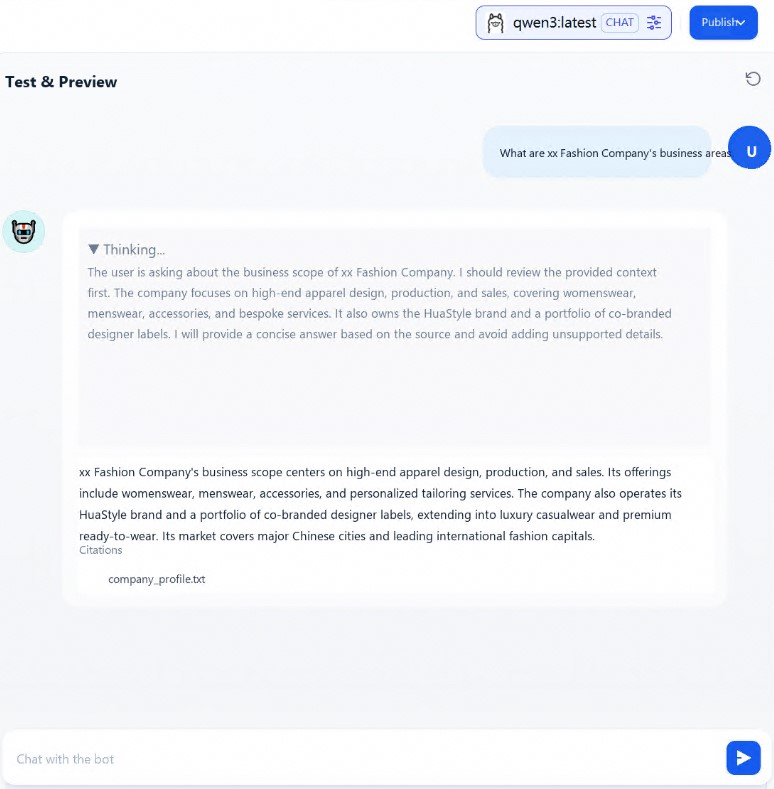

At this point, the RAG knowledge base built around the Qwen3 model and the openGauss vector database has been set up and tested successfully.

## References

Qwen3 model: <https://ollama.com/library/qwen3>

openGauss project repository: <https://gitcode.com/opengauss/openGauss-server>

Kunpeng RAG solution: <https://www.hikunpeng.com/document/detail/zh/kunpengrag/bestpractice/kunpengrag_21_0001.html>

Dify project repository: <https://github.com/langgenius/dify>
