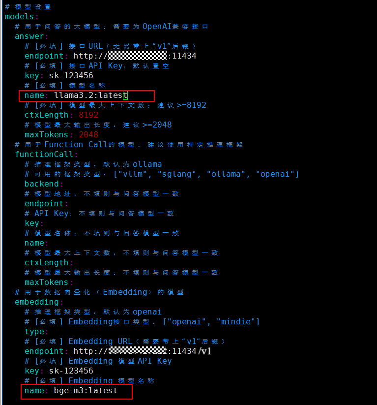

# Deploying openEuler Intelligence Based on the openGauss Vector Database

This document describes how to deploy openEuler Intelligence and use the openGauss DataVec vector database as the corpus for the RAG engine.

## openEuler Intelligence Deployment

### Environment Requirements

#### Software Requirements

|     Type        |       Version Requirement                         |  Description                                |
|----------------| -------------------------------------|--------------------------------------|
| Operating system    | openEuler 22.03 LTS or later         | None                                   |
| K3s        | >= v1.30.2, with the Traefik Ingress tool   | K3s provides a lightweight Kubernetes cluster that is easy to deploy and manage |
| Helm       | >= v3.15.3                           | Helm is a package management tool for Kubernetes, used to quickly install, upgrade, and uninstall openEuler Intelligence services |
| python     | >=3.9.9                              | Python 3.9.9 or later provides the runtime environment for downloading and installing models |


#### Hardware Specifications

| Hardware Resources | Minimum Configuration | Recommended Configuration |
|--------------|----------------------------|------------------------------|
| CPU          | 4 cores                    | 16 cores or above                 |
| RAM          | 4 GB                       | 64 GB                        |
| Storage      | 32 GB                      | 64 GB                        |
| Large Model Name | deepseek-llm-7b-chat  | DeepSeek-R1-Llama-8B                         
| GPU Memory (GPU) | NVIDIA RTX A4000 8GB  | NVIDIA A100 80GB * 2         |

**Key Notes**:

- In a CPU-only environment, it is recommended to implement the functionality by calling the OpenAI API or using the built-in model deployment method.
- If a k8s cluster environment is used, there is no need to install k3s separately; version >= 1.28 is required.

### Preparing Resources

1) Online mode

```bash
git clone https://gitee.com/openeuler/euler-copilot-framework.git -b dev
```

2) Offline mode

- Obtain the openEuler Intelligence project<br>
Download the archive from the [openEuler Intelligence official repository](https://gitee.com/openeuler/euler-copilot-framework/tree/dev/), upload it to the server, and extract it.

  ```bash
  unzip euler-copilot-framework.tar -d <YourPath>
  ```

- Obtain images, models, and toolkits

  Refer to the resource list in section 1.2 and download the required images, models, and toolkits from the
  [openEuler Intelligence resource download address](https://repo.oepkgs.net/openEuler/rpm/openEuler-22.03-LTS/contrib/eulercopilot/).

  Ensure that the following directories have been created on the server, and place the downloaded resources into the corresponding folders:

  ```
  /home/eulercopilot/
  ├── images/    # Store image files.
  ├── models/    # Store model files.
  └── tools/     # Store the toolkit.
  ```

Online and offline modes differ only in the resource preparation phase; all subsequent steps are identical.

### Run the Deployment Script

```bash
# Switch to the deployment script directory.
cd euler-copilot-framework/deploy/scripts
# Add executable permissions to the script files.
chmod -R +x ./*
# Run the deployment script.
bash deploy.sh
```

### Start Deploying Services

After running the deployment script, the following deployment menu list appears. We will deploy this project step by step manually so that you can clearly understand the implementation details of each stage.

```
==============================
        Main Deployment Menu
==============================
0) One-click automatic deployment
1) Manual step-by-step deployment
2) Restart services
3) Uninstall all components and clear data
4) Exit
==============================
Enter the option number (0-9): 1
```

```
# Enter the option number (0-9) to deploy step by step
==============================
       Step-by-Step Manual Deployment Menu
==============================
1) Run environment check script
2) Install k3s and Helm
3) Install Ollama
4) Deploy Deepseek model
5) Deploy Embedding model
6) Install database
7) Install AuthHub
8) Install EulerCopilot
9) Return to main menu
==============================
Enter the option number (0-9):
```

Here you only need to make sure that each step completes successfully without any error messages before moving on to the next stage. If the status of all the following service pods is normal, you can start your journey with openEuler Intelligence.

```
[root@localhost euler_copilot]# kubectl get pods -A
NAMESPACE       NAME                                      READY   STATUS      RESTARTS   AGE
euler-copilot   authhub-backend-deploy-9f46b886b-c25nl    1/1     Running     0          29h
euler-copilot   authhub-web-deploy-7957555974-7fgsx       1/1     Running     0          29h
euler-copilot   framework-deploy-cffdfc75f-pvv4c          1/1     Running     0          9m21s
euler-copilot   minio-deploy-746786cf66-6rnwt             1/1     Running     0          29h
euler-copilot   mongo-deploy-c89868d7d-5nczl              1/1     Running     0          29h
euler-copilot   mysql-deploy-7c6b8997cf-xrqjp             1/1     Running     0          29h
euler-copilot   opengauss-deploy-968d7848d-vqgjw          1/1     Running     0          11m
euler-copilot   rag-deploy-79ddfd786d-rtzw9               1/1     Running     0          38s
euler-copilot   rag-web-deploy-7df6d6b66d-bkh5v           1/1     Running     0          19h
euler-copilot   redis-deploy-7fb5b67844-kv9mz             1/1     Running     0          29h
euler-copilot   web-deploy-59dcfb78f7-cd54l               1/1     Running     0          19h
kube-system     coredns-576bfc4dc7-9v7dm                  1/1     Running     0          29h
kube-system     helm-install-traefik-crd-wwv9f            0/1     Completed   0          19h
kube-system     helm-install-traefik-dgszg                0/1     Completed   0          19h
kube-system     local-path-provisioner-6795b5f9d8-msz9p   1/1     Running     0          29h
kube-system     metrics-server-557ff575fb-grbm6           1/1     Running     0          29h
kube-system     svclb-traefik-be11ef18-qzv8d              2/2     Running     0          29h
kube-system     traefik-5fb479b77-pcbgr                   1/1     Running     0          29h
```

Note that if you have a local ollama service and have pulled the embedding and chat large models, you can skip steps 3-5. After installing the openEuler Intelligence service, simply modify the model configuration. The modification steps and content are as follows.

```bash
cd euler-copilot-framework/deploy/chart/euler-copilot
```

```
vim values.yaml
```



After modifying the model name as shown in the figure above, update the openEuler Intelligence deployment:

```bash
helm upgrade euler-copilot -n euler-copilot .
```

For specific operations, see [From Data to Intelligence: RAG Architecture in Practice with openGauss + openEuler Intelligence](opengauss_eulercopilot.md)
