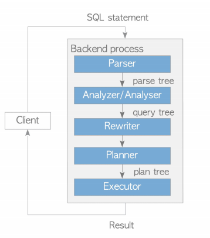

# Apache AGE (incubating) for openGauss

## Introduction

Graph databases have been widely used in recent years because they can handle complex relationships between data. Unlike traditional relational databases, graph databases represent data as nodes, edges, and properties. Nodes represent entities, edges represent relationships between entities, and properties represent the attributes of both.

Apache AGE is a graph database engine developed based on PostgreSQL. All components of AGE run on top of the PostgreSQL transaction cache layer and storage layer. AGE implements a storage engine that handles both relational and graph data models simultaneously. Users can query data using standard ANSI SQL and the graph query language openCypher.

Apache AGE is involved in query parsing, query rewriting, query planning, query execution, and data storage in the database kernel. In terms of data storage, it defines the storage model of the graph database. openGauss uses hook points in the database kernel in other aspects to support the Cypher language, implementing the capability to handle both relational and graph data simultaneously.

<a name="zh-cn_topic_0243295241_zh-cn_topic_0243253012_fig1128133574113"></a>
<div style="display:flex;justfy-content:center;">  
    
</div>

The openGauss database supports the graph database engine through plugins. In the openGauss database, you can directly use the Apache AGE capabilities by creating a plugin.

## Installation

> The enterprise edition openGauss installation package already includes AGE. After deploying the openGauss database, you can directly use the graph database capability by loading the plugin.

### Compile and Install

AGE source code address: <https://gitcode.com/opengauss/Plugin/tree/master/contrib/age>

#### Method 1 (Install Together with openGauss)

Place the age source code under the contrib directory of the openGauss-server source code, then compile and install openGauss-server directly. age will be compiled and installed automatically.
> This method is applicable when openGauss-server is compiled and installed at the same time.

#### Method 2 (Install Using openGauss Source Code)

1. Place the age source code under the contrib directory of the openGauss-server source code.
2. Enter the contrib/age directory and execute make install under the age directory.

> This method applies when openGauss-server has already been compiled and installed from source code, and the source code and build environment are still preserved. You can use this method to install age.

#### Installation Method 3 (Install Using PGXS)

1. Install the necessary dependencies

    ```
    yum install gcc glibc glib-common readline readline-devel zlib zlib-devel flex bison perl
    ```

    > The gcc version must be >= 7.3.0

2. Configure the bin directory under the openGauss installation directory into the environment variables, and execute the command

    ```
    which pg_config
    ```

    Confirm that pg_config is the pg_config under the openGauss installation directory<br>
3. Enter the age root directory and execute

    ```
    make install USE_PGXS=true
    ```

    > This method applies to installing openGauss directly using the installation package. Using the PGXS installation method is not recommended here. As openGauss is upgraded, not all necessary header files will be installed to the installation directory, which may cause missing header files during compilation. You can copy the header files from openGauss to the include/postgresql/server/ folder under the openGauss installation directory according to the error prompts.

##### Install Required Dependencies
>
> Prerequisites: openGauss is compiled and installed normally, and configured in the environment variables. Execute the command in the age source code directory.

```
make install USE_PGXS=true
```

## Quick Start

### Connect to openGauss

```
gsql -r
```

### Creat a Plugin

- Execute command

```
create extension age;
```

- Example

```
openGauss=# create extension age;
CREATE EXTENSION
```

- Constraints

After the dolphin plugin is installed in openGauss, install the AGE plugin in B mode as follows:

```
set dolphin.b_compatibility_mode=off;
create extension age;
set dolphin.b_compatibility_mode=on;
```

### Set the Search Path

- NOTE

After AGE is installed, the ag_catalog schema is created by default. The built-in data types and functions of AGE are all stored under ag_catalog.

- Execute the command

```
SET search_path TO ag_catalog;
```

- Example

```
openGauss=# SET search_path TO ag_catalog;
SET
```

### Load the Plugin

- Execute command

```
load 'age';
```

- Example

```
openGauss=# load 'age';
LOAD
```

### Create a Graph Space

- Execute command

```
SELECT create_graph('test');
```

- Example

```
openGauss=# SELECT create_graph('test');
NOTICE:  CREATE TABLE / PRIMARY KEY will create implicit index "_ag_label_vertex_pkey" for table "_ag_label_vertex"
CONTEXT:  referenced column: create_graph
NOTICE:  CREATE TABLE / PRIMARY KEY will create implicit index "_ag_label_edge_pkey" for table "_ag_label_edge"
CONTEXT:  referenced column: create_graph
NOTICE:  graph "test" has been created
CONTEXT:  referenced column: create_graph
 create_graph
--------------

(1 row)
```

### Execute Cypher Statements

- Syntax

```
SELECT * FROM cypher(parameter1: graph space to query, parameter2: cypher query statement) AS (a agtype, [number of tuples to return]);
```

- Example

```
openGauss=# SELECT * FROM cypher('test', $$CREATE (:v {i: 0})$$) AS (a agtype);
a
---
(0 rows)

openGauss=# SELECT * FROM cypher('test', $$MATCH (n:v) RETURN n$$) AS (n agtype);
n
-----------------------------------------------------------------------
{"id": 844424930131969, "label": "v", "properties": {"i": 0}}::vertex
(1 row)
```

## Adaptation Status

AGE has been adapted to openGauss. For adaptation details, see [Apache AGE Adaptation to openGauss Details](apache_age_adaptation.md)

- More Resources

> For more detailed usage, refer to the official AGE documentation: <https://age.apache.org/age-manual/master/>

## Running Apache AGE Regression Test Statements

### Execution Steps
>
> Prerequisite: openGauss is installed by compiling from source code

1. Place the age source code under the contrib directory of the openGauss source code
2. Enter the age source code directory and execute the command

```
make installcheck
```
