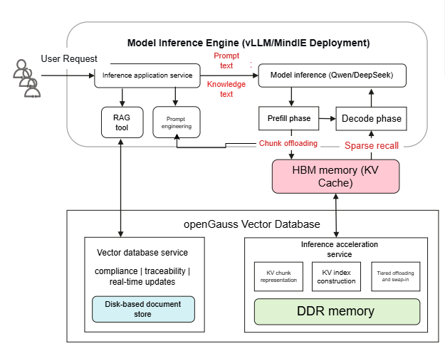
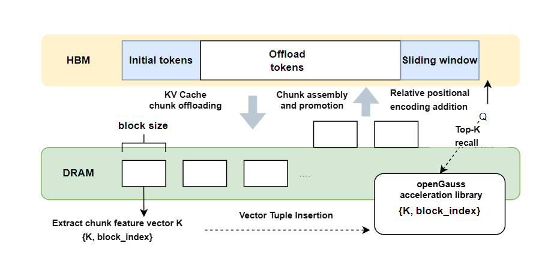

# KV Cache Query-Based Computation Inference Acceleration

## Introduction

Each inference step of a Transformer-based large model relies on the keys and values from all previous layers to compute attention weights, resulting in a large amount of repeated computation. KV Cache caches the computed keys and values, greatly reducing the amount of computation. For long-sequence inference scenarios, KV Cache exhibits significant sparsity, meaning that only a small number of tokens in the full KV Cache have a critical impact on the current attention weight computation. Therefore, during long-sequence inference, the critical KV can occupy the GPU's compute resources and HBM, thereby improving the end-to-end inference performance of large models in long-sequence scenarios. This feature combines [vllm-ascend](https://github.com/vllm-project/vllm-ascend/tree/v0.7.3rc1) with the self-developed openGauss acceleration library to implement query-based computation inference acceleration for KV Cache.



## Feature Description

The long-sequence KV Cache query-based computation feature is divided into the Prefill phase and the Decode phase.

- Prefill phase: After the forward function performs prefill computation, the KV Cache with lower attention relevance is offloaded to CPU memory in a hierarchical manner. Specifically, representation vectors are extracted block by block and inserted into the openGauss acceleration library, thereby reducing the HBM memory usage for long sequences.
- Decode phase: When the forward function performs decode inference, it first performs sparse retrieval on demand and loads the KV Cache with higher attention relevance into HBM, and then completes the current round of inference.

This feature improves end-to-end inference speed while ensuring inference accuracy.

## Overall Solution

The overall idea is to leverage the sparsity of long-sequence KV Cache during the Decode phase of large model inference, performing sparse computation and block-wise offloading during attention computation to reduce NPU computation and HBM usage in long-sequence inference, thereby improving the token-by-token speed. The specific implementation is as follows:



The entire long-sequence KV Cache is divided into three parts: initial_tokens, sliding_window, and offload_tokens. Since initial_tokens and sliding_window are relatively important to the inference result, these two parts always remain in HBM. The KV Cache in offload_tokens is extracted into representation vectors at block granularity, and {representation vector K, block_index} is stored in the openGauss acceleration library, while the KV Cache in offload_tokens is offloaded to DDR memory. During each round of inference, sparse retrieval is performed on the KV Cache of offload_tokens, and the selected KV Cache blocks are loaded into HBM, concatenated with the KV Cache in initial_tokens and sliding_window, and participate in attention computation.

Sparse retrieval computes the IP distance between the Q vector of the current token and each representation vector K during inference, and selects the topK closest KV Cache blocks for retrieval. These topK blocks have a critical impact on the current attention weight computation.

The lifecycle and read/write flow of the openGauss acceleration library are coupled with the RetrievalKV plugin. Writes to the openGauss acceleration library are concentrated in the Prefill phase, and reads are concentrated in the Decode phase.

>[!NOTE]Note
>
>This feature currently supports only the Qwen2 series of large models.<br>
>This feature is mainly intended for long-sequence inference scenarios. <br>
>This feature supports running only on NPU accelerator cards.

## Supported Companion Versions

- Python 3.10
- Pytorch_npu 2.5.1 [Download](https://pytorch-package.obs.cn-north-4.myhuaweicloud.com/pta/Daily/v2.5.1/20250320.3/pytorch_v2.5.1_py39.tar.gz)
- vllm 0.7.3
- vllm_ascend 0.7.3rc1
- RetrievalKV (a plugin based on vllm_ascend that provides KV Cache query-based computation inference acceleration)
- openGauss acceleration library

## Configuration Parameters

- Whether to enable query-based computation

    vllm_ascend (without query-based computation) requires the following configuration at runtime

    ```
    export VLLM_PLUGINS=ascend_enhanced_model,ascend
    ```

    vllm_ascend + RetrievalKV (with query-based computation) requires the following configuration at runtime

    ```
    export VLLM_PLUGINS=ascend_enhanced_model,ascend,retrieval
    ```

- Related parameters

    Length of initial tokens: VLLM_RETRIEVAL_INIT_TOKENS_NUM, defaults to 1024;

    Length of local tokens: VLLM_RETRIEVAL_LOCAL_TOKENS_NUM, defaults to 7192;

    Sparse retrieval ratio: VLLM_RETRIEVAL_TOPK_PERCENT, defaults to 0.2.

- KV Cache block size: recommended value is 128

- Configuration for adapting query-based computation to different input lengths

    KV Cache full computation: VLLM_RETRIEVAL_DENSE_BOUNDARY, default to 32K. For a sequence of prompt length < VLLM_RETRIEVAL_DENSE_BOUNDARY, query-based computation is not used for acceleration during attention computation;

    Sparse computation without offloading: VLLM_RETRIEVAL_OFFLOAD_BOUNDARY, default to 64K. For a sequence of VLLM_RETRIEVAL_DENSE_BOUNDARY < prompt length < VLLM_RETRIEVAL_OFFLOAD_BOUNDARY, sparse computation is performed during attention computation, but the KV of the sliding_window part is not offloaded to DDR memory;

    Sparse computation with offloading: For a sequence of prompt length > VLLM_RETRIEVAL_OFFLOAD_BOUNDARY, sparse retrieval is performed during attention computation, and inactive KV is offloaded to DDR memory.
