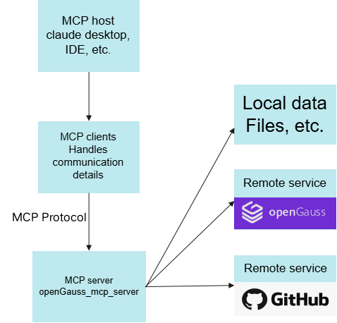
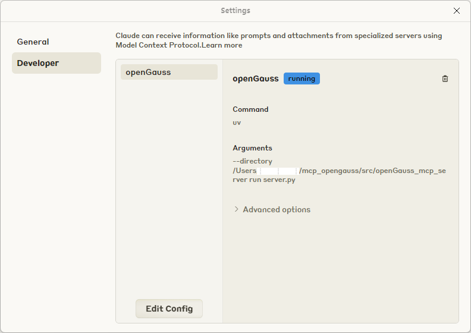
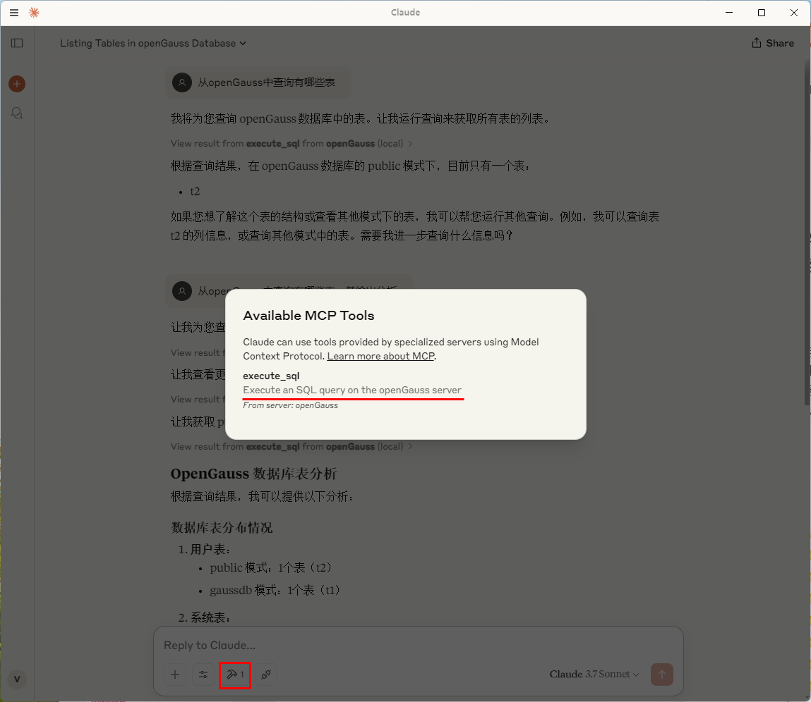
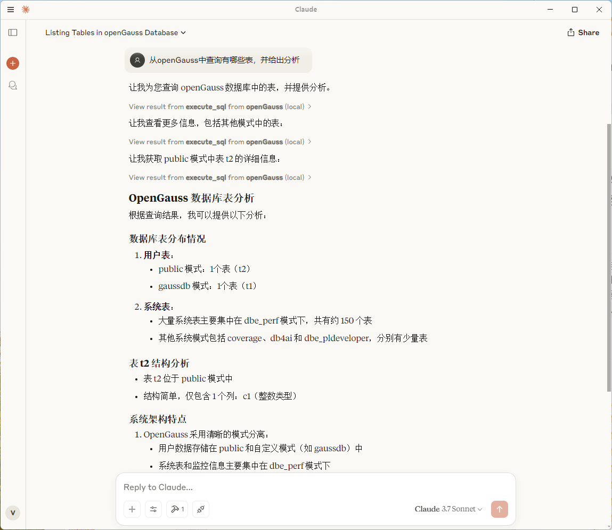
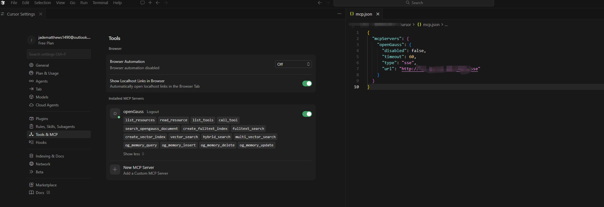
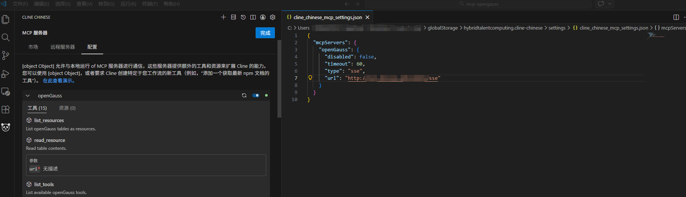
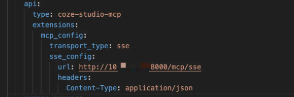

# MCP + openGauss

## Availability

This feature is introduced since openGauss 7.0.0-RC3.

## Feature Overview

As AI evolves from static inference to dynamic interaction, agents are becoming the focus. An agent can not only invoke an LLM for reasoning, but also access databases, call APIs, and execute tasks. However, there is currently no standardized interaction protocol between LLMs and agents, and each new data source requires a custom implementation, making truly interconnected systems difficult to scale. MCP (Model Context Protocol) addresses this challenge. MCP is a standardized interaction framework designed for LLMs and agent systems, enabling LLMs to interact efficiently with external databases, APIs, and tools.

## Customer Value

By adapting MCP to the openGauss database, AI agents can securely and efficiently operate an enterprise-grade domestic database through a standardized protocol, seamlessly integrating structured data into AI workflows and significantly lowering the development barrier for integrating AI applications with complex data systems.

## openGauss + MCP + LLM Architecture

**Figure 1**  openGauss + MCP + LLM architecture
<div style="display:flex;justfy-content:center;">
    
</div>

## Quickly Build an AI Agent Application with openGauss + MCP + LLM

### Environment Preparation

- Install the python3 environment and install uv.
- Deploy and start the openGauss database through [container deployment](https://docs.opengauss.org/zh/docs/7.0.0-RC1-lite/docs/InstallationGuide/%E5%AE%B9%E5%99%A8%E9%95%9C%E5%83%8F%E5%AE%89%E8%A3%85.html).
- Download Claude Desktop to perform Q&A operations with the MCP protocol.

### Obtain the openGauss_mcp_server Source Code

Visit <https://gitcode.com/opengauss/mcp-opengauss> to obtain the openGauss_mcp_server source code. The current version is (0.1.0).

### Configure Parameters

- Open Claude Desktop settings, edit the configuration file, and set the MCP server startup path (/src/openGauss_mcp_server).

**Figure 2** Claude Desktop configuration page
<div style="display:flex;justfy-content:center;">
    
</div>

#### Stdio Mode

In an MCP-enabled client, add the following content to the configuration file. For example, in Claude Desktop, you can add the configuration through Edit Config.

```json
{
    "mcpServers": {
        "openGauss": {
            "command": "uv",
            "args": [
            "--directory",
            "path/to/openGauss_mcp_server",
            "run",
            "server.py"
            ],
            "env": {
                "OPENGAUSS_HOST": "localhost",
                "OPENGAUSS_PORT": "your_port",
                "OPENGAUSS_USER": "your_username",
                "OPENGAUSS_PASSWORD": "your_password",
                "OPENGAUSS_DBNAME": "your_database",
                "ENABLE_MEMORY": "0"
            }
        }
    }
}
```

#### SSE Mode

In SSE mode, multiple MCP clients can share a single server, which may be a remote server, and HTTP/HTTPS connections are supported. Configure the relevant environment variables before starting the MCP service. The following are the basic steps for quick configuration.

1) Create the configuration file

```bash
cp env_template .env
```

2) Configure environment variables

Database-related configuration:

```bash
OPENGAUSS_HOST="localhost"
OPENGAUSS_PORT=your_port
OPENGAUSS_USER="your_username"
OPENGAUSS_DBNAME="your_database"
```

3) Configure HTTP/HTTPS connection

If HTTPS connection is enabled, turn on the HTTPS switch and set the certificate path:

```bash
# Configure in the .env file
SSL_KEYFILE="certs/server.key"
SSL_CERTFILE="certs/server.crt"
ENABLE_HTTPS="true"
```

If HTTP connection is selected, directly turn off the HTTPS switch:

```bash
ENABLE_HTTPS="false"
```

4) Start the server

```bash
# Manually load the environment variables.
cd mcp-opengauss
source .env
python3 -m src.openGauss_mcp_server.server --transport sse --sse_port <your_port> --sse_host 0.0.0.0
```

After the MCP service starts, you can update the MCP client configuration (if HTTPS is enabled, use the HTTPS protocol for the URL here; otherwise, use the HTTP protocol):

```json
{
  "mcpServers": {
    "openGauss":{
      "type":"sse",
      "url":"https://<yourip>:<yourport>/sse"
        }
  }
}
```

#### Streamable HTTP Mode

The environment variable configuration is the same as that in SSE mode.

Start the server:

```bash
# Manually load the environment variables.
cd mcp-opengauss
source .env
python3 -m src.openGauss_mcp_server.server --transport streamable-http --streamable_http_port <your_port> --streamable_http_host 0.0.0.0
```

MCP client configuration:

```json
{
  "mcpServers": {
    "openGauss": {
      "type": "streamableHttp",
      "url": "http://<yourip>:<yourport>/mcp"
    }
  }
}
```

### Environment Variables

#### 1. Database Connection Configuration

| Variable Name | Description | Default Value | Required |
|--------|------|--------|------|
| `OPENGAUSS_HOST` | Host address of the openGauss database | `localhost` | Yes |
| `OPENGAUSS_PORT` | Port number of the openGauss database | `5432` | Yes |
| `OPENGAUSS_USER` | Username for the openGauss database | None | Yes |
| `OPENGAUSS_PASSWORD` | Password for the openGauss database. For improved security, it is not recommended to set the openGauss database password in plaintext through an environment variable. Interactive input is recommended to avoid the risk of password leakage. (If the environment variable is not set, interactive input is prompted at startup.) | None | No |
| `OPENGAUSS_DBNAME` | Name of the openGauss database | None | Yes |

#### 2. Memory System Configuration

| Variable Name | Description | Default Value | Required |
|--------|------|--------|------|
| `ENABLE_MEMORY` | Memory system switch: `1`=enabled, `0`=disabled | `1` | No |
| `EMBEDDING_MODEL_PROVIDER` | Embedding model provider, currently only `huggingface` is supported | `huggingface` | No |
| `LOCAL_MODEL_DIR` | Local embedding model path | `""` | No |
| `REMOTE_MODEL_NAME` | Remote embedding model name | `BAAI/bge-small-en-v1.5` | No |

#### 3. HTTPS/SSL configuration

| Variable name | Description | Default value | Required |
|--------|------|--------|------|
| `ENABLE_HTTPS` | Whether to enable HTTPS: `true`/`false`, `1`/`0`, `yes`/`no`, `on`/`off` | `true` | No |
| `SSL_KEYFILE` | SSL private key file path | `certs/server.key` | When HTTPS is enabled |
| `SSL_CERTFILE` | SSL certificate file path | `certs/server.crt` | When HTTPS is enabled |
| `SSL_KEYFILE_PASSWORD` | SSL private key password (if any). If this environment variable is not set, interactive input is prompted at startup | `""` | No |
| `SSL_CA_CERTS` | SSL CA certificate path | `""` | No |

## openGauss MCP Tool Feature Description

- Execute SQL statements
- Query all tables in the database
- Query partial content of a table
- Query the execution plan of an SQL statement
- Create a BM25 full-text index
- Full-text search with scalar filters (currently only BM25 full-text indexes are supported)
- Create a vector index (any vector index supported by openGauss can be specified)
- Vector search with scalar filters
- Hybrid search combining full-text, vector, and scalar filters (scoring weights for full-text and vector can be configured)
- Query the openGauss official documentation
- User memory system (mainly for storing and applying personalized user information)

## AI Service Integration

### Restart Claude Desktop

You can see the available MCP tools, which execute SQL through the openGauss server.

**Figure 3**  MCP tools available in Claude Desktop
<div style="display:flex;justfy-content:center;">
    
</div>

### Using Cluade Desktop to Ask Questions with openGauss

**Figure 4**  Claude Desktop Q&A demonstration
<div style="display:flex;justfy-content:center;">
    
</div>

### Example

Question 1: View all tables in the database.

```sql
tablename,tableowner,schemaname
documents,test2,public
og_mcp_memory,test2,public
test_vectors_5d,test2,public
```

Question 2: Hybrid search (full-text + vector + scalar)
Perform a hybrid search on the table test_vectors_5d, with the full-text search weight set to 0.7, and the return parameters should not include the vector column.

```json
{
  "id": 1,
  "title": "Document A",
  "description": "First test document",
  "score": 0.0870114043354988,
  "bm25_norm": 1.0,
  "vector_norm": 1.0,
  "hybrid_score": 1.0
}

{
  "id": 3,
  "title": "Document C",
  "description": "Third test document",
  "score": 0.0870114043354988,
  "bm25_norm": 1.0,
  "vector_norm": 0.9974683567754559,
  "hybrid_score": 0.9992405070326367
}
```

Question 3: User memory system <br>
1) I like eating hot pot and usually live in Xi'an.

```text
AI: The user has shared personal preferences (enjoys hotpot, resides in Hangzhou). This information should be saved to the personal memory system, so I need to call the og_memory_insert tool to store it.
...
```

2) Recommend some good drinks.

```text
AI: Let me first use the og_memory_query tool to retrieve the user's beverage preferences.
...
```

## MCP Client Configuration Example

### cursor

**Figure 5**  cursor MCP client configuration
<div style="display:flex;justfy-content:center;">
    
</div>


### vscode cline plugin

**Figure 6**  vscode cline plugin MCP client configuration
<div style="display:flex;justfy-content:center;">
    
</div>

### coze

Since neither the Coze web version nor Coze Studio officially provides an interface for connecting to other MCP servers, if you want Coze to connect to a custom MCP service, you can refer to the modification scheme in [Coze Studio Secondary Development (I): Supporting Static MCP Server Configuration](https://juejin.cn/post/7582808491607261238) to extend Coze Studio and implement static configuration and remote invocation of third-party MCP servers.

Code repository: [coze-studio-plus](https://github.com/yangkun19921001/coze-studio-plus)

MCP plugin configuration:

<div style="display:flex;justfy-content:center;">
    
</div>

## Feature Constraints

- As a tool layer, MCP (Model Context Protocol) is primarily responsible for precisely executing database operation instructions issued by users in natural language. It does not possess independent awareness or content generation capabilities, and therefore does not proactively output any statements that violate security regulations. MCP only performs necessary functional read and write operations on the database.<br>
- When combined with a large language model, MCP gains the ability to operate on the database. Note that model misunderstanding may lead to the risk of accidental data deletion. Users need to review the commands to be executed, and it is recommended to configure the minimum necessary permissions for the database connection to ensure that even if an instruction is incorrect, it cannot cause damage beyond expectations.<br>
- When providing services, large language models usually collect users' conversation data for model training or service optimization, which may involve the unintended exposure of sensitive information such as enterprise secrets and personal privacy. To protect data privacy, it is recommended to use locally deployed large language models in scenarios involving sensitive data to reduce the risk of leakage caused by continuous analysis.<br>
