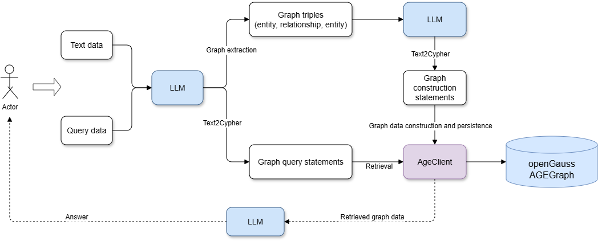

# openGauss AGEGraph + LLM Powers GraphRAG for a More Powerful RAG

Traditional Retrieval-Augmented Generation (RAG) typically uses vector databases to retrieve relevant documents, improving the accuracy of LLM answers. However, vector-based RAG cannot effectively express the relationships between entities. By contrast, GraphRAG, which is based on knowledge graph retrieval-augmented generation, provides structured retrieval capabilities, incorporating graphs as one component of traditional RAG multi-path recall. This makes knowledge representation more interpretable and better suited for complex relationships.

[openGauss AGEGraph](opengauss_agegraph.md) now provides graph database engine capabilities. This article details how to leverage LLMs and the openGauss graph database to quickly extract and persist document knowledge graphs. You then input a question into the LLM, which automatically extracts keywords and converts them into graph query statements to connect to the openGauss graph database for graph data retrieval. Finally, the graph data is fed into the LLM to generate an answer for the user.


## 1. Environment Setup

### 1.1 Deploying openGauss in a Container

For deploying openGauss, refer to [Installing the openGauss Container Image](https://docs.opengauss.org/en/docs/latest/installation_guide/installing_the_container_image.html).

After the openGauss container starts, run `docker ps` to check whether the container is running.
Output

```
CONTAINER ID        IMAGE                                                  COMMAND                  CREATED             STATUS                          PORTS                                              NAMES
253714c9c869        opengauss:7.0.0-rc1                                    "entrypoint.sh gauss…"   8 minutes ago       Up 8 minutes                    0.0.0.0:6543->5432/tcp                             opengauss-age

```

### 1.2 Installing Python Dependencies

```
pip install -U langchain_community langchain langgraph  langchain-ollama langchain-experimental  langchain-openai langchain-opengauss
```

## 2. Quickly Building Knowledge Graphs and Retrieval with LLMs and openGauss AGEGraph

This article uses the Bailian LLM. Obtain an API key and configure the `DASHSCOPE_API_KEY` environment variable.

### 2.1 Initializing the LLM

```
from langchain_community.llms import Tongyi
import os

os.environ["DASHSCOPE_API_KEY"] = "sk-**"
graph_llm =Tongyi(model="qwen-plus", temperature=0, base_url="https://dashscope.aliyuncs.com/compatible-mode/v1")

```

### 2.2 Extracting Entities and Relationships from Text Data Through LLM

```
from langchain_core.documents import Document
from langchain_experimental.graph_transformers import LLMGraphTransformer

# Set the entity types and relationships to extract
llm_transformer = LLMGraphTransformer(
    llm=graph_llm,
    allowed_nodes=["Person", "Organization", "Location", "Award", "ResearchField"],
    allowed_relationships = ["SPOUSE", "AWARD", "FIELD_OF_RESEARCH", "WORKS_AT", "IN_LOCATION"],
)

text = """
Marie Curie, 7 November 1867 – 4 July 1934, was a Polish and naturalised-French physicist and chemist who conducted pioneering research on radioactivity.
She was the first woman to win a Nobel Prize, the first person to win a Nobel Prize twice, and the only person to win a Nobel Prize in two scientific fields.
Her husband, Pierre Curie, was a co-winner of her first Nobel Prize, making them the first-ever married couple to win the Nobel Prize and launching the Curie family legacy of five Nobel Prizes.
She was, in 1906, the first woman to become a professor at the University of Paris.
Also, Robin Williams.
"""

# Convert text into a graph
documents = [Document(page_content=text)]
graph_documents = llm_transformer.convert_to_graph_documents(documents)


print(f"Nodes from graph doc:{graph_documents[0].nodes}")
print(f"Relationships from graph doc:{graph_documents[0].relationships}")
```

Output

```
Nodes from graph doc:[Node(id='Nobel Prize', type='Award', properties={}), Node(id='University of Paris', type='Organization', properties={}), Node(id='Marie Curie', type='Person', properties={}), Node(id='radioactivity', type='ResearchField', properties={}), Node(id='Pierre Curie', type='Person', properties={})]
Relationships from graph doc:[Relationship(source=Node(id='Marie Curie', type='Person', properties={}), target=Node(id='radioactivity', type='ResearchField', properties={}), type='FIELD_OF_RESEARCH', properties={}), Relationship(source=Node(id='Marie Curie', type='Person', properties={}), target=Node(id='Nobel Prize', type='Award', properties={}), type='AWARD', properties={}), Relationship(source=Node(id='Marie Curie', type='Person', properties={}), target=Node(id='Nobel Prize', type='Award', properties={}), type='AWARD', properties={}), Relationship(source=Node(id='Marie Curie', type='Person', properties={}), target=Node(id='Pierre Curie', type='Person', properties={}), type='SPOUSE', properties={}), Relationship(source=Node(id='Pierre Curie', type='Person', properties={}), target=Node(id='Nobel Prize', type='Award', properties={}), type='AWARD', properties={}), Relationship(source=Node(id='Marie Curie', type='Person', properties={}), target=Node(id='University of Paris', type='Organization', properties={}), type='WORKS_AT', properties={})]
```

### 2.3 Installing the openGauss AGE Extension

If the AGE extension has already been created in the database, you can skip this step.

```
import psycopg2
connection = psycopg2.connect(
    database = "omm",
    user = "gaussdb",
    password = "YourPassword",
    host = "Your IP",
    port = 8888
)

try:
    cursor = connection.cursor()
    sql_qeury = "create extension age;"
    cursor.execute(sql_query)
    connection.commit()
except Exception as e:
    print(e)
finally:
    cursor.close()
    connection.close()
```

### 2.4 Instantiating the openGauss AGEGraph Client and Persisting Graph Data

```
from langchain_opengauss import openGaussAGEGraph, openGaussSettings

conf = openGaussSettings(
    database = "omm",
    user = "gaussdb",
    password = "YourPassword",
    host = "Your IP",
    port = 8888
)
graph=openGaussAGEGraph(graph_name='graph_test1',conf=conf,create=True)
graph.add_graph_documents(graph_documents)
graph.refresh_schema()

```

### 2.5 LLM Text2Cypher: Extracting Keywords and Generating Graph Retrieval Queries

Adding the `cypher_prompt` prompt enables the LLM to generate more accurate graph query statements.

```
from langchain_core.prompts import PromptTemplate
from langchain.chains import GraphCypherQAChain

cypher_prompt = PromptTemplate(
    template="""你是 AGE Cypher 查询生成的专家。
    使用以下架构生成一个 Cypher 查询，以回答给定问题。
    不要出现name和properties和cypher

    架构：
    {schema}

    问题：{question}

    Cypher 查询：""",
    input_variables=["schema", "question"],
)

chain = GraphCypherQAChain.from_llm(
    graph_llm, graph=graph, verbose=True, allow_dangerous_requests=True, cypher_validation=True, return_intermediate_steps=True,cypher_prompt=cypher_prompt
)

question = "Who get Nobel Prize ?"
result = chain.invoke({"query": question})
```

Output

> Entering new GraphCypherQAChain chain...
Generated Cypher:
MATCH (p:Person)-[:AWARD]->(a:Award)
WHERE a.id = "Nobel Prize"
RETURN p.id
Full Context:
[{'p_id': 'Pierre Curie'}, {'p_id': 'Marie Curie'}]

## 3. Generating Answers from Retrieved Graph Data with the LLM

### 3.1 Setting the Prompt

```
prompt = PromptTemplate(
    template="""You are an assistant for question-answering tasks.
    Use the following pieces of retrieved context from a graph database to answer the question. If you don't know the answer, just say that you don't know.
    Use two sentences maximum and keep the answer concise:
    Question: {question}
    Graph Context: {graph_context}
    Answer:
    """,
    input_variables=["question", "graph_context"],
)

```

### 3.2 Generating the Answer

```
from langchain_core.output_parsers import StrOutputParser

composite_chain = prompt | graph_llm |StrOutputParser()

answer = composite_chain.invoke(
    {"question": question, "graph_context": result}
)
print(answer)
```

Output

```
Marie Curie and Pierre Curie received the Nobel Prize. They were recognized for their groundbreaking work in radioactivaity.
```

## 4. Summary

By combining LLMs with the openGauss AGEGraph graph database, you can quickly generate, persist, and retrieve knowledge graphs, building a complete GraphRAG system. Additionally, openGauss currently supports scalar and vector storage and retrieval. By deploying only the openGauss database, you can achieve a more powerful RAG system that supports multi-path recall across scalars, vectors, and knowledge graphs.
