# openGauss DataVec + Dify: Quickly Building Your Intelligent Assistant Platform

In the current digital and intelligent era, LLM applications are transforming workflows and user experiences across various fields at an unprecedented pace. Dify, an open-source LLM application development platform, provides developers with convenient and powerful tools to build a wide range of LLM applications, from basic agents to complex AI workflows. Its core advantage lies in its integrated Retrieval-Augmented Generation (RAG) engine, which intelligently retrieves and analyzes vast amounts of data to accurately provide relevant information to the LLM, significantly improving the accuracy and relevance of model outputs.
This article focuses on how to deploy Dify and use the openGauss DataVec vector database as the RAG engine corpus to build an efficient and intelligent assistant platform.

## Dify Deployment

### Obtaining the Dify Source Code

To begin deploying Dify, first obtain its source code from <https://github.com/langgenius/dify/releases/tag/1.1.3>. Dify has supported openGauss since version 1.1.0, and version 1.1.3 introduced product quantization (PQ) support. Therefore, this article uses Dify 1.1.0 as an example.

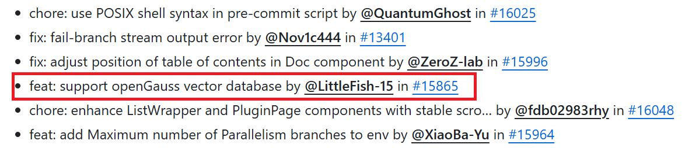

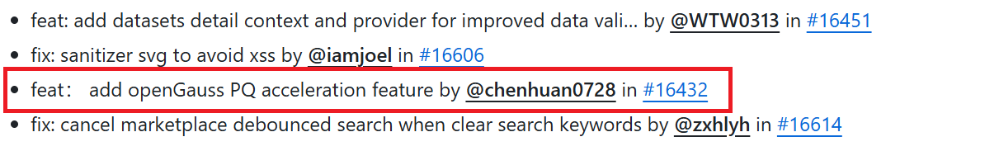

### Configuring Parameters

After downloading the source code archive, create a specific directory and extract the source code as follows:

```bash
mkdir /usr/local/dify
unzip 1.1.0.zip -d /usr/local/dify/
cd /usr/local/dify/dify-1.1.0/docker
```

The next key step is to configure the environment variables. In this process, modify the `.env` file and set `VECTOR_STORE` to `opengauss`. Run the following commands to copy and edit the file:

```bash
cp .env.example .env
vim .env
```


### Starting the Containers

After completing the preceding configuration, run the following command. The system will automatically pull the corresponding Docker images and start the Dify services:

```bash
docker-compose up -d
```

After the containers have started, run the `docker ps` command to verify that all services are running properly. If everything goes well, you should see a status similar to the following figure:

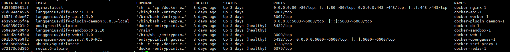

## AI Service Integration

### Creating a User and Logging In

Once the Dify service has started successfully, access the locally deployed Dify web service page in your browser:

```
http://your_server_ip
```

On this page, you can create an administrator user. Simply enter a valid email address and a custom password to create the account and log in:

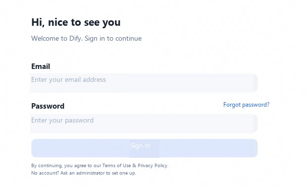

### Connecting an LLM

On the main page, click the username in the upper-right corner, then click "Settings" to enter the settings page. Click "Model Providers", select "OpenAI", and click the "Install" button. (For LLM and embedding model deployment using the Ascend s  olution, refer to [MindIE-DeepSeek-R1-Distill-Qwen-7B Model Deployment](https://modelers.cn/models/MindIE/DeepSeek-R1-Distill-Qwen-7B) and [mis-tei-embedding Deployment](https://www.hiascend.com/developer/ascendhub/detail/07a016975cc341f3a5ae131f2b52399d).)

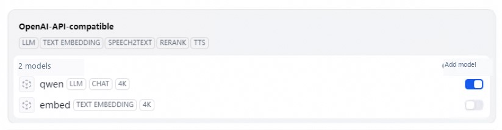

After installation, on the Add Model page, select "LLM" as the model type and configure it as follows:

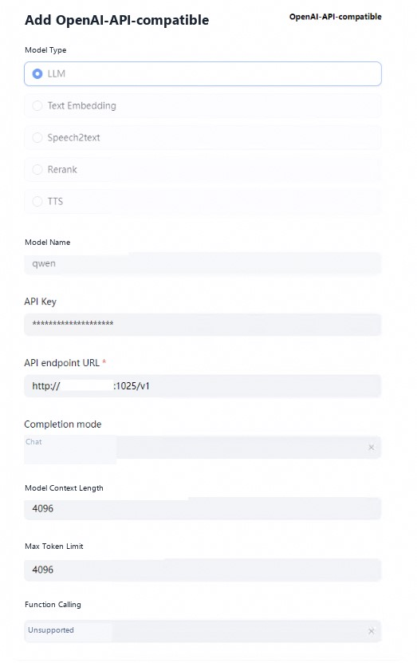

Then select "Text Embedding" and configure it as follows:

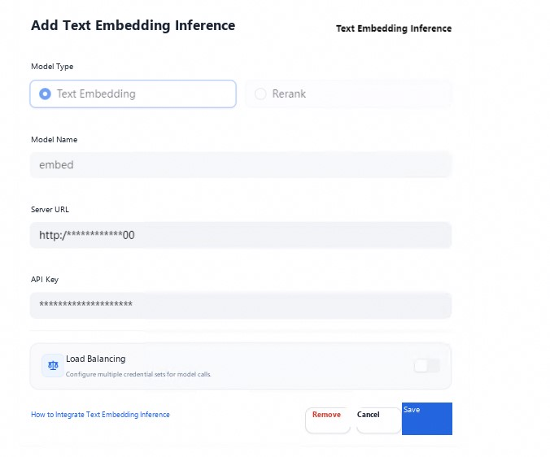

### Importing the Corpus

This article uses the openGauss corpus knowledge as an example to demonstrate how to import a corpus. On the page, click the "Knowledge" tab and select "Import Existing Text" to import your locally prepared corpus into the system:

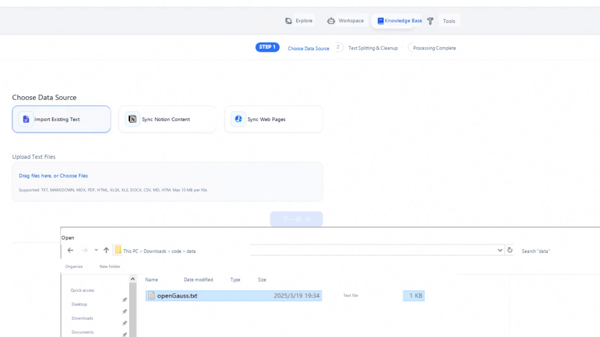

When importing, select the previously configured embedding model, then click "Save and Process":

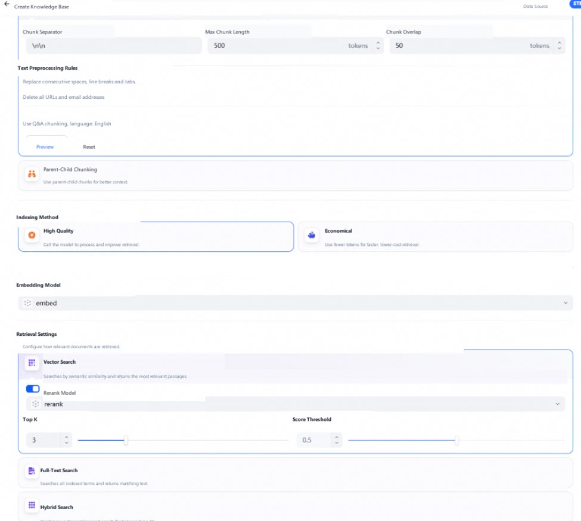

At this point, the system will automatically process the corpus and store it in the openGauss vector database. Simply wait for the processing to complete. When you see a prompt similar to the following figure, the corpus has been successfully stored:

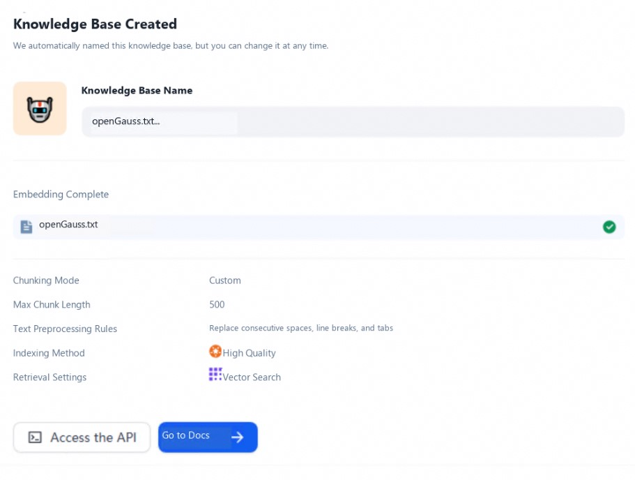

### Chatting

After completing all the preceding settings, open the chat window to start a conversation test. Enter a question in the chat window and wait for the system to respond:

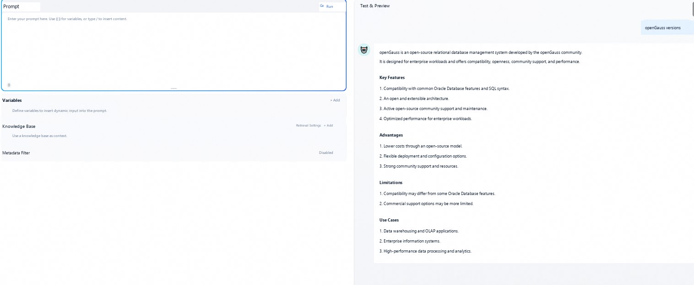

From the first response, you can see that the answer quality is low and the description is not accurate. Next, introduce the previously imported openGauss corpus as context and ask the question again:

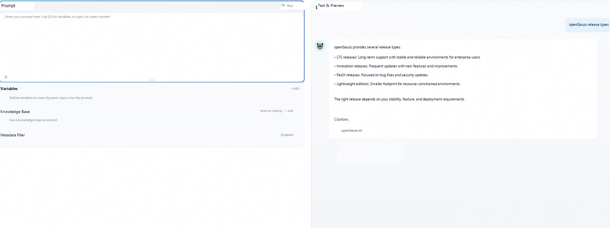

It is clearly evident that with the help of the openGauss corpus, the system provides much more accurate answers. At this point, the setup of the Dify RAG engine based on the openGauss vector database is successfully completed.
