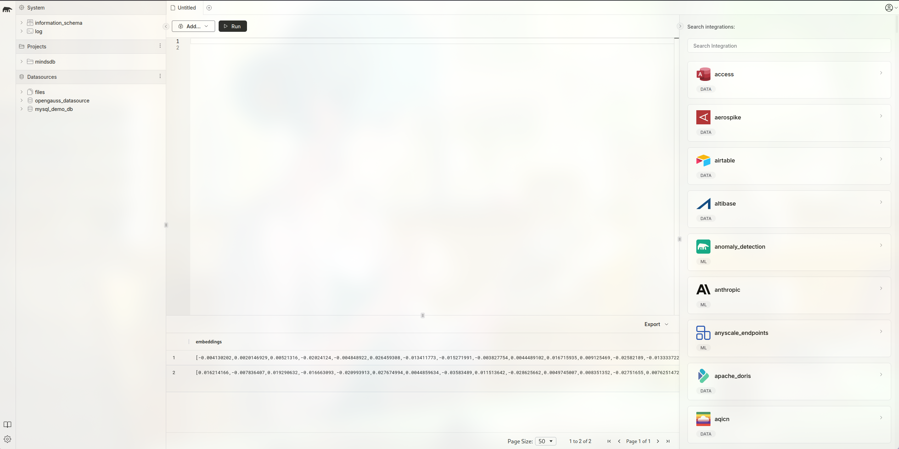
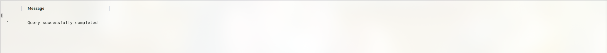
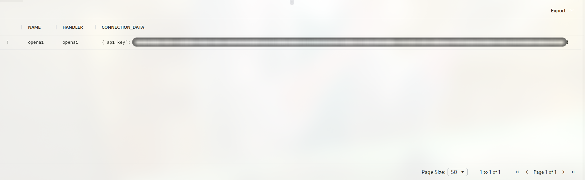
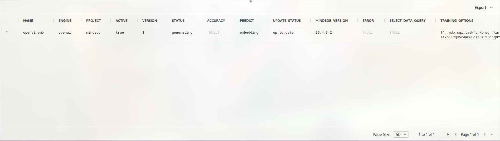
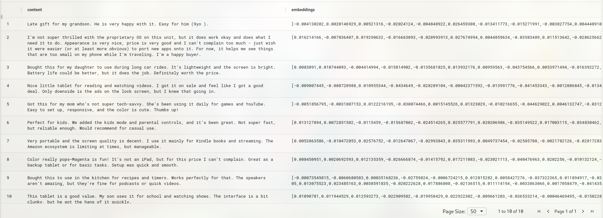
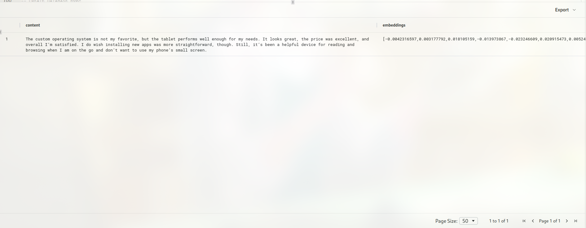
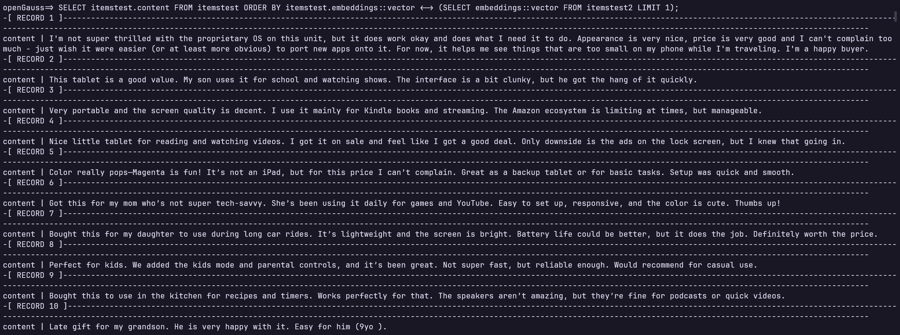
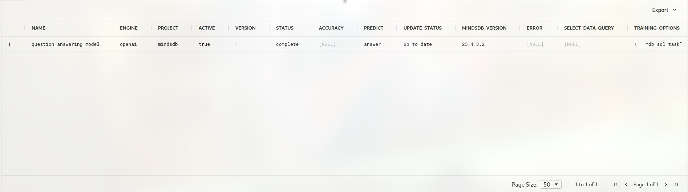
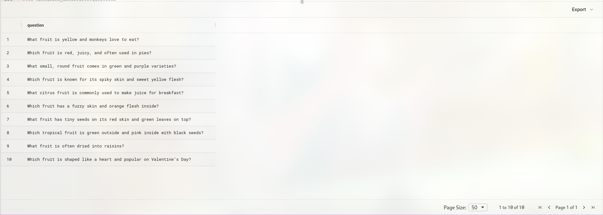
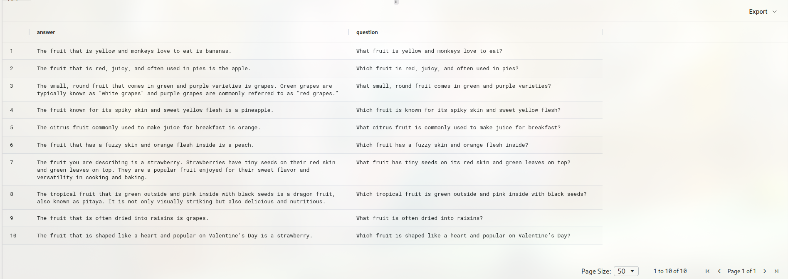

# Easily Empower Databases with AI Using openGauss + MindsDB

## Introduction to MindsDB

MindsDB is an open-source machine learning project that simplifies the deployment of machine learning models by integrating them with existing database systems. By integrating with various mainstream databases, MindsDB can reduce the time users spend on data migration, model training, and deployment. It bridges the gap between databases and machine learning by allowing users to query data and train models using SQL statements.

In this document, two simple examples are used to introduce how to use openGauss as the underlying data platform and combine it with the efficient and easy-to-use AI capabilities of MindsDB to quickly empower databases with AI.

## Deployment & Installation

### Installing MindsDB

Before getting started, you must first install MindsDB. MindsDB supports both container-based deployment and Python-based deployment (which is more convenient for debugging). For details, visit the [official website](https://docs.mindsdb.com/setup/self-hosted/docker).

### Installing openGauss

For details, visit the [openGauss official website](https://docs.opengauss.org/en/docs/latest/getting_started/preparing_for_installation.html), which is not described in detail here.

## Getting Started

### Establishing a Connection

After MindsDB is deployed, you can go to the MindsDB Studio page.


Use the following command to establish a connection to openGauss. `PORT` is the port number on which the openGauss server is listening, `DBNAME` is the database in openGauss that you intend to use, and `USER` and `PASSWORD` are the username and password of the database user, respectively.

```sql

CREATE DATABASE opengauss_datasource
WITH
  ENGINE = 'opengauss',
  PARAMETERS = {
    "host": "127.0.0.1",
    "port": PORT,
    "database": DBNAME,
    "user": USERNAME,
    "password": PASSWORD
  };
```

In MindsDB, when the SQL command is executed successfully, MindsDB Studio displays the following message.


To disconnect MindsDB from openGauss, use the following SQL statement:

```sql
DROP DATABASE opengauss_datasource
```

In MindsDB, you can perform some basic operations on data tables in openGauss by executing SQL statements.

### Preparing Data

First, create a table containing a vector column in openGauss:

```sql
CREATE TABLE test(id int, val vector(3));
```

Then, return to MindsDB Studio and operate on the table.

### Inserting Data

```sql
INSERT INTO opengauss_datasource.test(val) VALUES(1, '[1, 2, 3]');
```

### Updating Data

```sql
UPDATE opengauss_datasource.test SET val = '[2, 3, 4]' WHERE id = 1;
```

### Deleting Data

```sql
DELETE FROM opengauss_datasource.test WHERE id = 1;
```

### Querying Data

```sql
SELECT * FROM opengauss_datasource.test LIMIT 1;
```

### Calculating Distances

```sql
SELECT * FROM opengauss_datasource.test ORDER BY val <-> '[3,1,2]' LIMIT 5;
SELECT * FROM opengauss_datasource.test ORDER BY val <#> '[3,1,2]' LIMIT 5;
SELECT * FROM opengauss_datasource.test ORDER BY val <=> '[3,1,2]' LIMIT 5;
```

## Hands-on with MindsDB + openGauss: Using MindsDB for Text Embedding

First, use the text data provided by MindsDB to create your own data table. MindsDB provides some sample data in `mysql_demo_db` for you to use.
Here, use `amazon_reviews`.

```sql
CREATE DATABASE mysql_demo_db
WITH ENGINE = 'mysql',
PARAMETERS = {
    "user": "user",
    "password": "MindsDBUser123!",
    "host": "samples.mindsdb.com",
    "port": "3306",
    "database": "public"
};

CREATE TABLE opengauss_datasource.amazon_reviews
    (SELECT * FROM mysql_demo_db.amazon_reviews LIMIT 10);

```

As shown below, the table consists of two columns: one for the product name and the other for the customer's review of the product.


The text embedding model provided by OpenAI is used to perform text embedding. First, prepare the machine learning engine to be used. Create the engine using the following command. You need to obtain an OpenAI API key to call the OpenAI model API. When using the command, replace `your-api-key` with your own API key.

```sql

CREATE ML_ENGINE openai
FROM openai
USING
    api_key = your-api-key
```

You can use `SHOW ML_ENGINES WHERE name = 'openai'` to view the engine information.



In addition, MindsDB provides other machine learning engines, such as HuggingFace, for users to choose from. Here, use `CREATE MODEL` to create the required text embedding model. When creating the model, specify the ML engine to use. Here, use the `openai` engine created in the previous step. Then, specify the text embedding model to use. Here, use `text-embedding-ada-002` and set `mode` to `embedding`. Finally, specify the column to convert into an embedding. Here, specify the `review` column. You also need to use the API key from the previous step to create the model.

```sql

CREATE MODEL openai_emb 
PREDICT embedding 
USING    
  engine = 'openai',
  model_name='text-embedding-ada-002',    
  mode = 'embedding',    
  question_column = 'review',
  openai_api_key = your-api-key;
```

When the execution is successful, the model information is displayed as follows.



Finally, call the text embedding model to convert the text into vector data.

```sql
create table opengauss_datasource.itemstest (
SELECT m.embedding AS embeddings, t.review content FROM  opengauss_datasource.amazon_reviews t
  join openai_emb  m
);
```



As shown above, the text data has been converted into text embeddings.

Using vector calculations, you can search for semantically similar text. Here, randomly select one piece of text from the data used for text embedding and rewrite it so that its original meaning remains unchanged while the sentence itself differs from the original.

The original data is as follows.


Rewrite one of the sentences:

```text
Original sentence: I'm not super thrilled with the proprietary OS on this unit, but it does work okay and does what I need it to do. Appearance is very nice, price is very good and I can't complain too much - just wish it were easier (or at least more obvious) to port new apps onto it. For now, it helps me see things that are too small on my phone while I'm traveling. I'm a happy buyer.

Rewritten sentence: The custom operating system is not my favorite, but the tablet performs well enough for my needs. It looks great, the price was excellent, and overall I’m satisfied. I do wish installing new apps was more straightforward, though. Still, it’s been a helpful device for reading and browsing when I am on the go and don’t want to use my phone’s small screen.
```

Next, perform text embedding on the rewritten sentence as well.

```sql
CREATE TABLE opengauss_datasource.amazon_reviews2(product_name text, review text);

insert into amazon_reviews2 values('All-New Fire HD 8 Tablet, 8 HD Display, Wi-Fi, 16 GB - Includes Special Offers, Magenta', 'The custom operating system is not my favorite, but the tablet performs well enough for my needs. It looks great, the price was excellent, and overall I’m satisfied. I do wish installing new apps was more straightforward, though. Still, it’s been a helpful device for reading and browsing when I am on the go and don’t want to use my phone’s small screen.');

create table opengauss_datasource.itemstest2 (
SELECT m.embedding AS embeddings, t.review content FROM  opengauss_datasource.amazon_reviews2 t
  join openai_emb  m
);
```



Now, you have the text embedding of the rewritten sentence. Next, use the text embedding in openGauss to find the sentence that is semantically most similar to the rewritten sentence. Due to syntax limitations in MindsDB, you cannot perform type conversion through MindsDB. The following SQL statement must be executed in openGauss:

```sql
SELECT itemstest.content FROM itemstest ORDER BY itemstest.embeddings::vector <-> (SELECT embeddings::vector FROM itemstest2 LIMIT 1);
```

The following result is as expected.



## Hands-on with MindsDB + openGauss: Using MindsDB to Help Build a Local Knowledge Base

In addition to performing text embedding, you can also conveniently call models through MindsDB to help solve problems, and then store the answers in openGauss for subsequent use.

First, specify the model to use:

```sql
CREATE MODEL question_answering_model
PREDICT answer
USING
    engine = 'openai',
    prompt_template = 'answer the question of text:{{question}}', 
    openai_api_key = your-api-key;
```


You have created the `engine` earlier. For information about creating the `engine`, see the preceding section.
Here, create a table that stores the questions you want the LLM to answer. The table creation steps are omitted here. The following figure shows only the simple table you will use.

```sql
SELECT * FROM opengauss_datasource.questions;
```



Call the model to generate answers.

```sql 
CREATE TABLE opengauss_datasource.answer (
SELECT m.answer AS answer, t.question question FROM opengauss_datasource.questions t
  join question_answering_model m
);
```

Here, the `answer` column contains the generated answers, and `question` contains the input questions. By executing this SQL statement, MindsDB calls the model to generate a corresponding answer for each question in the table.


