# openGauss + RAGFlow: From Deployment to Integration

In a data-driven era, efficient and reliable database systems and intelligent Retrieval-Augmented Generation (RAG) technology have become key to improving the efficiency of enterprise data processing and knowledge management. Integrating openGauss with RAGFlow makes full use of openGauss's efficient data storage and retrieval capabilities. It also leverages RAG technology to enable intelligent knowledge-based question answering, data analysis, and content generation. This combination helps build more powerful enterprise-level data intelligence solutions.

This document provides a complete guide from deployment to integration. By following this guide, you can learn how to deploy openGauss and RAGFlow together and use this powerful combination to build high-performance, intelligent data application systems.

## Deploying RAGFlow

### 1. Environment Requirements

#### 1.1 System Requirements

Before installing RAGFlow, make sure that your machine meets the following minimum system requirements:

* CPU >= 4 cores
* RAM >= 16 GB
* Disk >= 50 GB

#### 1.2 Operating System and Software Requirements

* OS: openEuler 22.03 LTS SP3 for Arm / BClinux for Euler 21.10U4 / CTyunOS3 / CULinux3.0
* Docker: >= 28.0.1 for Arm
* Docker Compose: >= 2.33.1 for Arm

### 2. Installation

#### 2.1 Obtaining the Project

Clone the KunpengRAG repository and go to the `docker-compose` deployment directory for RAGFlow.

```bash
git clone https://gitee.com/kunpeng_compute/KunpengRAG.git
cd KunpengRAG/deployment/docker-compose/ragflow
```

#### 2.2 Starting the Containers

The simplest way to start the RAGFlow server is to run the [docker-compose.yml](https://gitee.com/kunpeng_compute/KunpengRAG/blob/master/deployment/docker-compose/ragflow/docker-compose.yml) file.

```bash
docker compose up -d
```

If all of the following containers are running properly and there are no errors in the `ragflow-server` container logs, RAGFlow has been installed successfully.

```bash
[root@sharedstore003 docker]# docker ps | grep ragflow
68eee5519e8f   opengauss:7.0.0-rc1                                "entrypoint.sh gauss…"   4 hours ago   Up 4 hours (healthy)    0.0.0.0:6601->5432/tcp, :::6601->5432/tcp                                                                                                                                                                                       ragflow-opengauss
b1307bba2277   mysql:8.0.39                                       "docker-entrypoint.s…"   4 hours ago   Up 4 hours (healthy)    33060/tcp, 0.0.0.0:5455->3306/tcp, :::5455->3306/tcp                                                                                                                                                                            ragflow-mysql
f6d95b01622f   infiniflow/ragflow:v0.18.0                         "./entrypoint.sh"        4 hours ago   Up 4 hours              0.0.0.0:80->80/tcp, :::80->80/tcp, 0.0.0.0:443->443/tcp, :::443->443/tcp, 0.0.0.0:5678-5679->5678-5679/tcp, :::5678-5679->5678-5679/tcp, 0.0.0.0:9380->9380/tcp, :::9380->9380/tcp, 0.0.0.0:9382->9382/tcp, :::9382->9382/tcp   ragflow-server
a4693b4c7e6d   valkey/valkey:8                                    "docker-entrypoint.s…"   4 hours ago   Up 4 hours              0.0.0.0:6379->6379/tcp, :::6379->6379/tcp                                                                                                                                                                                       ragflow-redis
00686502f65a   quay.io/minio/minio:RELEASE.2023-12-20T01-00-02Z   "/usr/bin/docker-ent…"   4 hours ago   Up 4 hours              0.0.0.0:9000-9001->9000-9001/tcp, :::9000-9001->9000-9001/tcp                                                                                                                                                                   ragflow-minio
```

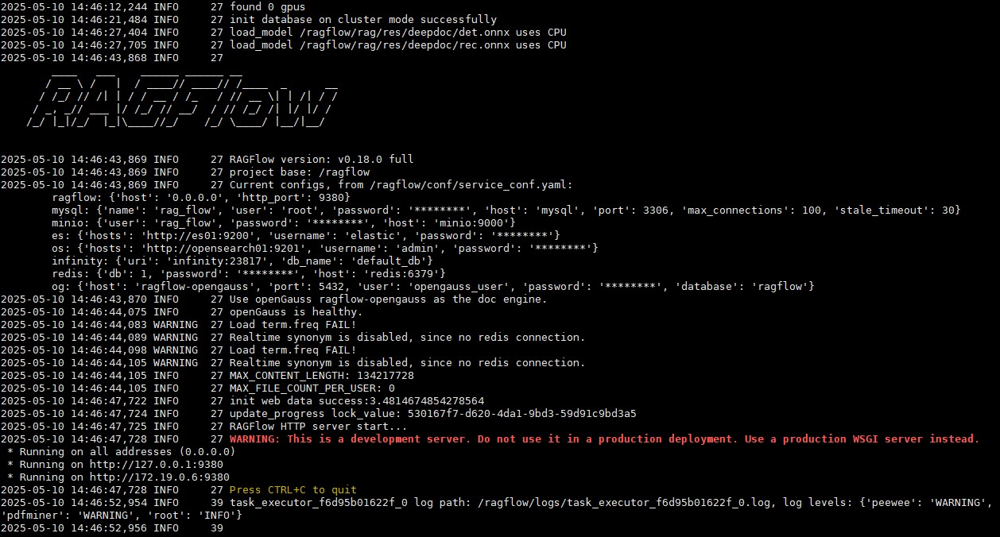
> [!NOTE]<br>
> The KunpengRAG project provides only RAGFlow + openGauss images for the Arm architecture. For x86 architecture, refer to [this document](https://ragflow.io/docs/dev/build_docker_image) and build the image yourself based on the [source code](https://github.com/lauraty123/ragflow/tree/adapt_opengauss).

#### 2.3 Accessing the RAGFlow Web Interface

Open `http://<your_server_ip>/login` in a browser to access the login page. Click **Sign up** to register an account. Enter your email address and password, and then return to the login page to log in with the account you just registered.


### 3. Configuring Models

This document uses Ollama to integrate large language models. Click your profile picture to open the settings page, select **Model providers**, and click **+ Add** under the Ollama icon.
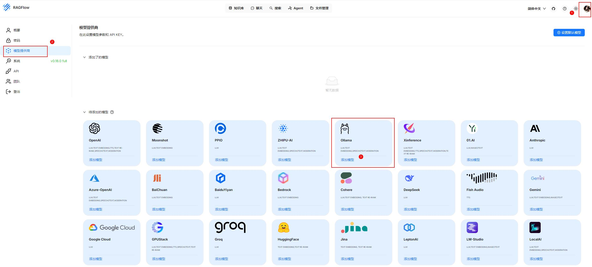

The following figure shows an example configuration for adding an embedding model.

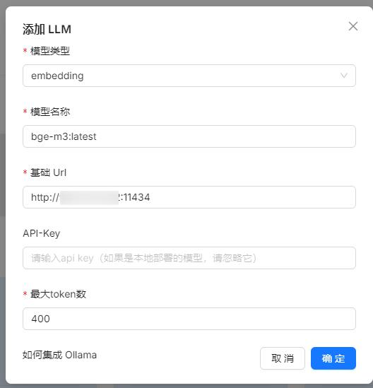

The following figure shows an example configuration for adding a chat model.

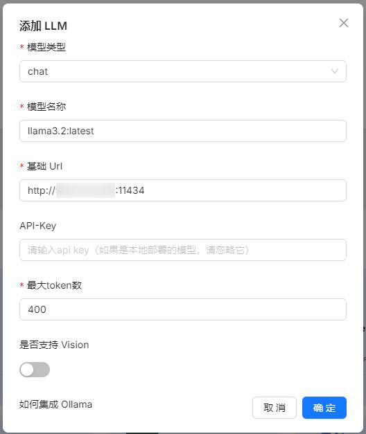

After integrating the LLM, set it as the default model for this project by clicking **Set default models**.
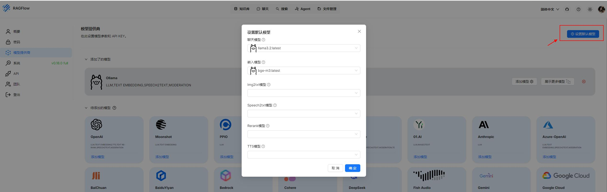

### 4. Creating a Dataset

This section describes how to create a dataset in RAGFlow for subsequent use in the Chat and Agent modules. Using an authoritative external dataset can reduce AI "hallucinations" and improve the accuracy of generated results. It also supports dynamic knowledge updates, eliminating the need for repeated model training.
Click **Create dataset** and enter a name for the dataset.

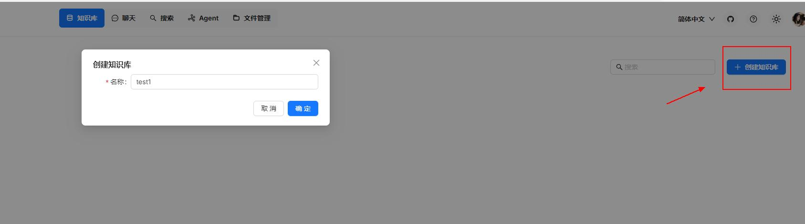

RAGFlow supports a wide range of file types, including Word documents, PPT files, Excel spreadsheets, TXT files, images, PDFs, scanned documents, photocopies, structured data, and web pages. In this example, a PDF research paper is uploaded.

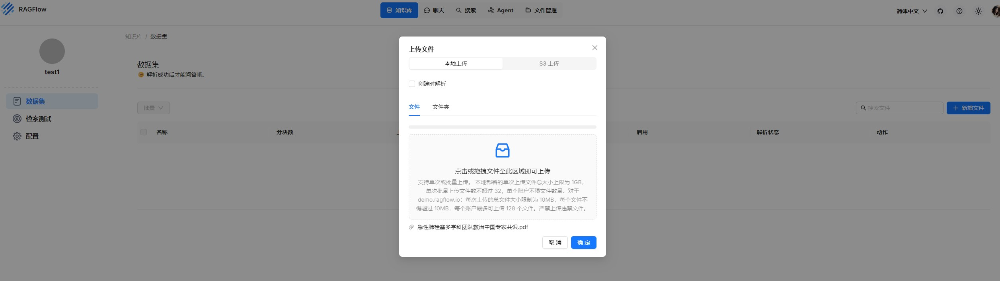

After the file is uploaded, click the parsing icon to automatically split the text into chunks.

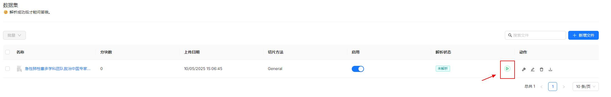

The text parsing results are as follows.

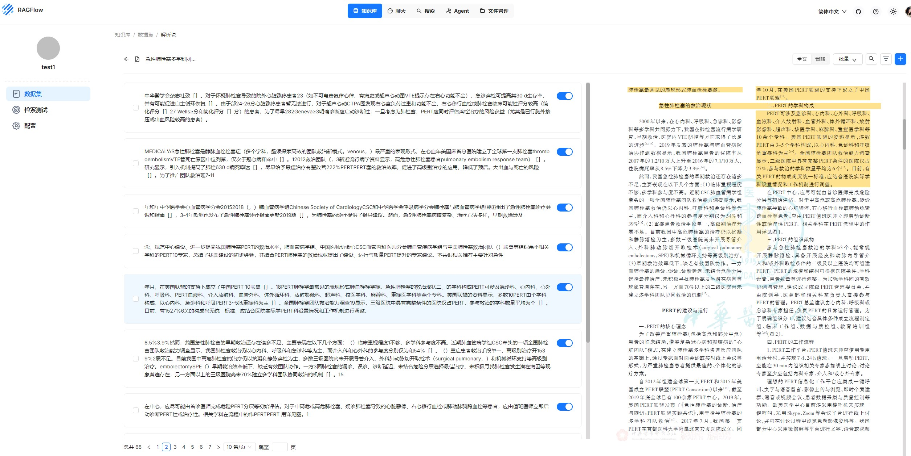

Click **Retrieval testing** to test the text search results. You can dynamically adjust the weights of full-text search and vector search.

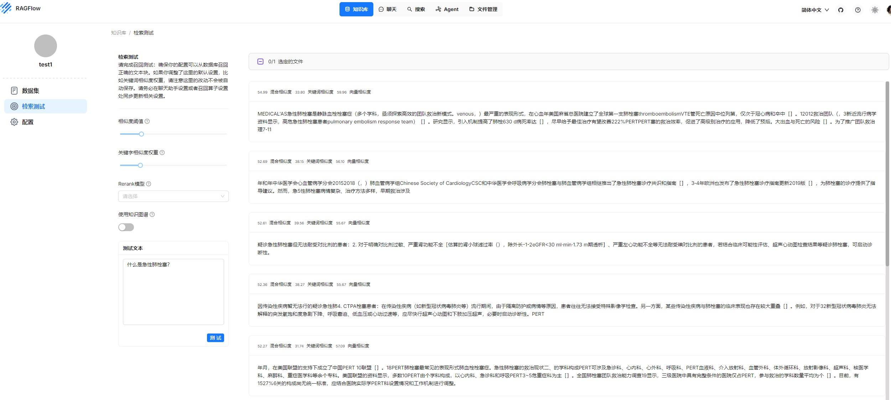

### 5. Chat

Click **Create assistant** and associate a dataset in the configuration.

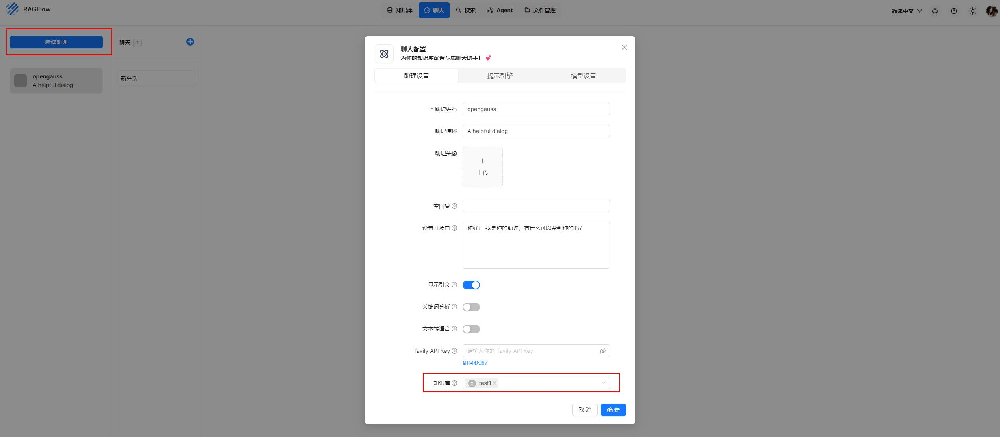

Start a real-time conversation.

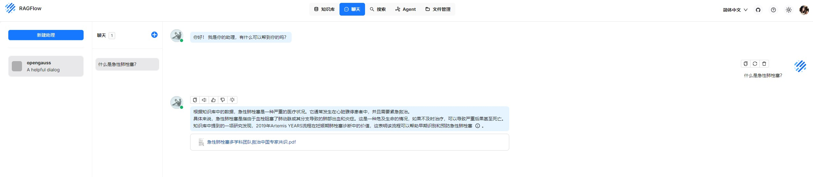

### 6. Agent

RAGFlow also provides fully automated workflows that you can configure as needed. The following figure shows a simple example of a conversational workflow.

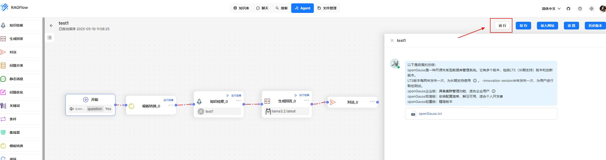

This completes the setup of RAGFlow based on the openGauss vector database.
