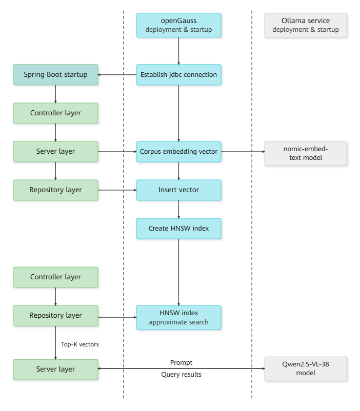
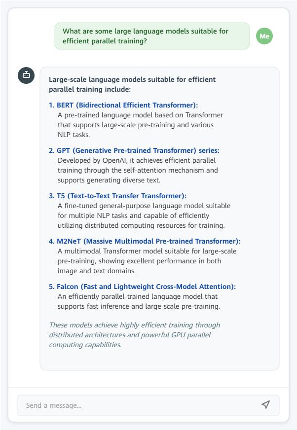

# Building an Efficient RAG Knowledge-Based Q&A System with Spring Boot and openGauss DataVec

With the development of artificial intelligence and natural language processing technologies, Retrieval-Augmented Generation (RAG)-based knowledge Q&A systems have attracted increasing attention. By combining existing data with model capabilities, these systems can provide accurate and targeted answers. Spring Boot, a popular Java development framework, enables applications to be built and deployed quickly. The openGauss DataVec vector database can efficiently store and retrieve corpus data, making it possible to build an efficient RAG knowledge-based Q&A system for enterprise scenarios such as knowledge management and customer service, thereby improving business efficiency and user experience.

This document describes how to integrate the openGauss DataVec vector database with Spring Boot to support vectorized data storage and efficient retrieval. It also explains how to construct prompts and call the embedding and chat services provided by Ollama to support RAG (Retrieval-Augmented Generation).

## Requirements

- Java 1.8 or later
- Spring Boot 3.x or later
- Ollama service installed and deployed. See the [deployment guide](https://github.com/ollama/ollama).
- openGauss database installed and deployed. See [Installing the Container Image](https://docs.opengauss.org/en/docs/latest/installation_guide/installing_the_container_image.html).

## Adding Maven Dependencies

Add the openGauss JDBC driver and Ollama SDK dependencies to `pom.xml`.

```xml
<dependency>
    <groupId>org.opengauss</groupId>
    <artifactId>opengauss-jdbc</artifactId>
    <version>6.0.1</version>
</dependency>
<dependency>
    <groupId>org.springframework.ai</groupId>
    <artifactId>spring-ai-ollama-spring-boot-starter</artifactId>
    <version>1.0.0-M5</version>
</dependency>
```

## Configuring the Properties File

Configure the required parameters in the `application.properties` file.

```
# Spring Boot service configuration
server.port=8088
spring.application.name=your_project_name

# openGauss vector database configuration
spring.datasource.url=jdbc:opengauss://localhost:port/database_name
spring.datasource.username=username
spring.datasource.password=password
spring.datasource.driver-class-name=org.opengauss.Driver

# Ollama embedding service configuration
ollama.model=nomic-embed-text:latest # Embedding model to use
ollama.modelDim=768 # Dimension of the generated vectors
ollama.embeddingURL=ip:port # IP address and port of the Ollama server

# Ollama chat service configuration
spring.ai.ollama.base-url=ip:port # IP address and port of the Ollama server
spring.ai.ollama.chat.model=qwen2.5:3b # Inference model to use
```



## Configuring and Operating the Vector Database

- The vector database configuration class obtains the service address, username, password, and other parameters and [establishes a connection](integration_java.md).

```java
@Configuration
public class opgsConfig {
    @Value("${spring.datasource.url}")
    private String url;

    @Value("${spring.datasource.username}")
    private String username;

    @Value("${spring.datasource.password}")
    private String password;

    @Value("${spring.datasource.driver-class-name}")
    private String driver;

    public Connection getConnection() {
        // Connect to the database
    }
}
```

- The vector database operation class interacts with the database to perform operations such as adding, deleting, modifying, and querying data, as well as creating tables and vector indexes. See the [example](integration_java.md).

```java
@Repository
public class Repository {
    private Connection conn;

    public void CreateTable(int dim)
    {
        ...
    }

    public void CreateIndex()
    {
        ...
    }

    public void InsertDataSingle(int id, String content, String vector)
    {
        ...
    }

    public String findNearestVectors(int efsearch, String vector, int topK)
    {
        ...
    }
    ...
}
```

## Service Layer

Call the Ollama service to generate embeddings for the raw data passed from the Controller layer, and call the APIs encapsulated in the operation class to access the data.

```java
@Service
public class Service {
    private final Repository repository;

    @Value("${ollama.modelDim}")
    private int vectorDim;

    @Value("${ollama.embeddingURL}")
    private String embeddingURL;

    @Value("${ollama.model}")
    private String ollamaModel;


    // Call the Ollama embedding service
    public float[] getEmbedding(String message)
    {
        OllamaApi ollamaApi = new OllamaApi(embeddingURL);
        OllamaOptions options = OllamaOptions.builder().withModel(ollamaModel).build();
        OllamaEmbeddingModel embeddingModel = new OllamaEmbeddingModel(ollamaApi, options);
        EmbeddingResponse embeddingResponse = embeddingModel.call(new EmbeddingRequest(List.of(message), options));
        return embeddingResponse.getResult().getOutput();
    }

    // Call the APIs for interacting with the vector database
    public void CreateTxtTable()
    {
        repository.CreateTable(vectorDim);
    }

    public void InsertTuples(int id, String message)
    {
        float[] res = getEmbedding(message);
        repository.InsertDataSingle(id, message, Arrays.toString(res));
    }

    public void IndexTxt()
    {
        repository.CreateIndex();
    }

    public String QueryContent(int efsearch, String query, int topK)
    {
        float[] res = getEmbedding(query);
        return repository.findNearestVectors(efsearch, Arrays.toString(res), int topK);
    }

    public String BuildRagPrompt(String query, List<String> relatedContents, int maxLength)
    {
        List<String> seletedTexts = new ArrayList<>();
        int totalLen = 0;
        for (String content : relatedContents) {
            if (totalLen + content.length() < maxLength) {
                seletedTexts.add(content);
            } else {
                break;
            }
        }
        return String.format("Answer the following question concisely in English based on the information below:\n%s\nQuestion: %s\nAnswer:",
                             String.join("\n", seletedTexts),
                             query);
    }
    ...
}
```

- `getEmbedding` calls the Ollama embedding service and uses the `nomic-embed-text:latest` model to generate an embedding for `message`.
- `CreateTxtTable`, `InsertTuples`, and `IndexTxt` create a table, insert data, and create an HNSW vector index in the vector database, respectively.
- `QueryContent` first generates an embedding for the query and then retrieves the original content corresponding to the `topK` nearest vectors from the vector database based on the specified `efsearch` parameter.
- `BuildRagPrompt` constructs the input prompt for the LLM using the `topK` most relevant contents retrieved from the corpus based on the query. The maximum prompt length is limited to `maxLength`.

## Controller Layer

```java
@RestController
public class Controller {
    @Autowired
    private Service service;

    private final ChatModel chatModel;

    public Controller(ChatModel chatModel)
    {
        this.chatModel = chatModel;
    }

    @GetMapping("/index")
    public String IndexDoc()
    {
        service.CreateTxtTable();
        service.InsertTuples(0, "Large-scale pre-trained language models support efficient parallel training and multiple NLP tasks.");
        service.InsertTuples(1, "Multimodal fusion models combine text, image, and audio inputs to provide comprehensive data understanding.");
        service.InsertTuples(2, "Distributed deep learning frameworks are easy to scale and support large-scale data processing.");
        service.InsertTuples(3, "Video understanding and generation models use advanced time-series analysis for monitoring and entertainment applications.");
        service.InsertTuples(4, "Ultra-high-resolution image generation models based on GAN architecture capture fine details effectively.");
        service.IndexTxt();
        return "embedding and index succeed!";

    }

    @GetMapping(value = "/chat", produces = "text/plain;charset=UTF-8")
    public String queryVector(@RequestParam(value = "message", defaultValue = "Briefly introduce openGauss.") String query)
    {
        // String query = "What are the large language models suitable for efficient parallel training?";
        int topK = 2;
        int maxPromptLen = 100;

        List<String> res = service.QueryContent(2, query, topK);

        String generatePrompt = service.BuildRagPrompt(query, res, maxPromptLen);
        System.out.println("prompt:");
        System.out.println(generatePrompt);

        Flux<ChatResponse> stream = chatModel.stream(new Prompt(generatePrompt));
        return stream.map(resp -> resp.getResult().getOutput().getText());
    }

}
```

- `IndexDoc` generates embeddings for the imported corpus, stores the vectors in the openGauss vector database, and creates an HNSW index.
- `queryVector` extracts `message` from the request as the query. If `message` is not provided, the default query is `"Briefly introduce openGauss."`. It calls `QueryContent` to retrieve the `topK` most relevant contents from the openGauss vector database, calls `BuildRagPrompt` to construct the prompt, and then calls the Qwen2.5-VL-3B-Instruct model provided by the Ollama service for inference. The result is streamed to the frontend.

## Viewing the Results

- Enter `localhost:8088/index` in a browser to generate embeddings for the corpus and create the index.

The following result is displayed. You can customize the frontend based on this result.

```
embedding and index succeed!
```

- Enter `localhost:8088/chat?message=What are the large language models suitable for efficient parallel training?` in a browser.
- The answer is then streamed to the page.



## Summary

This document demonstrates how to integrate the openGauss DataVec vector database with Spring Boot to vectorize and store data and enable millisecond-level retrieval. To optimize LLM input for RAG applications, a prompt template tailored to the target business scenario is constructed. The embedding and chat services provided by Ollama are then called to extract text features and generate vectors, and to generate responses based on an LLM, respectively. By combining these technologies, the system integrates data retrieval with language generation to provide a complete technical solution for RAG applications, improving the accuracy and response efficiency of knowledge Q&A.
